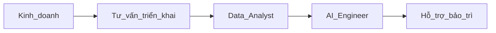

# **Kế hoạch tuyển dụng năm 2025**

## A.Quy trình tuyển dụng

### Xác định yêu cầu công việc:
* Xây dựng JD (Job Description) chi tiết cho từng vị trí.
* Lên danh sách các kỹ năng và chứng chỉ bắt buộc.

### Đăng tin trên các kênh tuyển dụng:
* LinkedIn, VietnamWorks, ITviec cho Tech Lead SAP và AI Engineer.
* Facebook Group, CareerBuilder cho Data Analyst.

### Sàng lọc ứng viên:
* Tech Lead SAP: Kiến thức về SAP Fiori, HANA, tích hợp API.
* AI Engineer: Thành thạo Python, TensorFlow, tích hợp ChatGPT hoặc các AI model.
* Data Analyst: Kinh nghiệm làm việc với SQL, Power BI, hoặc Tableau.

### Phỏng vấn:
* 1.Sàng lọc CV.
* 2.Phỏng vấn chuyên môn (Test case thực tế).

### Thử việc:
* Đào_tạo_hội_nhập
* Training on job

---

## B.Mô tả công việc cho 4 vị trí

### **2.1. Vị trí: Tư vấn triển khai (AI Consultant)**
- **Số lượng cần tuyển:** 4 người
- **Nhiệm vụ chính:**
  - Tiến hành khảo sát và phân tích nhu cầu AI của khách hàng.
  - Xây dựng chiến lược triển khai và báo cáo giải pháp phù hợp.
  - Phối hợp với đội phát triển sản phẩm để điều chỉnh giải pháp theo yêu cầu.
  - Đóng vai trò trung gian giữa khách hàng và bộ phận kỹ thuật, đảm bảo triển khai đúng tiến độ.
- **Yêu cầu:**
  - Tốt nghiệp ngành Quản trị kinh doanh, Khoa học máy tính hoặc tương đương.
  - Có kinh nghiệm tư vấn công nghệ (tối thiểu 2 năm).
  - Kỹ năng giao tiếp, phân tích và trình bày tốt.
- **Mức lương dự kiến:** ... triệu VNĐ/tháng.

### **2.2. Vị trí: Data Analyst**
- **Số lượng cần tuyển:** 3 người
- **Nhiệm vụ chính:**
  - Thu thập, làm sạch và phân tích dữ liệu từ khách hàng.
  - Xây dựng dashboard và báo cáo dữ liệu giúp tư vấn triển khai ra quyết định.
  - Đưa ra các phân tích chuyên sâu (insight) để hỗ trợ phát triển mô hình AI.
  - Hỗ trợ đào tạo khách hàng hiểu về dữ liệu đầu vào và đầu ra của AI.
- **Yêu cầu:**
  - Thành thạo SQL, Python hoặc R; kinh nghiệm làm việc với Power BI/Tableau.
  - Có kinh nghiệm phân tích dữ liệu và đưa ra đề xuất chiến lược.
  - Tư duy logic, kỹ năng giải quyết vấn đề.
- **Mức lương dự kiến:** ... triệu VNĐ/tháng.

### **2.3. Vị trí: Data Engineer**
- **Số lượng cần tuyển:** 5 người
- **Nhiệm vụ chính:**
  - Thiết kế và xây dựng hệ thống ETL (Extract, Transform, Load).
  - Tích hợp dữ liệu từ hệ thống khách hàng vào nền tảng AI.
  - Tối ưu hóa hiệu suất lưu trữ và xử lý dữ liệu lớn.
  - Hỗ trợ đội ngũ Data Analyst và AI Engineer trong việc chuẩn bị dữ liệu.
- **Yêu cầu:**
  - Kinh nghiệm với các công cụ xử lý dữ liệu lớn (Hadoop, Spark).
  - Thành thạo Python, Java hoặc Scala.
  - Am hiểu cơ sở dữ liệu SQL và NoSQL.
- **Mức lương dự kiến:** ... triệu VNĐ/tháng.

### **2.4. Vị trí: Hỗ trợ & đào tạo (AI Trainer)**
- **Số lượng cần tuyển:** 3 người
- **Nhiệm vụ chính:**
  - Đào tạo khách hàng sử dụng các công cụ AI và giải pháp tùy chỉnh.
  - Hỗ trợ khách hàng trong quá trình triển khai và vận hành hệ thống.
  - Ghi nhận phản hồi từ khách hàng và phối hợp với bộ phận tư vấn triển khai để cải tiến sản phẩm.
- **Yêu cầu:**
  - Có kiến thức cơ bản về AI, kỹ năng thuyết trình và đào tạo.
  - Khả năng giao tiếp tốt và kỹ năng giải quyết vấn đề.
  - Ưu tiên ứng viên có kinh nghiệm làm việc tại vị trí hỗ trợ khách hàng.
- **Mức lương dự kiến:** ... triệu VNĐ/tháng.

---

## **3. Quy trình phối hợp triển khai giữa 4 vị trí và bộ phận kinh doanh**

---

## **4. Các công việc cần thực hiện trong năm 2025**

### **4.1. Bộ phận nhân sự**
- Đăng tin tuyển dụng trên các kênh tuyển dụng uy tín.
- Tổ chức phỏng vấn và đánh giá ứng viên theo từng vòng.
- Onboarding và đào tạo cơ bản cho nhân viên mới (kỹ năng mềm và hiểu biết cơ bản về AI).

### **4.2. Bộ phận kinh doanh và phát triển sản phẩm**
- Thiết lập các quy trình phối hợp giữa bộ phận kinh doanh và các nhóm triển khai, đảm bảo thông tin không bị đứt gãy.
- Tổ chức họp giao ban hàng tuần giữa các bộ phận để theo dõi tiến độ dự án.

### **4.3. Hỗ trợ và quản lý khách hàng**
- Xây dựng tài liệu hướng dẫn sử dụng cho khách hàng.
- Triển khai khảo sát mức độ hài lòng của khách hàng định kỳ để cải thiện dịch vụ.

---

## **5. Tổng kết ngân sách tuyển dụng năm 2025**

| **Danh mục**            | **Chi phí dự kiến (VNĐ)** |
|--------------------------|--------------------------|
| Tuyển dụng & onboarding | 300 triệu               |
| Đào tạo nhân sự nội bộ   | 200 triệu               |
| **Tổng ngân sách**       | **500 triệu**           |

FoxAI sẽ tập trung xây dựng đội ngũ nhân sự chất lượng cao và phối hợp chặt chẽ giữa các bộ phận để triển khai dịch vụ hiệu quả, đảm bảo đáp ứng nhu cầu khách hàng và đạt mục tiêu kinh doanh trong năm 2025.
