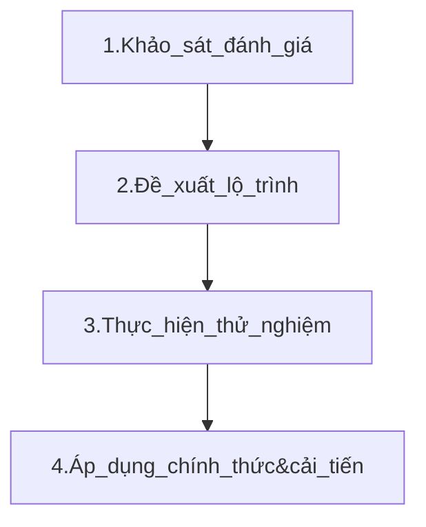

# Kế hoạch xây dựng gói dịch vụ khảo sát và tư vấn lộ trình doanh nghiệp ứng dụng AI

## Mục tiêu dịch vụ
1. **Khảo sát hiện trạng**:
   - Đánh giá mức độ sẵn sàng của doanh nghiệp trong việc áp dụng AI.
   - Hiểu rõ bài toán thực tế của doanh nghiệp.
2. **Tư vấn lộ trình**:
   - Xây dựng kế hoạch áp dụng AI phù hợp với nhu cầu, ngân sách và mục tiêu của doanh nghiệp.
3. **Triển khai và tối ưu hóa**:
   - Đề xuất giải pháp cụ thể, khả thi và lộ trình triển khai từng bước. Ví dụ:
       - Giai đoạn 1: Triển khai SAP hoặc hoàn thiện 1 thủ tục để có đủ dữ liệu cần thu thập.
       - Giai đoạn 2: Tích hợp AI vào các hệ thống sẵn có của đơn vị.
       - Giai đoạn 3: Huấn luyện và tinh chỉnh mô hình dữ liệu riêng cho khách hàng.

## Đối tượng khách hàng
1. **Khách hàng hiện tại của FoxAI**: Các doanh nghiệp đã có sản phẩm AI nhưng muốn mở rộng ứng dụng vào các lĩnh vực khác hoặc tối ưu hóa hệ thống hiện tại.
2. **Khách hàng tiềm năng**: Các doanh nghiệp chưa triển khai SAP, ERP của FoxAI nhưng có nhu cầu số hóa hoặc cải tiến hoạt động kinh doanh.

---

## Dung lượng thị trường và tiềm năng nhu cầu (5 năm tới)

### **1. Dung lượng thị trường**
- **Thị trường AI tại Việt Nam** dự kiến đạt tốc độ tăng trưởng hàng năm kép (CAGR) khoảng **22-25%** từ năm 2023 đến 2030, theo các báo cáo thị trường.
- Quy mô thị trường AI Việt Nam năm 2023 ước tính đạt khoảng **400 triệu USD**, và dự kiến đạt **1-1,5 tỷ USD vào năm 2028**.
- Phân khúc khách hàng tiềm năng:
  - Các doanh nghiệp trong lĩnh vực sản xuất, logistics, ngân hàng, tài chính, và bán lẻ chiếm **70% nhu cầu ứng dụng AI**.

### **2. Nhu cầu doanh nghiệp**
- Theo khảo sát từ McKinsey và PwC, **56% doanh nghiệp tại Việt Nam** có kế hoạch tích hợp AI vào hoạt động trong 3 năm tới.
- **Tiềm năng khách hàng**:
  - Doanh nghiệp vừa và lớn (chiếm 20% tổng số doanh nghiệp Việt Nam): khoảng **170.000 doanh nghiệp**.
  - Doanh nghiệp nhỏ và vừa: là thị trường tăng trưởng nhanh với nhu cầu khám phá và thử nghiệm AI.

### **Dự báo doanh thu (5 năm):**
- Với mức tăng trưởng trung bình hàng năm **25%**, doanh thu từ dịch vụ này có thể đạt:
  - Năm 1: **10 tỷ VNĐ** (100 khách hàng với giá trung bình 100 triệu VNĐ/dự án).
  - Năm 5: **30-50 tỷ VNĐ/năm**, nhờ mở rộng quy mô và danh mục dịch vụ.

---

## **II. Lộ trình thực hiện**

### **Giai đoạn 1: Khảo sát và đánh giá hiện trạng**
1. **Khảo sát sơ bộ**:
   - Thu thập thông tin về quy trình vận hành, các điểm nghẽn, và mức độ sử dụng công nghệ hiện tại.
   - Đánh giá khả năng tiếp cận dữ liệu của doanh nghiệp (chất lượng, nguồn gốc, lưu trữ).
   - Phỏng vấn các phòng ban để hiểu rõ nhu cầu và mục tiêu.
   
2. **Phân tích hiện trạng**:
   - Xác định các yếu tố cần cải thiện bằng AI: hiệu suất, chi phí, chất lượng dịch vụ.
   - Đo lường khả năng sẵn sàng về nguồn lực, cơ sở hạ tầng và đội ngũ nhân sự.

3. **Báo cáo đánh giá**:
   - Tóm tắt cơ hội, thách thức và các lĩnh vực có tiềm năng ứng dụng AI.

### **Giai đoạn 2: Đề xuất lộ trình áp dụng AI**
1. **Xác định mục tiêu ứng dụng AI**:
   - Tối ưu hóa quy trình hiện tại.
   - Tự động hóa các tác vụ lặp đi lặp lại.
   - Phân tích dữ liệu và dự đoán để hỗ trợ ra quyết định.
   
2. **Xây dựng lộ trình**:
   - Phân kỳ lộ trình theo giai đoạn: ngắn hạn, trung hạn, và dài hạn.
   - Định nghĩa các chỉ số KPI để đo lường hiệu quả.
   - Dự toán chi phí và thời gian triển khai.

3. **Xác định giải pháp AI phù hợp**:
   - Xây dựng các mô hình AI (dự đoán, phân loại, nhận diện hình ảnh, chatbot...).
   - Đề xuất các giải pháp phần mềm thương mại hoặc mã nguồn mở (tùy thuộc vào quy mô và ngân sách của khách hàng).

### **Giai đoạn 3: Thực hiện thử nghiệm và cải tiến**
1. **Thử nghiệm (Proof of Concept - POC)**:
   - Lựa chọn một lĩnh vực cụ thể để thử nghiệm AI (ví dụ: dự báo nhu cầu, chatbot chăm sóc khách hàng).
   - Triển khai giải pháp thử nghiệm với quy mô nhỏ.
   
2. **Triển khai chính thức**:
   - Mở rộng phạm vi ứng dụng sau khi thử nghiệm thành công.
   - Huấn luyện nhân viên sử dụng các công cụ AI.
   - Thiết lập quy trình giám sát và duy trì.

3. **Tối ưu hóa và cải tiến**:
   - Phân tích dữ liệu thực tế sau khi triển khai để điều chỉnh mô hình.
   - Đề xuất các giải pháp nâng cấp phù hợp với tăng trưởng của doanh nghiệp.

---

## III.Dự kiến giá bán
1. **Gói cơ bản (Basic): 50 triệu VNĐ/dự án**  
   - Khảo sát nhu cầu và đánh giá tiềm năng cơ bản.
   - Báo cáo đề xuất chiến lược sơ bộ.

2. **Gói nâng cao (Advanced): 100-150 triệu VNĐ/dự án**  
   - Khảo sát chi tiết, phân tích dữ liệu hiện trạng.
   - Báo cáo chiến lược chi tiết và gợi ý giải pháp.

3. **Gói thử nghiệm (Proof of Concept - POC): 200-300 triệu VNĐ/dự án**  
   - Bao gồm thử nghiệm giải pháp AI trong phạm vi nhỏ.
   - Đo lường và đánh giá hiệu quả thực tế.

4. **Gói toàn diện (Enterprise): Từ 500 triệu VNĐ/dự án trở lên**  
   - Dành cho các doanh nghiệp lớn với yêu cầu phân tích, triển khai AI toàn diện.

---

## **IV. Nguồn lực chuẩn bị**

### **1. Nhân sự**
- **Đội khảo sát**:
  - Chuyên gia tư vấn chiến lược (2-3 người).
  - Nhà phân tích dữ liệu (1 người).
  - Kỹ sư AI (2 người).
- **Đội triển khai**:
  - Kỹ sư phần mềm/DevOps (2-3 người).
  - Nhà khoa học dữ liệu (Data Scientist) (1-2 người).
  - Quản lý dự án (1 người).

### **2. Công cụ và công nghệ**
- **Công cụ khảo sát**:
  - Google Forms hoặc Microsoft Forms để thu thập thông tin.
  - Trello, Asana để quản lý dự án.
- **Công cụ AI**:
  - Framework AI: TensorFlow, PyTorch.
  - Công cụ xử lý dữ liệu: Pandas, NumPy.
  - Phần mềm hỗ trợ: Power BI, Tableau.
- **Hạ tầng công nghệ**:
  - Cloud: AWS, Google Cloud, hoặc Microsoft Azure.
  - Cơ sở dữ liệu: MySQL, PostgreSQL, hoặc NoSQL.

### **3. Ngân sách**
- Phân bổ ngân sách theo giai đoạn:
  - Giai đoạn khảo sát và đánh giá: ~30%.
  - Thử nghiệm giải pháp: ~40%.
  - Triển khai và tối ưu hóa: ~30%.

---

## **V. Các giải pháp cung cấp cho khách hàng**

### **1. Giải pháp công nghệ**
- **Tối ưu quy trình vận hành**:
  - Tự động hóa bằng RPA (Robotic Process Automation).
  - Tối ưu chuỗi cung ứng với AI dự báo.
- **Cải thiện dịch vụ khách hàng**:
  - Triển khai chatbot AI hoặc trợ lý ảo.
  - Phân tích phản hồi khách hàng bằng xử lý ngôn ngữ tự nhiên (NLP).
- **Hỗ trợ ra quyết định**:
  - Xây dựng hệ thống phân tích dữ liệu nâng cao.
  - Dự báo doanh thu, chi phí, và nhu cầu thị trường.

### **2. Tư vấn chiến lược**
- **Kế hoạch phát triển dài hạn**:
  - Lộ trình ứng dụng AI từ cơ bản đến nâng cao.
- **Tư vấn xây dựng đội ngũ AI nội bộ**:
  - Tuyển dụng và đào tạo nhân sự AI.
  - Đề xuất các khóa học và chứng chỉ phù hợp.

### **3. Triển khai thử nghiệm và báo cáo**
- Báo cáo kết quả POC (Proof of Concept).
- Đề xuất cải tiến trước khi triển khai toàn diện.

---

## **VI. Giá trị mang lại cho khách hàng**
1. **Hiệu quả vận hành**:
   - Giảm chi phí và thời gian xử lý công việc.
   - Tăng độ chính xác trong dự đoán và ra quyết định.
2. **Cạnh tranh thị trường**:
   - Giúp doanh nghiệp nắm bắt xu hướng AI, dẫn đầu so với đối thủ.
3. **Tăng trưởng bền vững**:
   - Ứng dụng AI một cách có kế hoạch, tránh lãng phí nguồn lực.

## Tóm lại
Dịch vụ "Khảo sát, đánh giá nhu cầu và tiềm năng ứng dụng AI" của FoxAI không chỉ giúp khách hàng tối ưu hóa hiệu quả kinh doanh mà còn là bước đệm để họ chuyển đổi số và đi trước trong cuộc cách mạng AI. Đây là một cơ hội lớn để FoxAI trở thành đối tác chiến lược của doanh nghiệp, thúc đẩy tăng trưởng và tạo giá trị bền vững cho khách hàng.
