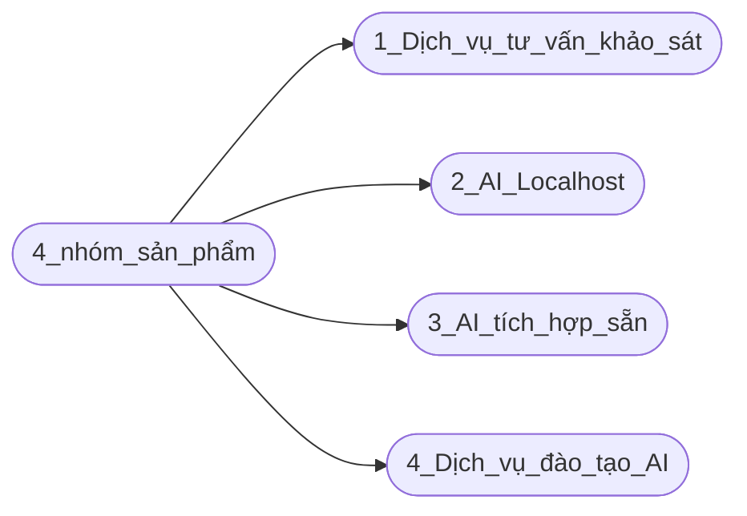

## Công ty cổ phần công nghệ FoxAI

   

# 1. Chiến lược phát triển khối sản phẩm AI - tầm nhìn 2025-2029

**1.1. Dịch vụ khảo sát, tư vấn lộ trình ứng dụng AI cho doanh nghiệp:**

* [Khảo sát, đánh giá nhu cầu và tư vấn lộ trình ứng dụng AI cho từng khách hàng của FoxAI.](https://github.com/hoanglong8/FoxAI-Data-Analyst/blob/main/A.1.1.D%E1%BB%8Bch%20v%E1%BB%A5%20kh%E1%BA%A3o%20s%C3%A1t,%20t%C6%B0%20v%E1%BA%A5n%20AI.md)

**1.2. Triển khai giải pháp AI localhost:**

* [Xây dựng và triển khai hệ thống AI localhost cho khách hàng có nhu cầu bảo mật dữ liệu](https://github.com/hoanglong8/FoxAI-Data-Analyst/blob/main/A.1.2.D%E1%BB%8Bch%20V%E1%BB%A5%3A%20X%C3%A2y%20D%E1%BB%B1ng%20H%E1%BB%87%20Th%E1%BB%91ng%20AI%20Chuy%C3%AAn%20Bi%E1%BB%87t%20Theo%20Y%C3%AAu%20C%E1%BA%A7u%20T%E1%BB%ABng%20Ng%C3%A0nh.md), tập trung vào các ngành như sản xuất, tài chính ngân hàng...

**1.3. Triển khai giải pháp AI tích hợp sẵn:**

* [Ứng dụng và triển Khai hệ thống AI có sẵn để tích hợp vào hệ thống phần mềm của khách hàng](https://github.com/hoanglong8/FoxAI-Data-Analyst/blob/main/A.1.3.D%E1%BB%8Bch%20v%E1%BB%A5%3A%20Tri%E1%BB%83n%20khai%20AI%20t%C3%ADch%20h%E1%BB%A3p%20ho%E1%BA%B7c%20AI%20t%E1%BB%B1%20%C4%91%E1%BB%99ng.md) như SAP, ERP, Kế toán, Nhân sự, CRM, MRP... Trong đó ưu tiên xây dựng hệ thống Chatbot hỗ trợ sản phẩm SAP dùng cho đào tạo nội bộ FoxAI và chăm sóc khách hàng.

**1.4. Dịch vụ đào tạo và hỗ trợ khách hàng ứng dụng AI hiệu quả:**

* [Đào tạo đội ngũ ban lãnh đạo, quản lý và nhân viên của khách hàng sử dụng công cụ AI để tăng hiệu quả công việc](https://github.com/hoanglong8/FoxAI-Data-Analyst/blob/main/A.1.4.D%E1%BB%8Bch%20v%E1%BB%A5:%20%C4%90%C3%A0o%20t%E1%BA%A1o%20kh%C3%A1ch%20h%C3%A0ng%20s%E1%BB%AD%20d%E1%BB%A5ng%20AI.md)

## 2.Giới thiệu chi tiết giải pháp AI cho các lĩnh vực

!Hình ảnh

## 2.1. Chatbot hỗ trợ khách hàng sử dụng SAP

**Mục tiêu dự án**
1. **Hỗ trợ nhân viên trong việc sử dụng SAP:**
   - Hướng dẫn thao tác trong các module của SAP như tài chính, bán hàng, quản lý kho.
   - Đưa ra câu trả lời nhanh cho các vướng mắc thường gặp.
2. **Tăng hiệu suất làm việc:**
   - Tiết kiệm thời gian cho nhân viên bằng cách tự động hóa câu trả lời cho các vấn đề phổ biến.
   - Giảm khối lượng công việc cho đội ngũ IT hoặc bộ phận hỗ trợ của FoxAI.
3. **Nắm bắt số liệu tức thời:**
   - Cho phép ban lãnh đạo truy xuất nhanh các số liệu quan trọng (doanh thu, chi phí, tồn kho) thông qua chatbot.

**Dữ liệu đầu vào cần thiết**
1. **Tài liệu hệ thống SAP:**
   - Cấu trúc dữ liệu và tài liệu hướng dẫn của các module SAP đang sử dụng.
   - Danh sách quy trình công việc và các thao tác phổ biến.
2. **Câu hỏi thường gặp (FAQs):**
   - Các câu hỏi và câu trả lời liên quan đến việc sử dụng SAP.
   - Dữ liệu từ các yêu cầu hỗ trợ trước đây.
3. **Số liệu vận hành thực tế:**
   - Dữ liệu từ hệ thống SAP về tài chính, bán hàng, quản lý kho, nhân sự.
4. **Dữ liệu hội thoại:**
   - Ghi nhận các yêu cầu và phản hồi từ nhân viên qua email, chat, hoặc các kênh hỗ trợ.
5. **Quyền truy cập:**
   - Phân quyền để chatbot có thể truy cập các dữ liệu theo từng cấp độ (nhân viên, quản lý, lãnh đạo).

**Cơ sở hạ tầng**
1. **Hạ tầng máy chủ và lưu trữ:**
   - **Cloud:** Sử dụng AWS, Microsoft Azure, hoặc Google Cloud để đảm bảo khả năng mở rộng.
   - **On-premises:** Nếu doanh nghiệp ưu tiên bảo mật cao, có thể sử dụng hạ tầng máy chủ tại chỗ.
2. **Hệ thống tích hợp:**
   - **API Gateway:** Để kết nối chatbot với hệ thống SAP.
   - **Database:** Dữ liệu cấu trúc (SQL) và phi cấu trúc (NoSQL) để lưu trữ thông tin từ các hội thoại và phản hồi.
3. **AI và NLP:**
   - **Ngôn ngữ:** Sử dụng các framework như Python (TensorFlow, PyTorch) hoặc sử dụng API có sẵn như OpenAI GPT.
   - **NLP Frameworks:** Google Dialogflow, Microsoft Bot Framework, hoặc Rasa để xử lý hội thoại.
4. **Hệ thống bảo mật:**
   - Mã hóa dữ liệu và xác thực hai lớp (2FA) để đảm bảo an toàn cho dữ liệu SAP.
   - Quản lý quyền truy cập để bảo vệ dữ liệu nhạy cảm.

**Giao diện người dùng (UI/UX)**

**Đối với ban lãnh đạo:**
   - **Dashboard tức thời:**
     - Hiển thị thông tin như:
       - Doanh thu theo thời gian thực.
       - Tồn kho theo loại hàng.
       - Chi phí vận hành hàng tháng.
     - Có thể truy cập qua web hoặc ứng dụng di động.
   - **Chức năng ra lệnh bằng giọng nói:**
     - Cho phép lãnh đạo yêu cầu số liệu bằng lệnh thoại qua chatbot.
    
**Đối với nhân viên sử dụng SAP:**
   - **Chatbot UI:** 
     - Tích hợp trên nền tảng Microsoft Teams, Slack, hoặc một ứng dụng nội bộ.
     - Giao diện đơn giản với các chức năng như hỏi đáp, hướng dẫn quy trình.
   - **Các tính năng:** 
     - Hướng dẫn từng bước theo câu lệnh (step-by-step).
     - Gợi ý tự động (autocomplete) khi nhân viên đặt câu hỏi.

**- Nguồn lực team sản xuất dự kiến:**

| **Vai trò**            | **Số lượng**     | **Nhiệm vụ**                                                                 |
|---------------------------|-------------------|------------------------------------------------------------------------------------|
| Giám đốc dự án (PM) | 1          | phụ trách kế hoạch & tiến độ triển khai. |
| Data Analyst | 1          | thu thập và xử lý dữ liệu từ SAP, ERP... |
| Kỹ sư (AI Engineers) | 1          | phát triển, tinh chỉnh mô hình NLP (Natural Language Processing) để chatbot hiểu tiếng Việt và các lệnh SAP. |
| Dev Backend | 1          | tích hợp với hệ thống SAP thông qua API, kết nối với các nền tảng (Teams, Slack, hoặc ứng dụng nội bộ). |
| Dev Frontend (UX/UI) | 1          | thiết kế giao diện chatbot thân thiện, trực quan và xây dựng dashboard cho ban lãnh đạo truy cập số liệu tức thời. |
| Kỹ sư hệ thống (DevOps) | 1          | đảm bảo hệ thống localhost vận hành ổn định, bảo mật.|

**Timeline triển khai**

| **Giai đoạn**            | **Thời gian**     | **Công việc chính**                                                                 |
|---------------------------|-------------------|------------------------------------------------------------------------------------|
| **Giai đoạn 1: Khảo sát nhu cầu** | 0,5 tháng           | - Phân tích nhu cầu doanh nghiệp, BLĐ và nhân viên.   - Xây dựng danh sách các chức năng cần thiết. |
| **Giai đoạn 2: Xử lý dữ liệu** | 0,5 tháng           | - Thu thập tài liệu và dữ liệu từ SAP.   - Làm sạch và chuẩn hóa dữ liệu.          |
| **Giai đoạn 3: Xây dựng chatbot** | 0,5-1 tháng           | - Xây dựng mô hình AI NLP để hiểu ngôn ngữ tự nhiên.   - Tích hợp API với SAP.   |
| **Giai đoạn 4: Thử nghiệm**     | 1 tháng           | - Triển khai thử nghiệm trên một nhóm nhỏ.   - Thu thập phản hồi và tối ưu hóa.   |
| **Giai đoạn 5: Triển khai chính thức** | 1 tháng           | - Đào tạo nhân viên sử dụng chatbot.   - Theo dõi hiệu quả và cập nhật định kỳ.   |

## 2.2. Cho ngành sản xuất
**Một số Case-study ứng dụng AI thành công**

- Amazon: Sử dụng AI để quản lý chuỗi cung ứng và dự đoán nhu cầu sản phẩm, từ đó giúp tối ưu hóa việc lưu trữ và vận chuyển dựa trên dự đoán chính xác nhu cầu.

- Toyota: Ứng dụng AI trong quản lý tồn kho và chuỗi cung ứng. Hệ thống AI phân tích dữ liệu thời gian thực từ nhà máy và nhà cung cấp để tối ưu hóa dòng nguyên vật liệu.

- Coca-Cola: Dùng AI để dự đoán nhu cầu nguyên vật liệu dựa trên phân tích dữ liệu tiêu thụ sản phẩm và xu hướng thị trường.

- Unilever: Kết hợp AI và Big Data để dự đoán nhu cầu sản phẩm và tối ưu hóa việc sản xuất theo khu vực.

**Chiến lược của FoxAI**

**Xây dựng hệ thống dự đoán nhu cầu nguyên vật liệu (MRP) giúp:**
  - Tối ưu hóa chuỗi cung ứng: Dự đoán chính xác nhu cầu nguyên vật liệu, giảm thiểu tồn kho và lãng phí.
  - Tăng hiệu quả hoạt động: Cải thiện quy trình lập kế hoạch sản xuất và đặt hàng nguyên liệu.
  - Giảm chi phí vận hành: Hạn chế tình trạng mua thừa hoặc thiếu nguyên vật liệu.

**Đối tượng khách hàng tiềm năng:**
  - Hạ tầng công nghệ: Có sẵn ERP, hệ thống quản lý kho (WMS), hoặc hệ thống quản lý sản xuất (MES) có đủ các dữ liệu lịch sử như đơn hàng, thông tin tồn kho, kế hoạch, tiến độ và chu kỳ sản xuất.
  - Nhân sự: Có đội ngũ IT hoặc sẵn sàng thuê ngoài triển khai.
  - Hạ tầng lưu trữ: Sử dụng cloud (AWS, Google Cloud, Azure) hoặc **hạ tầng tại chỗ (on-premises).**
 
**Dữ liệu đầu vào cần thiết:**
    - Lịch sử sản xuất: Thông tin về sản lượng sản xuất theo thời gian.
    - Lịch sử bán hàng: Số lượng hàng bán theo từng loại sản phẩm, theo mùa, hoặc theo thị trường.
    - Tồn kho: Tồn kho nguyên vật liệu và thành phẩm.
    - Thời gian giao hàng: Dữ liệu về thời gian giao hàng của các nhà cung cấp.
    - Các yếu tố bên ngoài: Dữ liệu kinh tế vĩ mô (giá nguyên liệu, xu hướng thị trường), thời tiết (nếu liên quan đến nguyên liệu nông nghiệp), và sự kiện đặc biệt (dịch bệnh, chiến tranh thương mại).
    - Dữ liệu nội bộ khác: Quy trình sản xuất, BOM (Bill of Materials), và vòng đời sản phẩm.

**Kiến trúc hệ thống**

**Nguồn lực team sản xuất dự kiến:**

| **Vai trò**            | **Số lượng**     | **Nhiệm vụ**                                                                 |
|---------------------------|-------------------|------------------------------------------------------------------------------------|
| Giám đốc dự án (PM) | 1          | phụ trách kế hoạch & tiến độ triển khai. |
| Data Analyst | 1          | thu thập và xử lý dữ liệu từ các hệ thống của KH. |
| Kỹ sư (AI Engineers) | 1          | dựng và tối ưu hóa mô hình ML, hồi quy (Regression) để dự đoán nhu cầu theo thời gian; xử lý ngôn ngữ tự nhiên (NLP) để phân tích dữ liệu từ email đặt hàng hoặc báo cáo. |
| Dev Backend | 1          | tích hợp với hệ thống SAP, ERP thông qua API. |
| Dev Frontend (UX/UI) | 1          | thiết kế bảng điều khiển. |
| Kỹ sư hệ thống (DevOps) | 1          | đảm bảo hệ thống localhost vận hành ổn định, bảo mật. |

**Timeline triển khai**

| **Giai đoạn**            | **Thời gian**     | **Công việc chính**                                                                 |
|---------------------------|-------------------|------------------------------------------------------------------------------------|
| **Giai đoạn 1: Khảo sát nhu cầu** | 0,5 tháng           | Team kinh doanh khảo sát, đánh giá KH & xúc tiến dự án |
| **Giai đoạn 2: Xử lý dữ liệu** | 0,5-1 tháng           | - Team SX thu thập tài liệu và dữ liệu từ SAP, ERP.   - Làm sạch và chuẩn hóa dữ liệu.          |
| **Giai đoạn 3: Xây dựng mô hình AI** | 0,5-1 tháng           | - Team SX phát triển mô hình AI, thử nghiệm trên dữ liệu lịch sử.      |
| **Giai đoạn 4: Thử nghiệm**     | 1 tháng           | - Tích hợp và chạy thử nghiệm trên 1 database REP.   - Thu thập phản hồi và tối ưu hóa.   |
| **Giai đoạn 5: Triển khai chính thức** | 1 tháng           | - Đào tạo đội ngũ sử dụng hệ thống.   - Theo dõi, tối ưu sau triển khai và chuyển sang bảo trì.   |

---

## 2.4. Lĩnh vực tài chính, ngân hàng và bảo hiểm
### Case-study ứng dụng AI thành công
- JP Morgan Chase:
  - Ứng dụng: AI xử lý hợp đồng và phát hiện gian lận tài chính.
  - Kết quả: Giảm 360.000 giờ làm việc thủ công mỗi năm.
- Zest AI:
  - Ứng dụng: AI hỗ trợ chấm điểm tín dụng dựa trên dữ liệu phi truyền thống.
  - Kết quả: Mở rộng tiếp cận tín dụng cho các nhóm đối tượng mới.

### Định hướng sản phẩm & dịch vụ AI
- Phát hiện gian lận giao dịch:
  - AI phân tích giao dịch theo thời gian thực để phát hiện bất thường.
- Chấm điểm tín dụng thông minh:
  - Dùng AI để đánh giá tín dụng dựa trên lịch sử tài chính và dữ liệu phi truyền thống.
- Tự động hóa quy trình xử lý tài liệu:
  - Xử lý hợp đồng, giấy tờ nhanh chóng với AI.
- Tư vấn tài chính cá nhân bằng AI:
  - Chatbot hoặc cố vấn AI gợi ý đầu tư và tiết kiệm.

---

# 3.Lộ Trình Chiến Lược 5 Năm (2025-2029)

## 3.1. Giả định
- **Doanh thu dự kiến:** Tổng doanh thu từ cả 4 gói sản phẩm.
- **Chi phí vận hành:** Dự kiến khoảng 60% tổng doanh thu (bao gồm nhân sự, công nghệ, marketing, vận hành).
- **Lợi nhuận:** 40% tổng doanh thu (sau chi phí).
- **Tăng trưởng khách hàng hàng năm:** Trung bình 20%/năm.
- **Số lượng nhân sự cần thiết:** Tăng tương ứng với quy mô khách hàng (1 nhân sự quản lý 5-7 khách hàng).

---

## 3.2. Các gói sản phẩm và giá bán dự kiến
| **Gói sản phẩm**                           | **Giá trung bình/dự án (VNĐ)** |
|-------------------------------------------|--------------------------------|
| Khảo sát, tư vấn ứng dụng AI              | 100 triệu                     |
| Phát triển giải pháp AI tùy chỉnh         | 1,5 tỷ                        |
| Tích hợp AI vào hệ thống sẵn có           | 1 tỷ                          |
| Đào tạo và hỗ trợ                         | 50 triệu                      |

---

## 4. Tổng kết 5 năm (2025-2029)
| **Chỉ số**               | **Năm 1** | **Năm 2** | **Năm 3** | **Năm 4** | **Năm 5** | **Tổng cộng** |
|---------------------------|-----------|-----------|-----------|-----------|-----------|---------------|
| Số lượng khách hàng       | 50        | 70        | 100       | 140       | 200       | 560           |
| Doanh số dự kiến (tỷ VNĐ) | 26        | 31,2      | 41        | 54,6      | 78        | 230,8         |
| Doanh thu thực tế (tỷ VNĐ)| 15,6      | 18,72     | 24,6      | 32,76     | 46,8      | 138,48        |
| Lợi nhuận (tỷ VNĐ)        | 10,4      | 12,48     | 16,4      | 21,84     | 31,2      | 92,32         |
| Nhân sự triển khai        | 15        | 18        | 25        | 35        | 50        | -             |

---

## 5. Chiến lược triển khai
- **Năm 1-2:** Tập trung vào tiếp thị và xây dựng thương hiệu FoxAI, triển khai dịch vụ khảo sát và giải pháp tùy chỉnh.
- **Năm 3-4:** Mở rộng quy mô dịch vụ tích hợp AI và đào tạo nhân viên. Đẩy mạnh các dự án tự động hóa quy trình (RPA).
- **Năm 5:** Phát triển các dịch vụ cao cấp, mở rộng thị trường ra các doanh nghiệp lớn và đối tác quốc tế.

