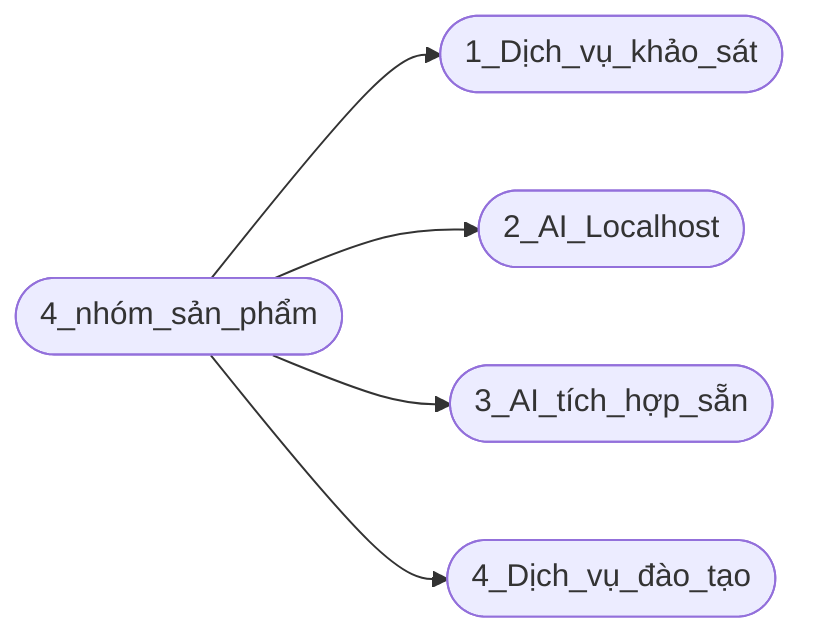

## Công ty cổ phần công nghệ FoxAI

   

# 1. Chiến lược phát triển khối sản phẩm AI - tầm nhìn 2025-2029

**1.1. Dịch vụ khảo sát, tư vấn lộ trình ứng dụng AI cho doanh nghiệp:**

* [Khảo sát, đánh giá nhu cầu và tư vấn lộ trình ứng dụng AI cho từng khách hàng của FoxAI.](https://github.com/hoanglong8/FoxAI-Data-Analyst/blob/main/A.1.1.D%E1%BB%8Bch%20v%E1%BB%A5%20kh%E1%BA%A3o%20s%C3%A1t,%20t%C6%B0%20v%E1%BA%A5n%20AI.md)

**1.2. Triển khai giải pháp AI localhost:**

* [Xây dựng và triển khai hệ thống AI localhost trên máy chủ của khách hàng](https://github.com/hoanglong8/FoxAI-Data-Analyst/blob/main/A.1.2.D%E1%BB%8Bch%20V%E1%BB%A5%3A%20X%C3%A2y%20D%E1%BB%B1ng%20H%E1%BB%87%20Th%E1%BB%91ng%20AI%20Chuy%C3%AAn%20Bi%E1%BB%87t%20Theo%20Y%C3%AAu%20C%E1%BA%A7u%20T%E1%BB%ABng%20Ng%C3%A0nh.md), tập trung vào các ngành mũi nhọn như sản xuất, ngân hàng... (xem chi tiết ở phần 2).

**1.3. Triển khai giải pháp AI tích hợp sẵn:**

* [Ứng dụng và triển Khai hệ thống AI có sẵn để tích hợp vào hệ thống phần mềm của khách hàng](https://github.com/hoanglong8/FoxAI-Data-Analyst/blob/main/A.1.3.D%E1%BB%8Bch%20v%E1%BB%A5%3A%20Tri%E1%BB%83n%20khai%20AI%20t%C3%ADch%20h%E1%BB%A3p%20ho%E1%BA%B7c%20AI%20t%E1%BB%B1%20%C4%91%E1%BB%99ng.md)

**1.4. Dịch vụ đào tạo và hỗ trợ khách hàng ứng dụng AI hiệu quả:**

* [Đào tạo đội ngũ ban lãnh đạo, quản lý và nhân viên của khách hàng sử dụng công cụ AI để tăng hiệu quả công việc](https://github.com/hoanglong8/FoxAI-Data-Analyst/blob/main/A.1.4.D%E1%BB%8Bch%20v%E1%BB%A5:%20%C4%90%C3%A0o%20t%E1%BA%A1o%20kh%C3%A1ch%20h%C3%A0ng%20s%E1%BB%AD%20d%E1%BB%A5ng%20AI.md)

## 2.Một số sản phẩm AI chuyên biệt cho từng lĩnh vực/ngành

## 2.1. Lĩnh vực sản xuất
### Case-study ứng dụng AI thành công
- Siemens:
  - Ứng dụng: Sử dụng AI trong bảo trì dự đoán (Predictive Maintenance).
  - Kết quả: Giảm thiểu thời gian chết của máy móc, tối ưu hóa lịch bảo trì.
- Tesla:
  - Ứng dụng: Dùng AI để tự động hóa dây chuyền sản xuất và kiểm tra chất lượng sản phẩm.
  - Kết quả: Tăng tốc độ sản xuất, giảm sai sót sản phẩm.

### Định hướng sản phẩm & dịch vụ AI
- Hệ thống bảo trì dự đoán (Predictive Maintenance):
  - Theo dõi tình trạng máy móc theo thời gian thực, dự đoán lỗi trước khi xảy ra.
  - Công cụ: IoT, AI phân tích dữ liệu cảm biến.
- Tối ưu hóa sản xuất:
  - Ứng dụng AI để lập kế hoạch sản xuất thông minh, tối ưu hóa chuỗi cung ứng.
  - Giải pháp: Machine Learning, mô hình tối ưu hóa.
- Kiểm tra chất lượng sản phẩm bằng Computer Vision:
  - Dùng camera và AI để phát hiện lỗi trên sản phẩm trong dây chuyền sản xuất.
- Dự đoán nhu cầu nguyên vật liệu:
  - Giảm tồn kho dư thừa bằng cách dự đoán chính xác nhu cầu.

---

## 2.2. Lĩnh vực nông nghiệp
### Case-study ứng dụng AI thành công
- John Deere:
  - Ứng dụng: AI và Computer Vision trên máy kéo để nhận diện cỏ dại và tự động phun thuốc.
  - Kết quả: Giảm 90% lượng thuốc trừ sâu sử dụng.
- CropX:
  - Ứng dụng: AI phân tích dữ liệu cảm biến đất để tối ưu hóa tưới tiêu.
  - Kết quả: Tiết kiệm nước và tăng năng suất cây trồng.

### Định hướng sản phẩm & dịch vụ AI
- Hệ thống AI tối ưu hóa tưới tiêu và phân bón:
  - Phân tích dữ liệu đất và khí hậu để đưa ra quyết định chính xác.
- Giải pháp quản lý cây trồng thông minh:
  - Theo dõi sức khỏe cây trồng bằng drone và AI.
- Dự báo năng suất và dịch bệnh:
  - Sử dụng Machine Learning để dự đoán năng suất mùa vụ và phát hiện sớm dịch bệnh.
- Tự động hóa trong thu hoạch:
  - Robot AI thu hoạch tự động hoặc phân loại nông sản.

---

## 2.3. Lĩnh vực thương mại
### Case-study ứng dụng AI thành công
- Amazon:
  - Ứng dụng: AI cá nhân hóa trải nghiệm mua sắm, phân tích hành vi khách hàng.
  - Kết quả: Tăng tỷ lệ chuyển đổi và doanh thu.
- Walmart:
  - Ứng dụng: AI dự báo nhu cầu để quản lý kho hàng hiệu quả.
  - Kết quả: Giảm thiểu hàng tồn kho dư thừa, tăng hiệu quả cung ứng.

### Định hướng sản phẩm & dịch vụ AI
- Giải pháp phân tích hành vi khách hàng:
  - AI phân tích dữ liệu giao dịch và lịch sử mua sắm để cá nhân hóa đề xuất sản phẩm.
- Hệ thống quản lý kho thông minh:
  - AI dự đoán nhu cầu để tối ưu hóa kho bãi và logistics.
- Tối ưu hóa giá bán:
  - Sử dụng AI để điều chỉnh giá theo cung cầu và chiến lược cạnh tranh.
- **Chatbot hỗ trợ khách hàng:**
  - Chatbot AI 24/7 giải đáp câu hỏi và hỗ trợ mua sắm.

---

## 2.4. Lĩnh vực tài chính, ngân hàng và bảo hiểm
### Case-study ứng dụng AI thành công
- JP Morgan Chase:
  - Ứng dụng: AI xử lý hợp đồng và phát hiện gian lận tài chính.
  - Kết quả: Giảm 360.000 giờ làm việc thủ công mỗi năm.
- Zest AI:
  - Ứng dụng: AI hỗ trợ chấm điểm tín dụng dựa trên dữ liệu phi truyền thống.
  - Kết quả: Mở rộng tiếp cận tín dụng cho các nhóm đối tượng mới.

### Định hướng sản phẩm & dịch vụ AI
- Phát hiện gian lận giao dịch:
  - AI phân tích giao dịch theo thời gian thực để phát hiện bất thường.
- Chấm điểm tín dụng thông minh:
  - Dùng AI để đánh giá tín dụng dựa trên lịch sử tài chính và dữ liệu phi truyền thống.
- Tự động hóa quy trình xử lý tài liệu:
  - Xử lý hợp đồng, giấy tờ nhanh chóng với AI.
- Tư vấn tài chính cá nhân bằng AI:
  - Chatbot hoặc cố vấn AI gợi ý đầu tư và tiết kiệm.

---

## 2.5. Lĩnh vực y tế
### Case-study ứng dụng AI thành công
- DeepMind Health:
  - Ứng dụng: AI chẩn đoán bệnh về mắt và ung thư.
  - Kết quả: Phát hiện sớm ung thư với độ chính xác trên 90%.
- Ping An Good Doctor:
  - Ứng dụng: Nền tảng tư vấn y tế trực tuyến sử dụng AI.
  - Kết quả: Tiết kiệm thời gian cho bác sĩ và nâng cao chất lượng dịch vụ.

### Định hướng sản phẩm & dịch vụ AI
- AI chẩn đoán bệnh:
  - Sử dụng AI để phân tích hình ảnh y khoa (X-quang, MRI).
- Quản lý lịch khám thông minh:
  - Hệ thống đặt lịch tự động dựa trên lịch trình bệnh nhân và bác sĩ.
- Hỗ trợ bác sĩ ra quyết định:
  - AI phân tích triệu chứng và gợi ý phác đồ điều trị.
- Hệ thống chăm sóc sức khỏe từ xa:
  - Tư vấn y tế 24/7 bằng AI hoặc kết nối với bác sĩ.

---

## 2.6. Lĩnh vực giáo dục
### Case-study ứng dụng AI thành công
-Duolingo (Ứng dụng học ngôn ngữ):
  - Sử dụng các thuật toán học máy (machine learning) để cá nhân hóa nội dung học tập.
  - AI đánh giá năng lực người học dựa trên hiệu suất, từ đó điều chỉnh mức độ bài học phù hợp.

-Squirrel AI (Học tập cá nhân hóa tại Trung Quốc):
  - Nền tảng học tập trực tuyến sử dụng AI để thiết kế lộ trình học tập cá nhân hóa.
  - AI xác định điểm mạnh và điểm yếu của học sinh, từ đó đưa ra nội dung học tập phù hợp.

-Carnegie Learning (AI hỗ trợ dạy toán tại Mỹ):
  - Tích hợp AI vào phần mềm dạy toán để đánh giá sự tiến bộ của học sinh.
  - AI đưa ra phản hồi thời gian thực và cung cấp hướng dẫn cho từng bài toán cụ thể.

-Content Technologies Inc. (Tạo giáo trình tự động bằng AI):
  - AI tự động hóa việc xây dựng giáo trình học tập từ các tài liệu hiện có.
  - Hệ thống tổng hợp và cá nhân hóa nội dung học tập theo nhu cầu học sinh.

-Gradescope (Chấm điểm tự động):
  - AI hỗ trợ giáo viên chấm điểm các bài kiểm tra tự luận và trắc nghiệm.
  - Phân tích lỗi sai để đưa ra các gợi ý giúp học sinh cải thiện.

### Định hướng sản phẩm & dịch vụ AI cho giáo dục tại Việt Nam

-Nền tảng học tập cá nhân hóa AI 
   - Mô tả:
     - Xây dựng nền tảng học trực tuyến sử dụng AI để đánh giá năng lực và thiết kế lộ trình học tập riêng cho từng học sinh.
     - Đề xuất nội dung học tập dựa trên sở thích, điểm yếu và năng lực cá nhân.

-Hệ thống chấm điểm và đánh giá tự động 
   - Mô tả:
     - Sử dụng AI để tự động chấm bài kiểm tra trắc nghiệm và tự luận.
     - Hệ thống phân tích lỗi sai và đưa ra phản hồi chi tiết.

-Ứng dụng dạy ngôn ngữ tích hợp AI 
   - Mô tả:
     - AI hỗ trợ người dùng học ngôn ngữ thông qua các bài học tương tác và phản hồi phát âm thời gian thực.
   - Đối tượng:
     - Người học tiếng Anh và các ngôn ngữ khác, từ người lớn đến trẻ em.

-Công cụ tạo giáo trình tự động:
   - Mô tả:
     - AI tự động tạo nội dung giảng dạy từ tài liệu có sẵn, cá nhân hóa giáo trình theo từng lớp học hoặc đối tượng.
   - Đối tượng:
     - Trường học, trung tâm đào tạo.

---

# 3.Lộ Trình Chiến Lược 5 Năm (2025-2029)

## 3.1. Giả định
- **Doanh thu dự kiến:** Tổng doanh thu từ cả 4 gói sản phẩm.
- **Chi phí vận hành:** Dự kiến khoảng 60% tổng doanh thu (bao gồm nhân sự, công nghệ, marketing, vận hành).
- **Lợi nhuận:** 40% tổng doanh thu (sau chi phí).
- **Tăng trưởng khách hàng hàng năm:** Trung bình 20%/năm.
- **Số lượng nhân sự cần thiết:** Tăng tương ứng với quy mô khách hàng (1 nhân sự quản lý 5-7 khách hàng).

---

## 3.2. Các gói sản phẩm và giá bán dự kiến
| **Gói sản phẩm**                           | **Giá trung bình/dự án (VNĐ)** |
|-------------------------------------------|--------------------------------|
| Khảo sát, tư vấn ứng dụng AI              | 100 triệu                     |
| Phát triển giải pháp AI tùy chỉnh         | 1,5 tỷ                        |
| Tích hợp AI vào hệ thống sẵn có           | 1 tỷ                          |
| Đào tạo và hỗ trợ                         | 50 triệu                      |

---

## 3.3. Lộ trình chi tiết theo năm

### **Năm 1 (2025)**
- **Số lượng khách hàng dự kiến:** 50
  - Khảo sát, tư vấn: 20 khách hàng
  - Phát triển giải pháp tùy chỉnh: 10 khách hàng
  - Tích hợp AI: 10 khách hàng
  - Đào tạo: 10 khách hàng
- **Doanh số dự kiến:** 26 tỷ VNĐ
  - Khảo sát, tư vấn: 2 tỷ VNĐ
  - Phát triển giải pháp: 15 tỷ VNĐ
  - Tích hợp AI: 10 tỷ VNĐ
  - Đào tạo: 0,5 tỷ VNĐ
- **Doanh thu thực tế (sau chi phí):** 15,6 tỷ VNĐ
- **Lợi nhuận:** 10,4 tỷ VNĐ
- **Nhân sự triển khai:** 15 người

---

### **Năm 2 (2026)**
- **Số lượng khách hàng dự kiến:** 70 (+20% so với năm trước)
  - Khảo sát, tư vấn: 28 khách hàng
  - Phát triển giải pháp tùy chỉnh: 14 khách hàng
  - Tích hợp AI: 14 khách hàng
  - Đào tạo: 14 khách hàng
- **Doanh số dự kiến:** 31,2 tỷ VNĐ
  - Khảo sát, tư vấn: 2,8 tỷ VNĐ
  - Phát triển giải pháp: 21 tỷ VNĐ
  - Tích hợp AI: 14 tỷ VNĐ
  - Đào tạo: 0,7 tỷ VNĐ
- **Doanh thu thực tế (sau chi phí):** 18,72 tỷ VNĐ
- **Lợi nhuận:** 12,48 tỷ VNĐ
- **Nhân sự triển khai:** 18 người

---

### **Năm 3 (2027)**
- **Số lượng khách hàng dự kiến:** 100 (+30% so với năm trước)
  - Khảo sát, tư vấn: 40 khách hàng
  - Phát triển giải pháp tùy chỉnh: 20 khách hàng
  - Tích hợp AI: 20 khách hàng
  - Đào tạo: 20 khách hàng
- **Doanh số dự kiến:** 41 tỷ VNĐ
  - Khảo sát, tư vấn: 4 tỷ VNĐ
  - Phát triển giải pháp: 30 tỷ VNĐ
  - Tích hợp AI: 20 tỷ VNĐ
  - Đào tạo: 1 tỷ VNĐ
- **Doanh thu thực tế (sau chi phí):** 24,6 tỷ VNĐ
- **Lợi nhuận:** 16,4 tỷ VNĐ
- **Nhân sự triển khai:** 25 người

---

### **Năm 4 (2028)**
- **Số lượng khách hàng dự kiến:** 140 (+40% so với năm trước)
  - Khảo sát, tư vấn: 56 khách hàng
  - Phát triển giải pháp tùy chỉnh: 28 khách hàng
  - Tích hợp AI: 28 khách hàng
  - Đào tạo: 28 khách hàng
- **Doanh số dự kiến:** 54,6 tỷ VNĐ
  - Khảo sát, tư vấn: 5,6 tỷ VNĐ
  - Phát triển giải pháp: 42 tỷ VNĐ
  - Tích hợp AI: 28 tỷ VNĐ
  - Đào tạo: 1,4 tỷ VNĐ
- **Doanh thu thực tế (sau chi phí):** 32,76 tỷ VNĐ
- **Lợi nhuận:** 21,84 tỷ VNĐ
- **Nhân sự triển khai:** 35 người

---

### **Năm 5 (2029)**
- **Số lượng khách hàng dự kiến:** 200 (+40% so với năm trước)
  - Khảo sát, tư vấn: 80 khách hàng
  - Phát triển giải pháp tùy chỉnh: 40 khách hàng
  - Tích hợp AI: 40 khách hàng
  - Đào tạo: 40 khách hàng
- **Doanh số dự kiến:** 78 tỷ VNĐ
  - Khảo sát, tư vấn: 8 tỷ VNĐ
  - Phát triển giải pháp: 60 tỷ VNĐ
  - Tích hợp AI: 40 tỷ VNĐ
  - Đào tạo: 2 tỷ VNĐ
- **Doanh thu thực tế (sau chi phí):** 46,8 tỷ VNĐ
- **Lợi nhuận:** 31,2 tỷ VNĐ
- **Nhân sự triển khai:** 50 người

---

## 4. Tổng kết 5 năm (2025-2029)
| **Chỉ số**               | **Năm 1** | **Năm 2** | **Năm 3** | **Năm 4** | **Năm 5** | **Tổng cộng** |
|---------------------------|-----------|-----------|-----------|-----------|-----------|---------------|
| Số lượng khách hàng       | 50        | 70        | 100       | 140       | 200       | 560           |
| Doanh số dự kiến (tỷ VNĐ) | 26        | 31,2      | 41        | 54,6      | 78        | 230,8         |
| Doanh thu thực tế (tỷ VNĐ)| 15,6      | 18,72     | 24,6      | 32,76     | 46,8      | 138,48        |
| Lợi nhuận (tỷ VNĐ)        | 10,4      | 12,48     | 16,4      | 21,84     | 31,2      | 92,32         |
| Nhân sự triển khai        | 15        | 18        | 25        | 35        | 50        | -             |

---

## 5. Chiến lược triển khai
- **Năm 1-2:** Tập trung vào tiếp thị và xây dựng thương hiệu FoxAI, triển khai dịch vụ khảo sát và giải pháp tùy chỉnh.
- **Năm 3-4:** Mở rộng quy mô dịch vụ tích hợp AI và đào tạo nhân viên. Đẩy mạnh các dự án tự động hóa quy trình (RPA).
- **Năm 5:** Phát triển các dịch vụ cao cấp, mở rộng thị trường ra các doanh nghiệp lớn và đối tác quốc tế.

