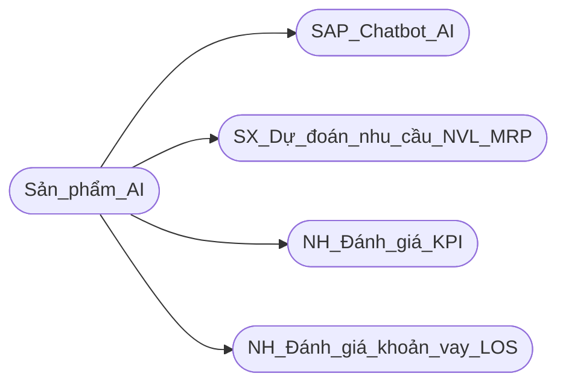

## Công ty cổ phần công nghệ FoxAI

   

# Nội dung
[1.Chiến lược phát triển 4 loại hình dịch vụ](#1.Chiến-lược-phát-triển-khối-sản-phẩm-AI-giai-đoạn-5-năm-tới)

[2.Tổng quan 4 giải pháp AI cho ngành sản xuất, ngân hàng](#2.Giới-thiệu-tổng-quan-4-giải-pháp-AI-cho-lĩnh-vực-sản-xuất,-ngân-hàng)

[2.1.Chatbot AI hỗ trợ khách hàng](#2.Giới-thiệu-tổng-quan-4-giải-pháp-AI-cho-lĩnh-vực-sản-xuất,-ngân-hàng)
    
[2.2.Hệ thống AI dự báo nhu cầu nguyên liệu MRP](#2.Giới-thiệu-tổng-quan-4-giải-pháp-AI-cho-lĩnh-vực-sản-xuất,-ngân-hàng)
    
[2.3.Hệ thống AI đánh giá KPI nhân viên ngân hàng](#2.Giới-thiệu-tổng-quan-4-giải-pháp-AI-cho-lĩnh-vực-sản-xuất,-ngân-hàng)
    
[2.4.Hệ thống AI đánh giá chất lượng khoản vay LOS](#2.Giới-thiệu-tổng-quan-4-giải-pháp-AI-cho-lĩnh-vực-sản-xuất,-ngân-hàng)

[3.Dự kiến kế hoạch tài chính](#3.Dự-kiến-kế-hoạch-tài-chính-5-năm-tới)

# 1.Chiến lược phát triển khối sản phẩm AI giai đoạn 5 năm tới

**1.1. Dịch vụ khảo sát, tư vấn lộ trình ứng dụng AI cho doanh nghiệp:**

* [Khảo sát, đánh giá nhu cầu và tư vấn lộ trình ứng dụng AI cho khách hàng](https://github.com/hoanglong8/FoxAI-Data-Analyst/blob/main/Chi%E1%BA%BFn%20l%C6%B0%E1%BB%A3c%20SP/A.1.1.D%E1%BB%8Bch%20v%E1%BB%A5%20kh%E1%BA%A3o%20s%C3%A1t%2C%20t%C6%B0%20v%E1%BA%A5n%20AI.md)

**1.2. Triển khai giải pháp AI localhost:**

* [Xây dựng và huấn luyện hệ thống AI self-host](https://github.com/hoanglong8/FoxAI-Data-Analyst/blob/main/Chi%E1%BA%BFn%20l%C6%B0%E1%BB%A3c%20SP/A.1.2.D%E1%BB%8Bch%20V%E1%BB%A5%3A%20X%C3%A2y%20D%E1%BB%B1ng%20H%E1%BB%87%20Th%E1%BB%91ng%20AI%20localhost.md) cho khách hàng có nhu cầu bảo mật dữ liệu ví dụ như sản xuất, tài chính ngân hàng...
* Một số giải pháp hiện nay:
    * PyTorch và Tensorflow để chạy các mô hình Machine Learning giúp phân loại và dự báo.
    * Llama, Open Assistant và Deepseek để xây dựng chatbot AI và trợ lý ảo.
    * OpenCV và YOLO để nhận diện và phân loại đối tượng trong xử lý hình ảnh Computer Vision.
    * Stable Diffusion và ComfyUI để tạo hình ảnh từ văn bản text2image.
    * ModelScope, CogVideo, DeepFloyd-IF để tạo video từ văn bản text2video.
    * EbSynth, Deforum Stable Diffusion, Pix2Video để tạo video từ hình ảnh image2video.
    * Apache Airflow, Prefect, Kedro, Luigi, N8N, Dify để tạo quy trình tự động auto-workflow.
    * Elevenlabs, Google TTS, Amazon Polly, Typecast giúp tạo audio từ text TTS.
    * Google STT, IBM Watson STT, AssemblyAI giúp tạo text từ audio STT.

**1.3. Triển khai giải pháp AI tích hợp sẵn:**

* [Ứng dụng và tích hợp hệ thống AI của bên thứ 3](https://github.com/hoanglong8/FoxAI-Data-Analyst/blob/main/Chi%E1%BA%BFn%20l%C6%B0%E1%BB%A3c%20SP/A.1.3.D%E1%BB%8Bch%20v%E1%BB%A5%3A%20Tri%E1%BB%83n%20khai%20AI%20t%C3%ADch%20h%E1%BB%A3p%20ho%E1%BA%B7c%20AI%20t%E1%BB%B1%20%C4%91%E1%BB%99ng.md) vào hệ thống phần mềm của khách hàng như SAP, ERP, Kế toán, Nhân sự, CRM, MRP... Trong đó ưu tiên xây dựng hệ thống Chatbot hỗ trợ sản phẩm SAP dùng cho đào tạo nội bộ FoxAI và chăm sóc khách hàng.
* Một số giải pháp hiện nay:
    * Chatbot và trợ lý ảo: ChatGPT của OpenAI, Gemini của Google, Claude, Heygen, D-id
    * Xử lý hình ảnh OCR: Google Vision, Adobe Acrobat, ABBYY FineReader
    * Dịch văn bản tự động: Google Translate API, Translate.io, DeepL Translator
    * Text2image: Midjourney, Dall-E,
    * Text2video: RunwayML, Pictory.ai
    * Image2video: RunwayML, Kling, DeepMotion
    * Auto-workflow: Make, Zapier, UiPath
    * Text2Speech: Coqui TTS, Mimic 3, Mozilla TTS, Applio, RVC
    * Speech2Text: Whisper, Vosk, Kaldi

**1.4. Dịch vụ đào tạo và hỗ trợ khách hàng ứng dụng AI hiệu quả:**

* [Đào tạo đội ngũ ban lãnh đạo, quản lý và nhân viên của khách hàng](https://github.com/hoanglong8/FoxAI-Data-Analyst/blob/main/Chi%E1%BA%BFn%20l%C6%B0%E1%BB%A3c%20SP/A.1.4.D%E1%BB%8Bch%20v%E1%BB%A5%3A%20%C4%90%C3%A0o%20t%E1%BA%A1o%20kh%C3%A1ch%20h%C3%A0ng%20s%E1%BB%AD%20d%E1%BB%A5ng%20AI.md) sử dụng công cụ AI để tăng hiệu quả công việc.

---

## 2.Giới thiệu tổng quan 4 giải pháp AI cho ngành sản xuất, ngân hàng

## 2.1. [Chatbot hỗ trợ khách hàng](https://fox.ai.vn/wp-content/uploads/2024/07/Logo_Original-1.png) sử dụng SAP

**a. Mục tiêu dự án**
- Hỗ trợ nhân viên trong việc sử dụng SAP:
   - Hướng dẫn thao tác trong các module của SAP như tài chính, bán hàng, quản lý kho.
   - Đưa ra câu trả lời nhanh cho các vướng mắc thường gặp.
- Tăng hiệu suất làm việc:
   - Tiết kiệm thời gian cho nhân viên bằng cách tự động hóa câu trả lời cho các vấn đề phổ biến.
   - Giảm khối lượng công việc cho đội ngũ IT hoặc bộ phận hỗ trợ của FoxAI.
- Nắm bắt số liệu tức thời:
   - Cho phép ban lãnh đạo truy xuất nhanh các số liệu quan trọng (doanh thu, chi phí, tồn kho) thông qua chatbot.

**b. Dữ liệu đầu vào cần thiết**
- Tài liệu hệ thống SAP:
   - Cấu trúc dữ liệu và tài liệu hướng dẫn của các module SAP đang sử dụng.
   - Danh sách quy trình công việc và các thao tác phổ biến.
- Câu hỏi thường gặp (FAQs):
   - Các câu hỏi và câu trả lời liên quan đến việc sử dụng SAP.
   - Dữ liệu từ các yêu cầu hỗ trợ trước đây.
- Số liệu vận hành thực tế:
   - Dữ liệu từ hệ thống SAP về tài chính, bán hàng, quản lý kho, nhân sự.
- Dữ liệu hội thoại:
   - Ghi nhận các yêu cầu và phản hồi từ nhân viên qua email, chat, hoặc các kênh hỗ trợ.

**c. Cơ sở hạ tầng**
- Hạ tầng máy chủ và lưu trữ:
   - **Cloud:** Sử dụng AWS, Microsoft Azure, hoặc Google Cloud để đảm bảo khả năng mở rộng.
   - **On-premises:** Nếu doanh nghiệp ưu tiên bảo mật cao, có thể sử dụng hạ tầng máy chủ tại chỗ.
- Hệ thống tích hợp:
   - **API Gateway:** Để kết nối chatbot với hệ thống SAP.
   - **Database:** Dữ liệu cấu trúc (SQL) và phi cấu trúc (NoSQL) để lưu trữ thông tin từ các hội thoại và phản hồi.
- AI và NLP:
   - **Ngôn ngữ:** Sử dụng các framework như Python (TensorFlow, PyTorch) hoặc sử dụng API có sẵn như OpenAI GPT.
   - **NLP Frameworks:** Google Dialogflow, Microsoft Bot Framework, hoặc Rasa để xử lý hội thoại.
- Hệ thống bảo mật:
   - Mã hóa dữ liệu và xác thực hai lớp (2FA) để đảm bảo an toàn cho dữ liệu SAP.
   - Quản lý quyền truy cập để bảo vệ dữ liệu nhạy cảm.

**d. Giao diện người dùng (UI/UX)**

- **Ban lãnh đạo xem Dashboard tức thời:**
    - Doanh thu theo thời gian thực.
    - Tồn kho theo loại hàng.
    - Chi phí vận hành hàng tháng.
    - Có thể truy cập qua web hoặc ứng dụng di động.
    - Cho phép lãnh đạo yêu cầu số liệu bằng lệnh thoại qua chatbot.
    
- **Đối với nhân viên sử dụng SAP:**
    - Tích hợp trên nền tảng Microsoft Teams, Slack, hoặc một ứng dụng nội bộ.
    - Giao diện đơn giản với các chức năng như hỏi đáp, hướng dẫn quy trình.
    - Hướng dẫn từng bước theo câu lệnh (step-by-step).
    - Gợi ý tự động (autocomplete) khi nhân viên đặt câu hỏi.

**e. Nguồn lực team sản xuất dự kiến:**

| **Vai trò**            | **Số lượng**     | **Nhiệm vụ**                                                                 |
|---------------------------|-------------------|------------------------------------------------------------------------------------|
| Giám đốc dự án (PM) | 1          | phụ trách kế hoạch & tiến độ triển khai. |
| Data Analyst | 1          | thu thập và xử lý dữ liệu từ SAP, ERP... |
| Kỹ sư (AI Engineers) | 1          | phát triển, tinh chỉnh mô hình NLP (Natural Language Processing) để chatbot hiểu tiếng Việt và các lệnh SAP. |
| Dev Backend | 1          | tích hợp với hệ thống SAP thông qua API, kết nối với các nền tảng (Teams, Slack, hoặc ứng dụng nội bộ). |
| Dev Frontend (UX/UI) | 1          | thiết kế giao diện chatbot thân thiện, trực quan và xây dựng dashboard cho ban lãnh đạo truy cập số liệu tức thời. |
| Kỹ sư hệ thống (DevOps) | 1          | đảm bảo hệ thống localhost vận hành ổn định, bảo mật.|

**f. Timeline triển khai**

| **Giai đoạn**            | **Thời gian**     | **Công việc chính**                                                                 |
|---------------------------|-------------------|------------------------------------------------------------------------------------|
| **Giai đoạn 1: Khảo sát nhu cầu** | 0,5 tháng           | - Phân tích nhu cầu doanh nghiệp, BLĐ và nhân viên.   - Xây dựng danh sách các chức năng cần thiết. |
| **Giai đoạn 2: Xử lý dữ liệu** | 0,5 tháng           | - Thu thập tài liệu và dữ liệu từ SAP.   - Làm sạch và chuẩn hóa dữ liệu.          |
| **Giai đoạn 3: Xây dựng chatbot** | 0,5-1 tháng           | - Xây dựng mô hình AI NLP để hiểu ngôn ngữ tự nhiên.   - Tích hợp API với SAP.   |
| **Giai đoạn 4: Thử nghiệm**     | 1 tháng           | - Triển khai thử nghiệm trên một nhóm nhỏ.   - Thu thập phản hồi và tối ưu hóa.   |
| **Giai đoạn 5: Triển khai chính thức** | 1 tháng           | - Đào tạo nhân viên sử dụng chatbot.   - Theo dõi hiệu quả và cập nhật định kỳ.   |

---

## 2.2. [Hệ thống dự đoán nhu cầu nguyên vật liệu (MRP)](https://fox.ai.vn/wp-content/uploads/2024/07/Logo_Original-1.png)

- Một số Case-study ứng dụng AI thành công:
    
    - Amazon: Sử dụng AI để quản lý chuỗi cung ứng và dự đoán nhu cầu sản phẩm, từ đó giúp tối ưu hóa việc lưu trữ và vận chuyển dựa trên dự đoán chính xác nhu cầu.
    
    - Toyota: Ứng dụng AI trong quản lý tồn kho và chuỗi cung ứng. Hệ thống AI phân tích dữ liệu thời gian thực từ nhà máy và nhà cung cấp để tối ưu hóa dòng nguyên vật liệu.
    
    - Coca-Cola: Dùng AI để dự đoán nhu cầu nguyên vật liệu dựa trên phân tích dữ liệu tiêu thụ sản phẩm và xu hướng thị trường.
    
    - Unilever: Kết hợp AI và Big Data để dự đoán nhu cầu sản phẩm và tối ưu hóa việc sản xuất theo khu vực.

**a. Mục tiêu dự án:**
  - Tối ưu hóa chuỗi cung ứng: Dự đoán chính xác nhu cầu nguyên vật liệu, giảm thiểu tồn kho và lãng phí.
  - Tăng hiệu quả hoạt động: Cải thiện quy trình lập kế hoạch sản xuất và đặt hàng nguyên liệu.
  - Giảm chi phí vận hành: Hạn chế tình trạng mua thừa hoặc thiếu nguyên vật liệu.

**b. Đối tượng khách hàng tiềm năng:**
  - Hạ tầng công nghệ: Có sẵn ERP, hệ thống quản lý kho (WMS), hoặc hệ thống quản lý sản xuất (MES) có đủ các dữ liệu lịch sử như đơn hàng, thông tin tồn kho, kế hoạch, tiến độ và chu kỳ sản xuất.
  - Nhân sự: Có đội ngũ IT hoặc sẵn sàng thuê ngoài triển khai.
  - Hạ tầng lưu trữ: Sử dụng cloud (AWS, Google Cloud, Azure) hoặc **hạ tầng tại chỗ (on-premises).**
 
**c. Dữ liệu đầu vào cần thiết:**
- Lịch sử sản xuất: Thông tin về sản lượng sản xuất theo thời gian.
- Lịch sử bán hàng: Số lượng hàng bán theo từng loại sản phẩm, theo mùa, hoặc theo thị trường.
- Tồn kho: Tồn kho nguyên vật liệu và thành phẩm.
- Thời gian giao hàng: Dữ liệu về thời gian giao hàng của các nhà cung cấp.
- Các yếu tố bên ngoài: Dữ liệu kinh tế vĩ mô (giá nguyên liệu, xu hướng thị trường), thời tiết (nếu liên quan đến nguyên liệu nông nghiệp), và sự kiện đặc biệt (dịch bệnh, chiến tranh thương mại).
- Dữ liệu nội bộ khác: Quy trình sản xuất, BOM (Bill of Materials), và vòng đời sản phẩm.

**d. Kiến trúc hệ thống**

**e. Nguồn lực team sản xuất dự kiến:**

| **Vai trò**            | **Số lượng**     | **Nhiệm vụ**                                                                 |
|---------------------------|-------------------|------------------------------------------------------------------------------------|
| Giám đốc dự án (PM) | 1          | phụ trách kế hoạch & tiến độ triển khai. |
| Data Analyst | 1          | thu thập và xử lý dữ liệu từ các hệ thống của KH. |
| Kỹ sư (AI Engineers) | 1          | dựng và tối ưu hóa mô hình ML, hồi quy (Regression) để dự đoán nhu cầu theo thời gian; xử lý ngôn ngữ tự nhiên (NLP) để phân tích dữ liệu từ email đặt hàng hoặc báo cáo. |
| Dev Backend | 1          | tích hợp với hệ thống SAP, ERP thông qua API. |
| Dev Frontend (UX/UI) | 1          | thiết kế bảng điều khiển. |
| Kỹ sư hệ thống (DevOps) | 1          | đảm bảo hệ thống localhost vận hành ổn định, bảo mật. |

**f. Timeline triển khai**

| **Giai đoạn**            | **Thời gian**     | **Công việc chính**                                                                 |
|---------------------------|-------------------|------------------------------------------------------------------------------------|
| **Giai đoạn 1: Khảo sát nhu cầu** | 0,5 tháng           | Team kinh doanh khảo sát, đánh giá KH & xúc tiến dự án |
| **Giai đoạn 2: Xử lý dữ liệu** | 0,5-1 tháng           | - Team SX thu thập tài liệu và dữ liệu từ SAP, ERP.   - Làm sạch và chuẩn hóa dữ liệu.          |
| **Giai đoạn 3: Xây dựng mô hình AI** | 0,5-1 tháng           | - Team SX phát triển mô hình AI, thử nghiệm trên dữ liệu lịch sử.      |
| **Giai đoạn 4: Thử nghiệm**     | 1 tháng           | - Tích hợp và chạy thử nghiệm trên 1 database REP.   - Thu thập phản hồi và tối ưu hóa.   |
| **Giai đoạn 5: Triển khai chính thức** | 1 tháng           | - Đào tạo đội ngũ sử dụng hệ thống.   - Theo dõi, tối ưu sau triển khai và chuyển sang bảo trì.   |

---

## 2.3. [Hệ thống AI phân loại và đánh giá KPI nhân viên](https://fox.ai.vn/wp-content/uploads/2024/07/Logo_Original-1.png) ngành ngân hàng, tài chính, bảo hiểm

**a. Mục tiêu dự án**
- Tăng cường hiệu quả đánh giá nhân viên:
   - Sử dụng AI để tự động hóa và tối ưu hóa việc phân tích KPI của nhân viên dựa trên dữ liệu hiệu suất.
   - Đảm bảo quá trình đánh giá công bằng, minh bạch, và dựa trên số liệu.
- Phát hiện và khuyến nghị cải thiện:
   - Xác định các nhân viên xuất sắc để khen thưởng.
   - Gợi ý các chương trình đào tạo phù hợp cho nhân viên cần cải thiện.
- Hỗ trợ quản lý nhân sự:
   - Giảm thời gian và công sức của quản lý trong việc đánh giá KPI.
   - Cung cấp báo cáo chi tiết để hỗ trợ ra quyết định.

**b. Dữ liệu đầu vào cần thiết**
- Dữ liệu hiệu suất nhân viên:
   - Doanh số (số hợp đồng ký kết, giá trị giao dịch).
   - Số lượng khách hàng được phục vụ hoặc tư vấn.
   - Tỷ lệ hoàn thành mục tiêu (OKR, KPI hàng tháng/quý/năm).
- Dữ liệu phản hồi:
   - Phản hồi từ khách hàng (Net Promoter Score, khảo sát).
   - Phản hồi từ đồng nghiệp và quản lý (360-degree feedback).
- Dữ liệu hành vi:
   - Dữ liệu log công việc (thời gian xử lý giao dịch, số lượng yêu cầu xử lý).
   - Tỷ lệ lỗi hoặc sai sót trong công việc.
- Dữ liệu nhân sự:
   - Kinh nghiệm làm việc, vị trí hiện tại, và lịch sử thăng tiến.
   - Chỉ số đào tạo và chứng chỉ đạt được.
- Yếu tố bên ngoài:
   - Thời gian trong năm (mùa vụ kinh doanh).
   - Kinh tế vĩ mô (lãi suất, thị trường tài chính).

**c. Cơ sở hạ tầng**
-Hạ tầng lưu trữ và xử lý dữ liệu:
   - **Cloud:** AWS, Azure, hoặc Google Cloud để lưu trữ và xử lý dữ liệu.
   - **Database:** Sử dụng cơ sở dữ liệu quan hệ (PostgreSQL, MySQL) và phi quan hệ (MongoDB) để lưu trữ dữ liệu nhân sự và KPI.
-Xử lý dữ liệu:
   - **Framework:** Apache Spark hoặc Hadoop để xử lý dữ liệu lớn.
   - **ETL Pipeline:** Xây dựng pipeline để tự động hóa quy trình thu thập, xử lý và truyền tải dữ liệu.
-Triển khai AI:
   - Sử dụng TensorFlow hoặc PyTorch để phát triển mô hình học máy.
   - Container hóa mô hình bằng Docker và triển khai trên Kubernetes.
-Bảo mật:
   - Mã hóa dữ liệu (AES-256) và xác thực người dùng hai lớp (2FA).
   - Phân quyền truy cập để đảm bảo dữ liệu nhạy cảm được bảo vệ.

**d. Giao diện người dùng (UI/UX)**
- Dashboard quản lý KPI:
   - Hiển thị các chỉ số chính: doanh số, tỷ lệ hoàn thành mục tiêu, phản hồi khách hàng.
   - Biểu đồ trực quan hóa như: thanh, tròn, dòng thời gian.
- Công cụ khuyến nghị:
   - Gợi ý đào tạo hoặc hành động cần thực hiện cho từng nhân viên.
   - Xếp hạng và phân loại nhân viên (Top Performers, Needs Improvement).
- Chế độ xem cá nhân hóa:
   - Nhân viên có thể xem chi tiết KPI của mình và các gợi ý cải thiện.
   - Quản lý có thể xem báo cáo nhóm và cá nhân.
- Tích hợp đa nền tảng:
   - Hỗ trợ trên web và ứng dụng di động để truy cập dễ dàng.
   - Tích hợp với hệ thống hiện tại như HRM (SAP SuccessFactors, Workday).

**e. Nguồn lực team sản xuất dự kiến**
| **Vai trò**               | **Số lượng** | **Nhiệm vụ chính**                                                              |
|---------------------------|--------------|---------------------------------------------------------------------------------|
| **Giám đốc dự án**        | 1            | Quản lý dự án, theo dõi tiến độ và ngân sách.                                  |
| **Chuyên gia dữ liệu**    | 2            | Thu thập, làm sạch và xử lý dữ liệu từ các hệ thống hiện có.                   |
| **Kỹ sư AI/ML**           | 2            | Phát triển và tinh chỉnh mô hình học máy để phân tích KPI.                     |
| **Kỹ sư phần mềm**        | 2            | Tích hợp mô hình AI với hệ thống nhân sự, xây dựng backend và API.             |
| **UX/UI Designer**        | 1            | Thiết kế giao diện trực quan cho dashboard và hệ thống báo cáo.                |
| **Chuyên gia nhân sự**    | 1            | Tư vấn về KPI và các yếu tố đánh giá nhân sự.                                  |
| **Nhân sự kiểm thử (QA)** | 1            | Kiểm thử hệ thống, đảm bảo tính chính xác và ổn định.                          |

**7. Timeline triển khai**

| **Giai đoạn**              | **Thời gian**    | **Nhân sự tham gia**                                                  |
|----------------------------|------------------|------------------------------------------------------------------------|
| **Giai đoạn 1: Lập kế hoạch**   | 1 tháng          | Giám đốc dự án, chuyên gia nhân sự                                    |
| **Giai đoạn 2: Thu thập dữ liệu** | 2 tháng          | Chuyên gia dữ liệu, chuyên gia nhân sự                                |
| **Giai đoạn 3: Phát triển AI**    | 3 tháng          | Kỹ sư AI/ML, chuyên gia dữ liệu                                       |
| **Giai đoạn 4: Xây dựng hệ thống**| 2 tháng          | Kỹ sư phần mềm, UX/UI Designer                                        |
| **Giai đoạn 5: Thử nghiệm**       | 2 tháng          | Nhân sự kiểm thử, giám đốc dự án, chuyên gia nhân sự                  |
| **Giai đoạn 6: Triển khai chính thức** | 1 tháng          | Tất cả các thành viên, đào tạo người dùng.                            |

---

## 2.4.[Hệ thống AI đánh giá chất lượng khoản vay (Loan Origination System - LOS)](https://fox.ai.vn/wp-content/uploads/2024/07/Logo_Original-1.png) cho ngành ngân hàng, tài chính, bảo hiểm

**a. Mục tiêu dự án**
- Tăng cường khả năng đánh giá khoản vay:
   - Sử dụng AI để tự động phân tích và đánh giá rủi ro của khoản vay dựa trên dữ liệu khách hàng.
   - Đảm bảo quyết định phê duyệt nhanh chóng và chính xác.
- Giảm thiểu rủi ro tín dụng:
   - Phát hiện và cảnh báo sớm các khoản vay có khả năng không đáp ứng tiêu chuẩn tín dụng.
- Tối ưu hóa quy trình phê duyệt:
   - Rút ngắn thời gian xử lý hồ sơ khoản vay, cải thiện trải nghiệm khách hàng.
- Hỗ trợ ra quyết định:
   - Cung cấp báo cáo chi tiết giúp ban lãnh đạo đánh giá chất lượng danh mục tín dụng.

**b. Dữ liệu đầu vào cần thiết**
- Dữ liệu khách hàng:
   - Thông tin cá nhân: Họ tên, tuổi, nghề nghiệp, tình trạng hôn nhân.
   - Lịch sử tín dụng: Điểm tín dụng, các khoản vay trước đây, tỷ lệ trả nợ đúng hạn.
   - Thu nhập và chi phí: Thu nhập hàng tháng, khoản chi tiêu cố định, tài sản sở hữu.
- Dữ liệu khoản vay:
   - Loại khoản vay (tín dụng cá nhân, vay mua nhà, vay kinh doanh).
   - Số tiền vay, kỳ hạn vay, và lãi suất.
   - Mục đích sử dụng khoản vay.
- Dữ liệu ngân hàng:
   - Lịch sử tài khoản của khách hàng: Số dư tài khoản, tần suất giao dịch.
   - Tỷ lệ nợ xấu hiện tại trong danh mục tín dụng.
- Yếu tố bên ngoài:
   - Thông tin kinh tế vĩ mô: Lãi suất thị trường, tỷ lệ thất nghiệp.
   - Các chính sách tín dụng hiện hành.
- Dữ liệu phản hồi:
   - Kết quả khoản vay trong quá khứ: Tỷ lệ hoàn trả, khoản vay quá hạn, hoặc nợ xấu.

**c. Cơ sở hạ tầng**
- Hạ tầng lưu trữ và xử lý dữ liệu:
   - **Cloud:** AWS, Microsoft Azure, hoặc Google Cloud để lưu trữ dữ liệu và xử lý khối lượng lớn.
   - **Database:** Sử dụng cơ sở dữ liệu quan hệ (PostgreSQL, Oracle) và phi quan hệ (MongoDB) để lưu trữ thông tin khách hàng và khoản vay.
- Xử lý dữ liệu:
   - **ETL (Extract, Transform, Load):** Tự động thu thập và làm sạch dữ liệu từ nhiều nguồn.
   - **Framework Big Data:** Apache Spark hoặc Hadoop để xử lý dữ liệu lớn.
- Triển khai AI:
   - **Mô hình:** Sử dụng thuật toán như Random Forest, Gradient Boosting (XGBoost), hoặc Neural Networks.
   - **Nền tảng AI/ML:** TensorFlow, PyTorch hoặc scikit-learn.
   - **Triển khai mô hình:** Container hóa với Docker và triển khai trên Kubernetes.
- Bảo mật:
   - Mã hóa dữ liệu (AES-256) và xác thực hai lớp (2FA).
   - Phân quyền truy cập và giám sát an ninh mạng.

**d. Giao diện người dùng (UI/UX)**
- Dashboard quản lý khoản vay:
   - Hiển thị chất lượng danh mục tín dụng: tỷ lệ nợ xấu, khoản vay theo loại, và tỷ lệ hoàn trả.
   - Cảnh báo sớm các khoản vay có rủi ro cao.
- Chi tiết khoản vay:
   - Phân tích rủi ro cụ thể cho từng hồ sơ: điểm tín dụng, lịch sử tài chính, và tỷ lệ thu nhập/nợ.
   - Đề xuất phê duyệt, từ chối, hoặc yêu cầu bổ sung thông tin.
- Báo cáo và phân tích:
   - Cung cấp biểu đồ trực quan: xu hướng tỷ lệ nợ xấu, tỷ lệ phê duyệt theo thời gian.
   - Tùy chỉnh báo cáo theo chi nhánh hoặc danh mục.
- Chế độ xem cá nhân hóa:
   - Quản lý có thể xem toàn cảnh danh mục tín dụng.
   - Nhân viên tín dụng có quyền truy cập chi tiết khoản vay theo khách hàng.

**e. Nguồn lực team sản xuất dự kiến**
| **Vai trò**               | **Số lượng** | **Nhiệm vụ chính**                                                              |
|---------------------------|--------------|---------------------------------------------------------------------------------|
| **Giám đốc dự án**        | 1            | Quản lý dự án, đảm bảo tiến độ và ngân sách.                                   |
| **Chuyên gia dữ liệu**    | 2            | Thu thập, xử lý và phân tích dữ liệu khách hàng và khoản vay.                  |
| **Kỹ sư AI/ML**           | 2            | Phát triển và tối ưu mô hình học máy để đánh giá chất lượng khoản vay.         |
| **Kỹ sư phần mềm**        | 2            | Tích hợp mô hình AI với hệ thống LOS và xây dựng API.                          |
| **UX/UI Designer**        | 1            | Thiết kế giao diện người dùng thân thiện và trực quan.                         |
| **Chuyên gia tín dụng**   | 1            | Xác định các tiêu chí rủi ro và hỗ trợ đánh giá chất lượng đầu ra.             |
| **Nhân sự kiểm thử (QA)** | 1            | Kiểm thử hệ thống, đảm bảo tính chính xác và ổn định.                         |

**f. Timeline triển khai**

| **Giai đoạn**              | **Thời gian**    | **Nhân sự tham gia**                                                  |
|----------------------------|------------------|------------------------------------------------------------------------|
| **Giai đoạn 1: Lập kế hoạch**   | 1 tháng          | Giám đốc dự án, chuyên gia tín dụng                                   |
| **Giai đoạn 2: Thu thập dữ liệu** | 2 tháng          | Chuyên gia dữ liệu, chuyên gia tín dụng                               |
| **Giai đoạn 3: Phát triển AI**    | 3 tháng          | Kỹ sư AI/ML, chuyên gia dữ liệu                                       |
| **Giai đoạn 4: Xây dựng hệ thống**| 2 tháng          | Kỹ sư phần mềm, UX/UI Designer                                        |
| **Giai đoạn 5: Thử nghiệm**       | 2 tháng          | Nhân sự kiểm thử, giám đốc dự án, chuyên gia tín dụng                 |
| **Giai đoạn 6: Triển khai chính thức** | 1 tháng          | Tất cả các thành viên, đào tạo người dùng.                            |

**g. Lợi ích kỳ vọng**

- **Tăng tốc độ phê duyệt:** Rút ngắn thời gian xử lý hồ sơ khoản vay xuống 30-50%.
    
- **Giảm thiểu rủi ro tín dụng:** Cảnh báo sớm các khoản vay không đạt tiêu chuẩn.

- **Tăng hiệu suất làm việc:** Tự động hóa quy trình đánh giá, giảm áp lực cho nhân viên tín dụng.

- **Hỗ trợ ra quyết định:** Cung cấp dữ liệu và báo cáo chi tiết giúp lãnh đạo quản lý danh mục tín dụng hiệu quả hơn.

---

# 3.Dự kiến kế hoạch tài chính 5 năm tới

## 3.1. Giả định
- **Doanh thu dự kiến:** Tổng doanh thu từ cả 4 gói sản phẩm.
- **Chi phí vận hành:** Dự kiến khoảng 60% tổng doanh thu (bao gồm nhân sự, công nghệ, marketing, vận hành).
- **Lợi nhuận:** 40% tổng doanh thu (sau chi phí).
- **Tăng trưởng khách hàng hàng năm:** Trung bình 20%/năm.
- **Số lượng nhân sự cần thiết:** Tăng tương ứng với quy mô khách hàng (1 nhân sự quản lý 3-5 khách hàng).

## 3.2. Các gói sản phẩm và giá bán dự kiến
| **Gói sản phẩm**                           | **Giá trung bình/dự án (VNĐ)** |
|-------------------------------------------|--------------------------------|
| Dịch vụ tư vấn, khảo sát AI              | 50-100 triệu                |
| Giải pháp AI localhost tùy chỉnh         | 1,5 tỷ                        |
| Giải pháp AI tích hợp sẵn           | 1 tỷ                          |
| Dịch vụ đào tạo và hỗ trợ AI                    | 100-150 triệu                      |

## 3.3.Giả định ban đầu (Năm 2025)
- **Khách hàng mục tiêu:** 10 khách hàng.
  - 3 khách hàng mua gói **Dịch vụ đào tạo AI**: 3 x 100 triệu = **300 triệu VNĐ**.
  - 3 khách hàng mua gói **Dịch vụ tư vấn khảo sát AI**: 3 x 50 triệu = **150 triệu VNĐ**.
  - 2 khách hàng mua gói **AI localhost tùy chỉnh**: 2 x 1,5 tỷ = **3 tỷ VNĐ**.
  - 2 khách hàng mua gói **AI tích hợp sẵn**: 2 x 1 tỷ = **2 tỷ VNĐ**.
- **Doanh thu năm 2025:** **5,45 tỷ VNĐ**.
- **Chi phí vận hành (60%):** **3,27 tỷ VNĐ**.
- **Lợi nhuận (40%):** **2,18 tỷ VNĐ**.
- **Nhân sự triển khai dự kiến:** **3 nhân sự** (chưa tính team KD và team SX).

## 3.4.Tổng hợp mục tiêu 5 năm
| Năm      | Số khách hàng | Doanh thu (VNĐ) | Chi phí vận hành (VNĐ) | Lợi nhuận (VNĐ) | Nhân sự triển khai |
|----------|---------------|------------------|-------------------------|------------------|-------------------|
| **2025** | 10            | 5,45 tỷ         | 3,27 tỷ                | 2,18 tỷ         | 3                 |
| **2026** | 12            | 6,54 tỷ         | 3,92 tỷ                | 2,62 tỷ         | 4               |
| **2027** | 14            | 7,85 tỷ         | 4,71 tỷ                | 3,14 tỷ         | 5                 |
| **2028** | 17            | 9,42 tỷ         | 5,65 tỷ                | 3,77 tỷ         | 6               |
| **2029** | 21            | 11,31 tỷ        | 6,79 tỷ                | 4,52 tỷ         | 7                 |

## **Chiến lược tổng thể**
1. **Tăng trưởng khách hàng:** Đạt mức tăng trưởng đều đặn 20% mỗi năm thông qua các chiến lược marketing, quan hệ đối tác và chất lượng dịch vụ.
2. **Tối ưu hóa chi phí:** Đầu tư vào công nghệ tự động hóa và cải thiện quy trình vận hành để duy trì tỷ lệ chi phí/doanh thu.
3. **Phát triển nhân sự:** Tuyển dụng và đào tạo đội ngũ nhân sự đáp ứng tốc độ tăng trưởng khách hàng.
4. **Mở rộng thị trường:** Tập trung vào ngân hàng và các ngành tài chính khác để mở rộng cơ hội doanh thu.
5. **Đầu tư vào R&D:** Phát triển các gói dịch vụ AI mới để giữ vững vị thế cạnh tranh trên thị trường.

