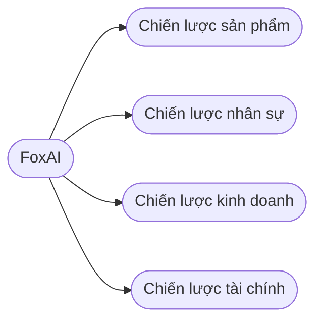
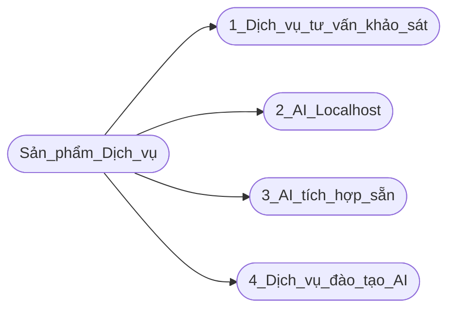
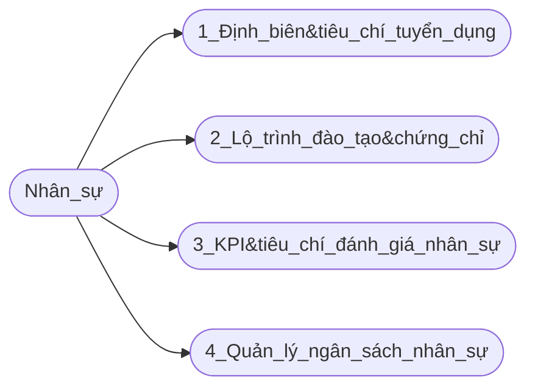
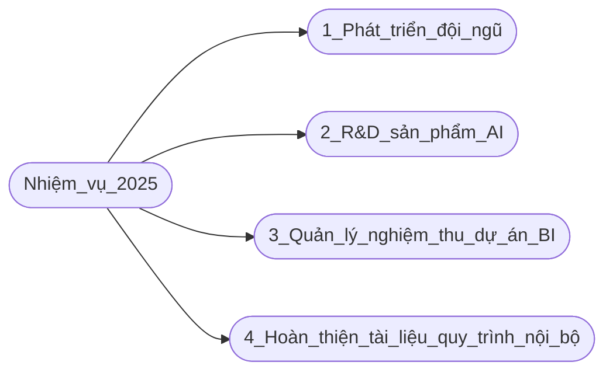

## Công ty cổ phần công nghệ FoxAI

 
 
 

# Dự thảo chiến lược phát triển sản phẩm khối AI trong giai đoạn 2025-2029

Trong nội dung này, tôi sẽ trình bày 2 chiến lược là sản phẩm, nhân sự. Nội dung thứ 3 là nhiệm vụ cụ thể của Trưởng phòng Data Analyst trong năm 2025.

## A.[Chiến lược phát triển sản phẩm, dịch vụ AI](https://github.com/hoanglong8/FoxAI-Data-Analyst/blob/main/Chi%E1%BA%BFn%20l%C6%B0%E1%BB%A3c%20SP/A.Chi%E1%BA%BFn%20l%C6%B0%E1%BB%A3c%20ph%C3%A1t%20tri%E1%BB%83n%20s%E1%BA%A3n%20ph%E1%BA%A9m%20AI.md)

## B.[Chiến lược phát triển nhân sự khối AI](https://github.com/hoanglong8/FoxAI-Data-Analyst/blob/main/Chi%E1%BA%BFn%20l%C6%B0%E1%BB%A3c%20NS/B.Chi%E1%BA%BFn%20l%C6%B0%E1%BB%A3c%20ph%C3%A1t%20tri%E1%BB%83n%20%C4%91%E1%BB%99i%20ng%C5%A9.md)

## C.[Nhiệm vụ mục tiêu](https://github.com/hoanglong8/FoxAI-Data-Analyst/blob/main/docs/C.KPI%20d%E1%BB%B1%20ki%E1%BA%BFn%20-%20Tr%C6%B0%E1%BB%9Fng%20ph%C3%B2ng%20Data%20Analyst.md) của trưởng phòng Data Analyst năm 2025:

