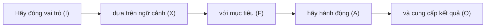

# Kỹ thuật Prompt Engineering để tối ưu hóa phản hồi trên các mô hình ngôn ngữ lớn LLM

## Nội dung

1.[Prompt và cơ chế nhận diện - phản hồi của LLM](https://github.com/hoanglong8/FoxAI-Data-Analyst/edit/main/D%E1%BB%B1%20%C3%A1n%20Chatbot%20FoxAI/%5BFoxAI%5D%20Prompt%20Engineer.md)

2.[Cấu trúc của 1 prompt đầy đủ](https://github.com/hoanglong8/FoxAI-Data-Analyst/edit/main/D%E1%BB%B1%20%C3%A1n%20Chatbot%20FoxAI/%5BFoxAI%5D%20Prompt%20Engineer.md)

3.[Nguồn tham khảo ví dụ prompt theo từng ngành](https://github.com/hoanglong8/FoxAI-Data-Analyst/edit/main/D%E1%BB%B1%20%C3%A1n%20Chatbot%20FoxAI/%5BFoxAI%5D%20Prompt%20Engineer.md)

4.[Thực hành với Chatbot FoxAI](https://github.com/hoanglong8/FoxAI-Data-Analyst/edit/main/D%E1%BB%B1%20%C3%A1n%20Chatbot%20FoxAI/%5BFoxAI%5D%20Prompt%20Engineer.md)

## 1.Prompt và các khái niệm liên quan (token, temperature...)

### 1.1. Khái niệm Prompt

Prompt là lời nhắc, câu lệnh hoặc câu hỏi mà người dùng nhập vào để tương tác với mô hình ngôn ngữ lớn (LLM - Large Language Model) như ChatGPT. Nói cách khác, prompt là cách bạn hướng dẫn AI để nhận được câu trả lời mong muốn.

Ví dụ:

    * 👉 Prompt đơn giản: "Hãy giải thích khái niệm AI là gì?"
    * 👉 Prompt nâng cao: "Hãy giải thích AI theo cách dễ hiểu cho một học sinh lớp 10, sử dụng ví dụ thực tế."
    * 💡 Lưu ý: Cùng một câu hỏi, nhưng cách đặt prompt khác nhau có thể dẫn đến các câu trả lời hoàn toàn khác!

### 1.2. Cơ chế LLMs nhận diện và phản hồi Prompt

Mô hình ngôn ngữ như ChatGPT hoạt động dựa trên dự đoán `từ tiếp theo`, khi người dùng đưa ra 1 prompt thì quá trình LLM phản hồi sẽ trải qua `6 bước`, chúng ta cùng xem 1 ví dụ như sau:

👉 Giả sử chúng ta có 1 Chatbot FoxAI chuyên hỗ trợ **Tư vấn triển khai phần mềm SAP**, và người dùng nhập `prompt` sau vào hệ thống:

`"Trong quá trình triển khai SAP Business One, một trong những bước quan trọng nhất là thiết lập..."`

🔹 **Bước 1: Nhận diện và chia Prompt thành Token**

Token - đơn vị nhỏ nhất mà mô hình hiểu được như từ, dấu câu...

| Token    | Từ gốc   |
|----------|---------|
| Trong    | Trong   |
| quá      | quá     |
| trình    | trình   |
| triển    | triển   |
| khai     | khai    |
|...|...|
| thiết    | thiết   |
| lập      | lập     |
| ...      | (từ cần đoán) |

🔹 **Bước 2: Xác định ngữ cảnh và trọng số của các từ liên quan**

- Mô hình sẽ nhìn vào **toàn bộ ngữ cảnh trước đó** để hiểu nội dung của câu.
- Các keyword quan trọng như **"triển khai", "SAP Business One", "bước quan trọng", "thiết lập"** sẽ có **trọng số cao hơn**, vì chúng giúp xác định từ tiếp theo hợp lý nhất.
- Xác định **loại yêu cầu**: tìm kiếm thông tin, tóm tắt, giải thích, sáng tạo, v.v..

📌 Nếu prompt thiếu `ngữ cảnh`, mô hình có thể đoán sai hoặc đưa ra câu trả lời không mong muốn.

Ví dụ:

    * ❌ "Tóm tắt bài viết." → Quá mơ hồ, AI không biết bài viết nào.
    * ✅ "Tóm tắt bài viết về trí tuệ nhân tạo trong 100 từ." → Rõ ràng hơn.

LLM sử dụng bộ nhớ ngữ cảnh (Context Window) để nhớ nội dung trong `cuộc trò chuyện trước đó` => Trước khi đưa ra `yêu cầu`, hãy hỏi về các `bài viết`, `công trình nghiên cứu` và `tổ chức uy tín` liên quan đến lĩnh vực muốn hỏi để tạo `ngữ cảnh`.

    ChatGPT-4 có thể ghi nhớ khoảng 8.000 token (~6.000 từ), GPT-4 Turbo có thể lên đến 128.000 token.

📌 Lưu ý: Nếu prompt quá dài và vượt quá giới hạn token, mô hình có thể "quên" thông tin ban đầu.

🔹 **Bước 3: Tính toán xác suất cho các từ tiếp theo**

Mô hình sẽ xem xét hàng triệu câu từ dữ liệu đã được huấn luyện để **dự đoán các từ tiếp theo với xác suất tương ứng** như sau:

| **Từ dự đoán**    | **Xác suất (%)** |
|------------------|----------------|
| **cấu hình**    | 35%            |
| **tài khoản**   | 20%            |
| **cơ sở dữ liệu** | 15%           |
| **người dùng**  | 10%            |
| **quyền hạn**   | 7%             |
| **môi trường**  | 5%             |
| **báo cáo**     | 3%             |
| **khác**        | 5%             |


🔹 **Bước 4: Chọn từ có xác suất cao nhất để tạo phản hồi**

Mô hình thường chọn từ **"cấu hình"** vì có xác suất cao nhất (35%).

👉 Câu được hoàn thiện thành:  
`"Trong quá trình triển khai SAP Business One, một trong những bước quan trọng nhất là thiết lập cấu hình"`

🔹 **Bước 5: Tiếp tục dự đoán từ tiếp theo**

Sau khi đã điền từ "cấu hình", mô hình tiếp tục đoán từ tiếp theo:

| **Từ dự đoán**    | **Xác suất (%)** |
|------------------|----------------|
| **hệ thống**    | 40%            |
| **ban đầu**   | 25%            |
| **tài khoản** | 15%           |
| **dữ liệu**  | 10%            |
| **người dùng**   | 10%             |

👉 Mô hình có thể tiếp tục hoàn thiện câu thành:  
`"Trong quá trình triển khai SAP Business One, một trong những bước quan trọng nhất là thiết lập cấu hình hệ thống."`

LLM tiếp tục **lặp lại quá trình này** để tạo ra văn bản hợp lý và chỉ dừng lại khi đủ `max token output` hoặc gặp dấu hiệu `stop`.

[DeepSeek R1](https://www.together.ai/models/deepseek-r1)


🔹 **Bước 6: Kiểm tra và tối ưu hóa phản hồi**

Sau khi tạo phản hồi, LLM sẽ kiểm tra:
* Có lỗi logic không?
* Có phù hợp với prompt không?
* Có vi phạm chính sách không?
* Mô hình có thể điều chỉnh lại câu trả lời bằng cách tùy chỉnh `Temperature, Top-k, Top-p...`


* **Temperature:** Quyết định mức độ sáng tạo và tính ngẫu nhiên của mô hình (t = 0 là logic, không sáng tạo; t = 2 là sáng tạo tối đa).

* **Max token output:** Giới hạn số token đầu ra tối đa cho 1 lần phản hồi để tránh ảnh hưởng tới hệ thống, thường từ 5.000 - 8.000 token (khoảng 4.000-6.000 từ tiếng Việt).

* **Top-p:** Giới hạn `rổ từ để đoán` về mặt `tổng xác suất`, p càng cao thì rổ từ để lựa chọn càng nhiều, câu văn càng đa dạng, sáng tạo. Thông thường p=0,95.

* **Top-k:** Giới hạn `rổ từ để đoán` về mặt `số lượng`, k thường để mặc định từ 40-50 lựa chọn cho từ tiếp theo.

* **stop:** Phản hồi của mô hình sẽ dừng lại khi gặp ký tự nào, ví dụ: dấu kết thúc câu `<｜end▁of▁sentence｜>`.

* **role:** Vai trò của mô hình, ví dụ `bạn đóng vai trò là 1 chuyên gia về lĩnh vực ...`

* **stream=True:** Phản hồi được viết ra liên tục giống như đang có người gõ chữ.

## 2. Viết prompt đủ cấu trúc là cách tốt nhất để tối ưu phản hồi


Có thể sử dụng công thức **FOXAI** để viết Prompt hiệu quả:

🔹 **F - Focus (Mục tiêu):** Xác định rõ ràng mục đích của mình (tôi muốn làm gì, viết cho đối tượng nào, phong cách viết...)

🔹 **O - Output (Đầu ra):** Xác định dạng kết quả mong muốn (bài viết, danh sách, bảng biểu, code, độ dài ký tự...)

🔹 **X - Context (Ngữ cảnh):** Cung cấp thông tin nền để AI hiểu rõ (bạn là ai, bạn đang ở đâu, bạn có gì...)

🔹 **A - Action (Hành động):** Chỉ định AI thực hiện điều gì cụ thể (tìm kiếm thông tin - facts, sáng tạo - creative, phân tích - analyst, liệt kê, tư vấn, dự báo, tóm tắt, tổng hợp, dịch thuật...)

🔹 **I - Identity (Vai trò):** Chỉ định AI đóng vai trò nào (chuyên gia, nhà tư vấn, giảng viên...)

👉 Công thức viết prompt theo FOXAI:



`"Hãy đóng vai trò [I], dựa trên ngữ cảnh [X] với mục tiêu [F], hãy hành động [A] và cung cấp kết quả [O]."`

💡 Ví dụ 1:
"Hãy đóng vai trò là **một chuyên gia SAP B1 (I)**, hãy **viết (A)** tài liệu hướng dẫn cài đặt SAP dưới **dạng danh sách từng bước (O)**, dành cho **quản trị viên IT (F)** của **công ty sản xuất quy mô vừa đang sử dụng SQL (X)**"

💡 Ví dụ 2:
```
📌 **F-Focus (Mục tiêu):** Viết hướng dẫn triển khai SAP Business One cho doanh nghiệp bán lẻ.  
🎭 **O-Output (Đầu ra):** Nội dung dài khoảng 500 từ, dễ hiểu, trình bày dưới dạng checklist.
📖 **X-Context (Ngữ cảnh):** Công ty có 3 kho hàng, sử dụng nền tảng Microsoft SQL Server.  
✍️ **A-Action (Hành động):** Hướng dẫn cần trình bày theo từng bước, bao gồm cả các lỗi thường gặp.  
📜 **I-Identity (Vai trò):** Bạn là chuyên gia tư vấn SAP Business One với 10 năm kinh nghiệm.  
```

## 3.Tham khảo một số prompt mẫu

1.[Vidtools.online](https://vidtools.online/prompt/?fbclid=IwY2xjawH52xNleHRuA2FlbQIxMAABHQmUnsLgM-KtlYNExUHshjohNp7ldi_waccPqsetSl14KGrD4tP5HgdQLg_aem__6ueV2_du0xoyIEVOOC-IA)

Lĩnh vực marketing - bán hàng
```
Vui lòng cung cấp danh sách chi tiết các tiêu đề quảng cáo sáng tạo sẽ thu hút sự chú ý trên phương tiện truyền thông xã hội cho sản phẩm [[TÊN SẢN PHẨM]]. Hãy cân nhắc đến đối tượng mục tiêu [[ĐỐI TƯỢNG MỤC TIÊU]], xu hướng hiện tại [[XU HƯỚNG HIỆN TẠI]] và các điểm bán hàng độc đáo của sản phẩm [[ĐIỂM BÁN HÀNG ĐỘC ĐÁO]]. Các tiêu đề phải hấp dẫn, sáng tạo và phù hợp với các nền tảng như Facebook, Instagram hoặc Twitter. Bao gồm một lời giải thích ngắn gọn cho mỗi tiêu đề về lý do tại sao nó sẽ có hiệu quả trong việc thu hút sự quan tâm của đối tượng.
```
```
Tạo chiến dịch thương mại điện tử cho sản phẩm A của thương hiệu B – đây là một thương hiệu mới được đẩy lên trên thương mại điện tử. Bạn hãy đề xuất các biện pháp phù hợp để xây dựng chiến dịch, bao gồm các chiến lược tăng nhận thức về thương hiệu, thu hút khách hàng tiềm năng, và tạo niềm tin từ người tiêu dùng. Các biện pháp có thể bao gồm: tối ưu hóa trang sản phẩm trên các nền tảng thương mại điện tử, sử dụng quảng cáo trả tiền (PPC), tiếp thị qua mạng xã hội, các chương trình khuyến mãi, và xây dựng các chương trình khách hàng thân thiết để thúc đẩy doanh số bán hàng.
```
```
Gợi ý cho tôi [số] biện pháp hiệu quả để thu hút nhóm đối tượng khách hàng tiềm năng cho sản phẩm A. Mỗi biện pháp nên được mô tả chi tiết, bao gồm cách thức triển khai và lý do tại sao nó phù hợp với nhóm đối tượng mục tiêu. Các biện pháp cần sáng tạo và dễ áp dụng, từ chiến lược marketing trực tuyến đến các hoạt động quảng bá ngoại tuyến, nhằm tối ưu hóa sự thu hút và tăng khả năng chuyển đổi khách hàng.
```
```
Nghiên cứu chân dung khách hàng phù hợp với sản phẩm A. Bạn cần xác định các đặc điểm chính của khách hàng tiềm năng bao gồm độ tuổi, giới tính, thu nhập, sở thích, thói quen mua sắm, và các yếu tố tâm lý ảnh hưởng đến quyết định mua hàng. Nghiên cứu cũng cần đề xuất các kênh marketing và thông điệp phù hợp để tiếp cận nhóm khách hàng này hiệu quả nhất. Từ đó, xây dựng các chiến lược tiếp thị nhắm đến đối tượng mục tiêu, nhằm tối ưu hóa khả năng chuyển đổi và tăng trưởng doanh số.
```

2.[Prompts.chat](https://prompts.chat/)

## 4.Thực hành với Chatbot FoxAI

Tài liệu [Chatbot FoxAI](https://github.com/hoanglong8/FoxAI-Data-Analyst/blob/main/D%E1%BB%B1%20%C3%A1n%20Chatbot%20FoxAI/K%E1%BA%BF%20ho%E1%BA%A1ch%20Chatbot%20FoxAI.md)

Thông tin tài khoản ChatGPT chung của FoxAI:
```
Tài khoản ChatGPT dùng chung: congtycophan001@gmail.com
Pass: Fox@12345678
```

