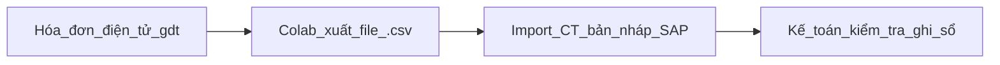

# Hướng Dẫn Xuất Danh Sách Hóa Đơn Mua hàng Từ gdt.gov.vn Sang .csv Để Import Vào SAP

## 1. Chuẩn Bị
- Yêu cầu có tài khoản truy cập vào **gdt.gov.vn**.
- Trình duyệt web (**Chrome, Firefox**).
- Phần mềm hỗ trợ đọc và chỉnh sửa file `.csv` hoặc `.txt ` (**Excel, Notepad++, VS Code**).
- SAP Business One Workben có hỗ trợ import hóa đơn.

## 2. Hướng Dẫn Xuất Danh Sách Hóa Đơn Trên gdt.gov.vn
### 2.1. Đăng Nhập Hệ Thống
- Truy cập **[https://hoadondientu.gdt.gov.vn](https://hoadondientu.gdt.gov.vn)**.
- Đăng nhập bằng **Tài khoản MST** hoặc **Chữ ký số**.

### 2.2. Truy Vấn Danh Sách Hóa Đơn
- Vào menu **Quản lý hóa đơn** → **Tra cứu hóa đơn**.
- Chọn **Khoảng thời gian** cần xuất dữ liệu.
- Lọc hóa đơn theo các tiêu chí (**MST người bán, trạng thái hóa đơn, loại hóa đơn**).

### 2.3. Xuất Dữ Liệu Hóa Đơn
- Nhấn ... copy link...
- Lưu file trên máy tính dưới dạng `.csv` hoặc `.txt`.
- Chọn **Encoding: UTF-8** để tránh lỗi font tiếng Việt.

## 3. Import Danh Sách Hóa Đơn Vào SAP
### 3.1. Kiểm Tra Cấu Trúc File CSV Đúng Chuẩn
- File CSV Headers cần có các cột:
  1. Số hóa đơn
  2. Ngày hóa đơn
  3. MST người bán
  4. ...
- File CSV Details cần có các cột:
  1. Mã hàng
  2. Tổng tiền
  3. Thuế GTGT
  4. Mô tả sản phẩm/dịch vụ
  5. ...

### 3.2. Import Dữ Liệu Vào SAP Business One
- Cài đặt Workben...
- Chọn **File CSV** và nhập giả lập để kiểm tra lỗi
  - Dữ liệu bị sai định dạng số, ngày tháng.
  - Thiếu hoặc dư cột dữ liệu.
  - Lỗi trùng số hóa đơn đã tồn tại trong SAP.

## 4. Phụ Lục
- 02 Mẫu file CSV đúng chuẩn để import vào SAP.
- 01 Mẫu file Excel gốc từ gdt.gov.vn.

