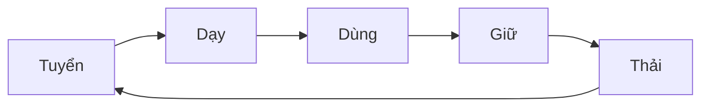

# Quản lý công tác nhân sự của Phòng Data Analyst

## 1.Công tác Tuyển dụng
- Kế hoạch tuyển dụng
- Mô tả công việc JDs [tại đây](https://github.com/hoanglong8/FoxAI-Data-Analyst/blob/main/FoxAI%20-%20Qu%E1%BA%A3n%20l%C3%BD%20Nh%C3%A2n%20s%E1%BB%B1/1.C%C3%B4ng%20t%C3%A1c%20Tuy%E1%BB%83n%20d%E1%BB%A5ng%20%26%20JD.md)
- Bộ câu hỏi phỏng vấn tại đây

## 2.Công tác Đào tạo
- Kế hoạch đào tạo học việc
- Kế hoạch đào tạo thử việc
- Kế hoạch đào tạo đội ngũ chính thức
- Tài liệu đào tạo tại đây

## 3.Phân công công việc và quản lý tiến độ, chất lượng công việc

## 4.Công tác Đánh giá nhân sự

## 5.Công tác hành chính khác

### 5.1.Chấm công
Bảng chấm công hàng tuần [tại đây](https://docs.google.com/spreadsheets/d/10i4sFlOOz-D13WCeTfPkgnDDwdMlKbjK7mEapQZR_DE/edit?usp=sharing)
