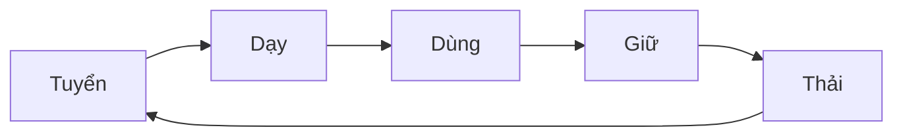

# Quản lý công tác nhân sự của Phòng Data Analyst

## 1.Công tác Tuyển dụng
- Kế hoạch tuyển dụng
- Mô tả công việc JDs [tại đây](https://github.com/hoanglong8/FoxAI-Data-Analyst/blob/main/FoxAI%20-%20Qu%E1%BA%A3n%20l%C3%BD%20Nh%C3%A2n%20s%E1%BB%B1/1.C%C3%B4ng%20t%C3%A1c%20Tuy%E1%BB%83n%20d%E1%BB%A5ng%20%26%20JD.md)
- Bộ câu hỏi phỏng vấn [tại đây](https://github.com/hoanglong8/FoxAI-Data-Analyst/blob/main/FoxAI%20-%20Qu%E1%BA%A3n%20l%C3%BD%20Nh%C3%A2n%20s%E1%BB%B1/1.1.B%E1%BB%99%20c%C3%A2u%20h%E1%BB%8Fi%20ph%E1%BB%8Fng%20v%E1%BA%A5n%20Data%20Analyst.md)

## 2.Công tác Đào tạo
- Kế hoạch đào tạo học việc
- Kế hoạch đào tạo thử việc
- Kế hoạch đào tạo nhân sự chính thức
- Tài liệu Data Science [tại đây](https://github.com/hoanglong8/Document-Data-science)
- Tài liệu sử dụng trong các khóa đào tạo [tại đây](https://github.com/hoanglong8/FoxAI-Data-Analyst/blob/main/FoxAI%20-%20Qu%E1%BA%A3n%20l%C3%BD%20Nh%C3%A2n%20s%E1%BB%B1/2.C%C3%B4ng%20t%C3%A1c%20%C4%91%C3%A0o%20t%E1%BA%A1o%20-%20Ch%E1%BB%A9ng%20ch%E1%BB%89%20%C4%91%E1%BA%A7u%20ra.md)

## 3.Phân công công việc và quản lý tiến độ, chất lượng công việc
- Biên bản họp giao ban hàng tuần của Trung tâm Sản xuất [tại GitHub Pages](https://github.com/hoanglong8/FoxAI-SEO-AI/blob/main/README.md)
- Phân công công việc, nhận việc, phản hồi liên quan đến các dự án [tại GitHub Projects](https://github.com/hoanglong8/FoxAI-Data-Analyst/projects?query=is%3Aopen)
- Quản lý danh sách công việc [tại GitHub Issues](https://github.com/hoanglong8/FoxAI-Data-Analyst/issues)
- Quản lý tài liệu, biên bản nghiệm thu dự án [tại Sharepoint](https://foxai.sharepoint.com/sites/TaiLieuTTSXFoxAI/Shared%20Documents/Forms/AllItems.aspx) và tài liệu kỹ thuật [tại GitHub Code](https://github.com/hoanglong8/FoxAI-Data-Analyst)

## 4.Công tác Đánh giá nhân sự
- Kế hoạch và chỉ tiêu KPI công ty giao
- Quy tắc và tài liệu đánh giá KPI [tại đây](https://github.com/hoanglong8/FoxAI-Data-Analyst/blob/main/FoxAI%20-%20Qu%E1%BA%A3n%20l%C3%BD%20Nh%C3%A2n%20s%E1%BB%B1/3.C%C3%B4ng%20t%C3%A1c%20%C4%91%C3%A1nh%20gi%C3%A1%20NS.md)

## 5.Công tác hành chính khác

### 5.1.Chấm công
Bảng chấm công hàng tuần [tại đây](https://docs.google.com/spreadsheets/d/10i4sFlOOz-D13WCeTfPkgnDDwdMlKbjK7mEapQZR_DE/edit?usp=sharing)
