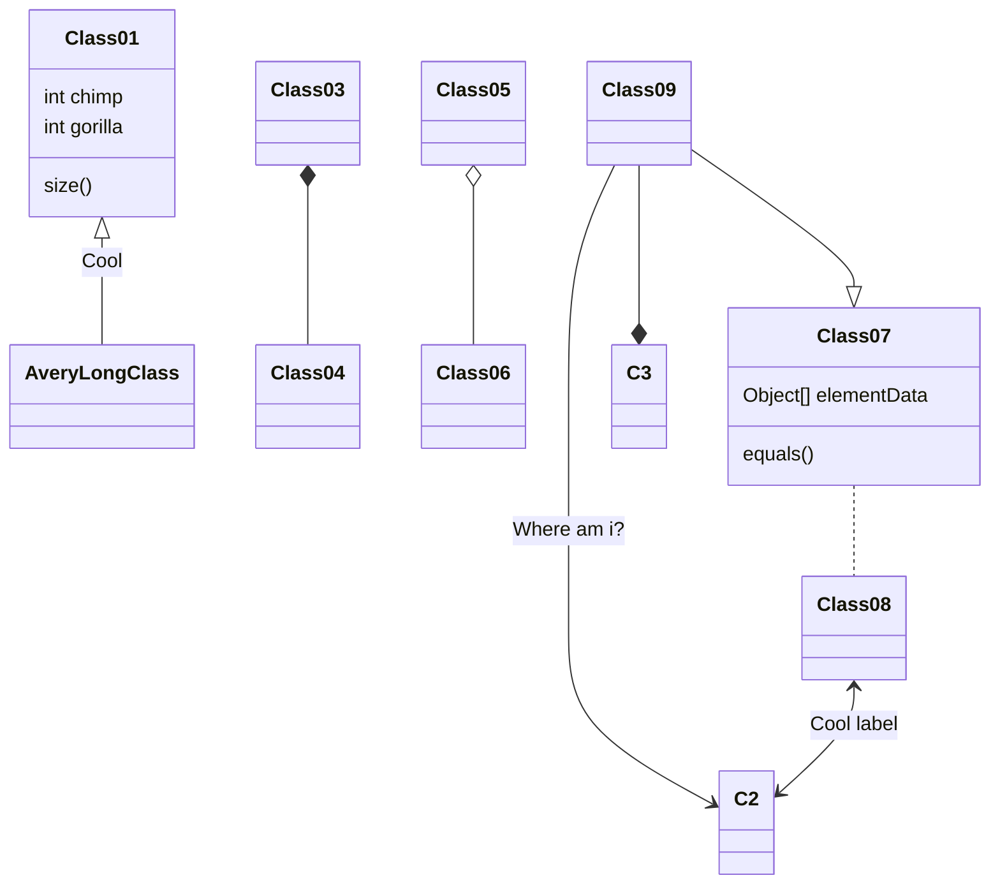

# TÀI LIỆU GIẢI PHÁP QUẢN TRỊ DỮ LIỆU ...

**Công ty cổ phần công nghệ FoxAI**  
**Tên khách hàng**: *[Điền tên khách hàng]*  
**Tên giải pháp**: *[Điền tên giải pháp]*  
**Ngày ban hành**: *[dd/mm/yyyy]*  
**Phiên bản tài liệu**: *[v1.0 / v1.1 / etc.]*  

---

## 1. MỤC ĐÍCH TÀI LIỆU
- Tài liệu này nhằm mô tả chi tiết **giải pháp** mà **Công ty cổ phần công nghệ FoxAI** cung cấp cho *[Tên khách hàng]*.  
- Trình bày **kiến trúc, tính năng, quy trình triển khai** và **quản trị dữ liệu** liên quan đến *[Tên giải pháp]*.  

---

## 2. PHẠM VI VÀ ĐỐI TƯỢNG SỬ DỤNG
- **Phạm vi**: Áp dụng cho dự án triển khai giải pháp quản trị dữ liệu/phần mềm tại đơn vị *[Tên khách hàng]*.  
- **Đối tượng sử dụng**:  
  1. Ban quản lý dự án (Bên A, Bên B).  
  2. Đội ngũ kỹ thuật / phòng CNTT.  
  3. Các phòng ban liên quan (nếu có).  

---

## 3. GIỚI THIỆU TỔNG QUAN GIẢI PHÁP
### 3.1 Mô tả ngắn gọn
- *[Mô tả tóm tắt giải pháp, mục tiêu cốt lõi]*

### 3.2 Các lợi ích chính
1. **Tự động hóa quy trình**: *[Ví dụ: Tự động thu thập, chuẩn hóa dữ liệu]*  
2. **Tăng hiệu suất**: *[Ví dụ: Giảm thời gian thao tác thủ công]*  
3. **Bảo mật và ổn định**: *[Ví dụ: Cơ chế phân quyền, giám sát]*  
4. **Khả năng mở rộng**: *[Ví dụ: Tích hợp với các hệ thống khác]*  

---

## 4. KIẾN TRÚC VÀ CÔNG NGHỆ
### 4.1 Mô hình tổng quan
- Diagram/hình minh họa (nếu có):
(Ghi chú: Sử dụng các tool như Mermaid.live để vẽ biểu đồ minh họa)

