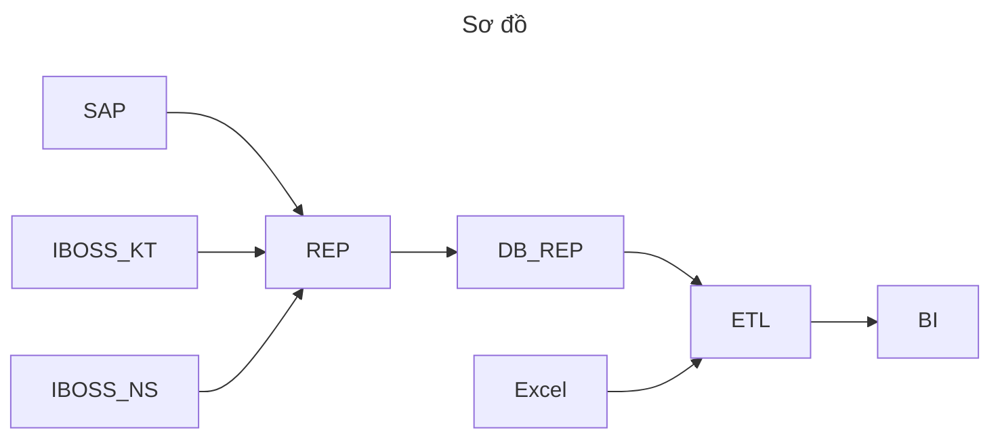

# TÀI LIỆU KỸ THUẬT

**Đơn vị triển khai**: *Công ty CP Công nghệ FoxAI*  
**Tính năng**: *Database Replication*  
**Ngày ban hành**: *17/01/2025*  

---

## 1. MỤC ĐÍCH TÀI LIỆU
- Tài liệu này nhằm mô tả chi tiết **giải pháp** mà **Công ty cổ phần công nghệ FoxAI** cung cấp cho *Thuốc lá Thăng Long*.  
- Trình bày **kiến trúc, tính năng, quy trình triển khai** và **quản trị dữ liệu** liên quan đến *Database Replicationtion*.  

---

## 2. PHẠM VI VÀ ĐỐI TƯỢNG SỬ DỤNG
- **Phạm vi**: Áp dụng cho dự án triển khai giải pháp quản trị dữ liệu/phần mềm tại đơn vị *Thuốc lá Thăng Long*.  
- **Đối tượng sử dụng**:  
  I. Đội ngũ kỹ thuật / phòng CNTT.  
  II. Các phòng ban liên quan.  
  

---

## 3. GIỚI THIỆU TỔNG QUAN GIẢI PHÁP
### 3.1 Mô tả ngắn gọn
- Database Replicationtion là bản sao của cơ sở dữ liệu chính, được duy trì để cải thiện hiệu suất và tính sẵn sàng cao.
- Mục tiêu cốt lõi của Database Replicationtion là phân tán tải công việc đọc, tăng cường khả năng chịu lỗi và đảm bảo tính sẵn sàng liên tục cho hệ thống. Nó cho phép sao lưu dữ liệu, phục hồi nhanh chóng khi gặp sự cố, và thực hiện phân tích mà không làm ảnh hưởng đến hoạt động của cơ sở dữ liệu chính.

### 3.2 Các lợi ích chính
1. **Cải thiện hiệu suất đọc:** Việc phân tán các truy vấn đọc giữa các Replication giúp giảm tải cho cơ sở dữ liệu chính và cải thiện hiệu suất xử lý các yêu cầu đọc dữ liệu.
2. **Tăng cường tính sẵn sàng và khả năng chịu lỗi**: Nếu cơ sở dữ liệu chính gặp sự cố, các Replication có thể thay thế, đảm bảo hệ thống vẫn hoạt động mà không bị gián đoạn.
3. **Phân tán tải và mở rộng quy mô**: Việc sử dụng nhiều Replication giúp phân tán tải công việc đọc và hỗ trợ mở rộng quy mô hệ thống mà không làm giảm hiệu suất.
4. **Sao lưu và phục hồi nhanh chóng**: Các Replication có thể được sử dụng để sao lưu dữ liệu mà không ảnh hưởng đến hoạt động của cơ sở dữ liệu chính, đồng thời giúp phục hồi dữ liệu nhanh chóng khi cần.
5. **Phân tích dữ liệu mà không làm gián đoạn**: Database Replicationtion cho phép thực hiện phân tích, báo cáo và các công việc không làm gián đoạn hoạt động của cơ sở dữ liệu chính.
6. **Tăng tính khả dụng của dịch vụ**: Với nhiều bản sao ở các vị trí khác nhau, dịch vụ có thể tiếp tục hoạt động ngay cả khi một Replication gặp sự cố, đảm bảo dịch vụ luôn có sẵn cho người dùng.

---

## 4. KIẾN TRÚC VÀ CÔNG NGHỆ
### 4.1 Mô hình tổng quan
- Diagram/Hình minh họa sơ đồ kiến trúc:

### 4.2 Thành phần hệ thống trong sơ đồ
- **SAP**: Các dữ liệu từ phần mềm SAP
- **IBOSS_KT**: Các dữ liệu từ phần mềm IBOSS liên quan đến kế toán
- **IBOSS_NS**: Các dữ liệu từ phần mềm IBOSS liên quan đến nhân sự
- **Excel**: Dữ liệu từ các file Excel của các phòng ban liên quan
- **REP**: Replication (Sao chép dữ liệu) là quá trình sao chép và duy trì các bản sao đồng nhất của dữ liệu giữa nhiều máy chủ hoặc cơ sở dữ liệu khác nhau.
- **DB_REP**: Dữ liệu bản sao là một bản sao của dữ liệu từ cơ sở dữ liệu nguồn (Primary Database), được duy trì và đồng bộ hóa để phục vụ các mục đích như cải thiện hiệu suất, tăng cường khả năng sẵn sàng và đảm bảo tính dự phòng của hệ thống.
- **ETL**: Extract, Transform, Load (Trích xuất, Chuyển đổi, Nạp), là một quy trình trong lĩnh vực xử lý dữ liệu dùng để chuyển đổi và hợp nhất dữ liệu từ nhiều nguồn khác nhau vào một hệ thống đích, ở đây là phần mềm phân tích dữ liệu Power BI.
- **BI**: Power BI công cụ dùng để phân tích và trực quan hóa dữ liệu từ các dữ liệu đã làm sạch ở **ETL**.

### 4.3 Công nghệ sử dụng 
- **Cơ sở dữ liệu**: *SQL Server*
  
---

## 5. CHI TIẾT TÍNH NĂNG
### 5.1 Đồng bộ hóa dữ liệu

- **Sao chép đồng bộ (Synchronous Replication)**:
  - Đảm bảo dữ liệu được đồng bộ hóa ngay lập tức giữa nguồn và bản sao.
  - Dữ liệu chỉ được xác nhận khi tất cả các bản sao đã nhận và áp dụng thay đổi.
  - Phù hợp với các hệ thống yêu cầu độ tin cậy cao
- **Sao chép không đồng bộ (Asynchronous Replication):**
  - Dữ liệu được sao chép với độ trễ cho phép.
  - Phù hợp với hệ thống yêu cầu hiệu suất cao hơn tính đồng nhất dữ liệu ngay lập tức.

### 5.2 Phân phối dữ liệu

- **Phân tán dữ liệu địa lý:**:
  - Sao chép dữ liệu tới các trung tâm dữ liệu tại các địa điểm khác nhau để giảm độ trễ truy cập.
- **Cung cấp nhiều bản sao:**:
  - Tạo ra nhiều bản sao để phân phối truy vấn đọc, tăng cường khả năng mở rộng hệ thống.

### 5.3. Hỗ trợ các mô hình sao chép

- **Master-Slave Replication**
  - Một cơ sở dữ liệu chính (Master) xử lý các thao tác ghi, còn các cơ sở dữ liệu phụ (Slave) xử lý thao tác đọc.
- **Master-Master Replication**
  - Các cơ sở dữ liệu đều có thể vừa ghi vừa đọc, đồng thời đồng bộ hóa thay đổi giữa các bản sao.
- **Peer-to-Peer Replication**
  - Mỗi nút trong hệ thống đều ngang hàng, có khả năng ghi và đồng bộ hóa.
- **Snapshot Replication**
  - Sao chép dữ liệu tại một thời điểm cụ thể, thường áp dụng cho dữ liệu ít thay đổi.

### 5.4. Quản lý xung đột dữ liệu

- **Phát hiện xung đột**
  - Trong mô hình sao chép hai chiều hoặc nhiều chiều, xung đột dữ liệu có thể xảy ra khi hai bản sao được cập nhật đồng thời.

- **Giải quyết xung đột**
  - Áp dụng các quy tắc giải quyết xung đột như ưu tiên bản sao chính, thời gian cập nhật gần nhất, hoặc tùy chỉnh dựa trên logic kinh doanh.

### 5.5. Hiệu suất và tối ưu hóa

- **Phân tải công việc**
  - Chuyển các truy vấn đọc từ cơ sở dữ liệu chính sang các bản sao để giảm tải.

- **Tối ưu hóa độ trễ**
  - Đảm bảo độ trễ thấp nhất trong sao chép không đồng bộ để cải thiện trải nghiệm người dùng.

### 5.6. Đảm bảo tính toàn vẹn dữ liệu

- **Ghi lại nhật ký giao dịch (Transaction Logs)**
  - Sử dụng nhật ký giao dịch để theo dõi và sao chép các thay đổi trong cơ sở dữ liệu.

- **Kiểm tra tính toàn vẹn**
  - Kiểm tra định kỳ để đảm bảo bản sao không có sự sai lệch so với dữ liệu gốc.

### 5.7. Khả năng phục hồi và dự phòng

- **Hệ thống sao lưu tự động**
  - Bản sao đóng vai trò dự phòng để đảm bảo tính liên tục của dịch vụ trong trường hợp lỗi hệ thống chính.

- **Khôi phục sau thảm họa (Disaster Recovery)**
    - Nhanh chóng khôi phục dữ liệu từ bản sao trong trường hợp mất dữ liệu hoặc sự cố.
    
### 5.8. Tích hợp và linh hoạt

- **Hỗ trợ đa dạng hệ quản trị**
  - Có thể áp dụng trên các hệ quản trị như MySQL, PostgreSQL, SQL Server, Oracle, MongoDB, v.v.

- **Tùy chỉnh phạm vi sao chép**
  - Sao chép toàn bộ cơ sở dữ liệu hoặc chỉ một phần (bảng, cột, hoặc hàng cụ thể).

### 5.9. Theo dõi và quản lý

- **Giám sát trạng thái sao chép**
  - Theo dõi quá trình sao chép, xác định độ trễ và hiệu suất sao chép.

- **Cảnh báo và thông báo lỗi**
  - Thông báo ngay khi xảy ra lỗi hoặc sự cố trong quá trình sao chép.

### 5.10. Bảo mật

- **Mã hóa dữ liệu**
  - Bảo vệ dữ liệu trong quá trình sao chép bằng mã hóa.

- **Kiểm soát truy cập**
  - Quản lý quyền truy cập vào bản sao để đảm bảo chỉ các vai trò được cấp phép mới có thể truy cập.
 
## 7. QUẢN TRỊ RỦI RO & BẢO MẬT
### 7.1 Rủi ro về kỹ thuật
-   

### 7.2 Rủi ro về quy trình
- *[Ví dụ: Thiếu nguồn lực triển khai, thay đổi yêu cầu]*  

### 7.3 Bảo mật
Theo tiêu chuẩn của Microsoft
- **Kiến trúc an ninh**: *[Firewall, SSL, xác thực]*  
- **Cơ chế phân quyền**: *[User, role, group]*  
- **Tuân thủ tiêu chuẩn**: *[ISO 27001, GDPR (nếu áp dụng)]*  

---

## 8. KẾT LUẬN
- Tóm tắt **lợi ích** và **giá trị** cốt lõi của giải pháp.  
- Đề xuất phương án **phát triển tiếp** (nâng cấp, mở rộng) trong tương lai.  

---
## 9. PHỤ LỤC
- Lấy thêm danh mục IBOSS
- Lấy báo cáo IBOSS
- Autohotkey

> **Thông tin liên hệ:**  **Công ty cổ phần công nghệ FoxAI**  

> **Địa chỉ:** Tầng 3, tòa nhà N03-T3, khu đô thị mới Ngoại giao Đoàn, Bắc Từ Liêm, Tp.Hà Nội

> **Điện thoại:** 0246 254 4578

> **Email:** info@fox.ai.vn 

