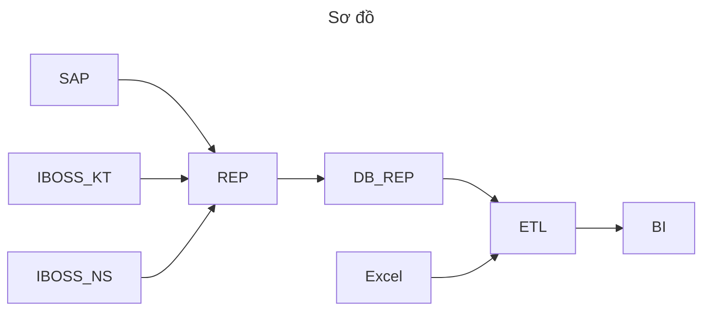

# TÀI LIỆU KỸ THUẬT

**Đơn vị triển khai**: *Công ty CP Công nghệ FoxAI*  
**Tính năng**: *Database Replication*  
**Ngày ban hành**: *17/01/2025*  

---

## 1. MỤC ĐÍCH TÀI LIỆU
- Tài liệu này nhằm mô tả chi tiết **giải pháp** mà **Công ty cổ phần công nghệ FoxAI** cung cấp cho *Thuốc lá Thăng Long*.  
- Trình bày **kiến trúc, tính năng, quy trình triển khai** và **quản trị dữ liệu** liên quan đến *Database Replication*.  

---

## 2. PHẠM VI VÀ ĐỐI TƯỢNG SỬ DỤNG
- **Phạm vi**: Áp dụng cho dự án triển khai giải pháp quản trị dữ liệu/phần mềm tại đơn vị *Thuốc lá Thăng Long*.  
- **Đối tượng sử dụng**:  
  I. Đội ngũ kỹ thuật / phòng CNTT.  
  II. Các phòng ban liên quan.  
  
---

## 3. GIỚI THIỆU TỔNG QUAN GIẢI PHÁP
### 3.1 Mô tả ngắn gọn
- Database Replication là bản sao của cơ sở dữ liệu chính, được duy trì để cải thiện hiệu suất và tính sẵn sàng cao.
- Mục tiêu cốt lõi của Database Replication là phân tán tải công việc đọc, tăng cường khả năng chịu lỗi và đảm bảo tính sẵn sàng liên tục cho hệ thống. Nó cho phép sao lưu dữ liệu, phục hồi nhanh chóng khi gặp sự cố, và thực hiện phân tích mà không làm ảnh hưởng đến hoạt động của cơ sở dữ liệu chính.

### 3.2 Các lợi ích chính
1. **Cải thiện hiệu suất đọc:** Việc phân tán các truy vấn đọc giữa các Replication giúp giảm tải cho cơ sở dữ liệu chính và cải thiện hiệu suất xử lý các yêu cầu đọc dữ liệu.
2. **Tăng cường tính sẵn sàng và khả năng chịu lỗi**: Nếu cơ sở dữ liệu chính gặp sự cố, các Replication có thể thay thế, đảm bảo hệ thống vẫn hoạt động mà không bị gián đoạn.
3. **Phân tán tải và mở rộng quy mô**: Việc sử dụng nhiều Replication giúp phân tán tải công việc đọc và hỗ trợ mở rộng quy mô hệ thống mà không làm giảm hiệu suất.
4. **Sao lưu và phục hồi nhanh chóng**: Các Replication có thể được sử dụng để sao lưu dữ liệu mà không ảnh hưởng đến hoạt động của cơ sở dữ liệu chính, đồng thời giúp phục hồi dữ liệu nhanh chóng khi cần.
5. **Phân tích dữ liệu mà không làm gián đoạn**: Database Replication cho phép thực hiện phân tích, báo cáo và các công việc không làm gián đoạn hoạt động của cơ sở dữ liệu chính.
6. **Tăng tính khả dụng của dịch vụ**: Với nhiều bản sao ở các vị trí khác nhau, dịch vụ có thể tiếp tục hoạt động ngay cả khi một Replication gặp sự cố, đảm bảo dịch vụ luôn có sẵn cho người dùng.

---

## 4. KIẾN TRÚC VÀ CÔNG NGHỆ
### 4.1 Mô hình tổng quan
- Hình minh họa sơ đồ nhân bản dữ liệu:

### 4.2 Thành phần hệ thống trong sơ đồ
- **SAP**: Các dữ liệu từ phần mềm SAP
- **IBOSS_KT**: Các dữ liệu từ phần mềm IBOSS liên quan đến kế toán
- **IBOSS_NS**: Các dữ liệu từ phần mềm IBOSS liên quan đến nhân sự
- **Excel**: Dữ liệu từ các file Excel của các phòng ban liên quan
- **REP**: Replication (Sao chép dữ liệu) là quá trình sao chép và duy trì các bản sao đồng nhất của dữ liệu giữa nhiều máy chủ hoặc cơ sở dữ liệu khác nhau.
- **DB_REP**: Dữ liệu bản sao là một bản sao của dữ liệu từ cơ sở dữ liệu nguồn (Primary Database), được duy trì và đồng bộ hóa để phục vụ các mục đích như cải thiện hiệu suất, tăng cường khả năng sẵn sàng và đảm bảo tính dự phòng của hệ thống.
- **ETL**: Extract, Transform, Load (Trích xuất, Chuyển đổi, Nạp), là một quy trình trong lĩnh vực xử lý dữ liệu dùng để chuyển đổi và hợp nhất dữ liệu từ nhiều nguồn khác nhau vào một hệ thống đích, ở đây là phần mềm phân tích dữ liệu Power BI.
- **BI**: Power BI công cụ dùng để phân tích và trực quan hóa dữ liệu từ các dữ liệu đã làm sạch ở **ETL**.

### 4.3 Công nghệ sử dụng 
- **Cơ sở dữ liệu**: *SQL Server*
- **Phần mềm**: AutoHotKey, Unikey, Anaconda,Jupyter Notebook
- **Ngôn ngữ**: Ngôn ngữ SQL, Python
  
---

## 5. Ưu điểm của giải pháp Database Replication
### 5.1 Đồng bộ hóa dữ liệu

- **Sao chép đồng bộ (Synchronous Replication)**:
  - Đồng bộ hóa dữ liệu một cách tức thời 
  - Phù hợp với các hệ thống yêu cầu độ tin cậy cao
- **Sao chép không đồng bộ (Asynchronous Replication):**
  - Dữ liệu được sao chép với độ trễ cho phép.
  - Phù hợp với hệ thống yêu cầu hiệu suất cao hơn tính đồng nhất dữ liệu ngay lập tức.

### 5.2. Hỗ trợ các mô hình sao chép

- **Master-Slave Replication**
  - Một cơ sở dữ liệu chính (Master) xử lý các thao tác ghi, còn các cơ sở dữ liệu phụ (Slave) xử lý thao tác đọc.
- **Master-Master Replication**
  - Các cơ sở dữ liệu đều có thể vừa ghi vừa đọc, đồng thời đồng bộ hóa thay đổi giữa các bản sao.
- **Peer-to-Peer Replication**
  - Mỗi nút trong hệ thống đều ngang hàng, có khả năng ghi và đồng bộ hóa.
- **Snapshot Replication**
  - Sao chép dữ liệu tại một thời điểm cụ thể, thường áp dụng cho dữ liệu ít thay đổi.

### 5.3. Ghi lại nhật ký giao dịch

- **Ghi lại nhật ký giao dịch (Transaction Logs)**
  - Sử dụng nhật ký giao dịch để theo dõi và sao chép các thay đổi trong cơ sở dữ liệu giúp người dùng dễ dàng kiểm tra nhật ký giao dịch.
  
### 5.4. Khả năng phục hồi và dự phòng

- **Hệ thống sao lưu tự động**
  - Bản sao đóng vai trò dự phòng để đảm bảo tính liên tục của dịch vụ trong trường hợp lỗi hệ thống chính.

- **Khôi phục sau thảm họa (Disaster Recovery)**
    - Nhanh chóng khôi phục dữ liệu từ bản sao trong trường hợp mất dữ liệu hoặc sự cố.

### 5.10. Bảo mật dữ liệu

- **Mã hóa dữ liệu**
  - Bảo vệ dữ liệu trong quá trình sao chép bằng mã hóa.

- **Kiểm soát truy cập**
  - Quản lý quyền truy cập vào bản sao để đảm bảo chỉ các vai trò được cấp phép mới có thể truy cập.
 
## 6. CẤU HÌNH MÁY CHỦ
| Tên VM      | vCPU        | Memory(GB)  |  SDD(GB)    |Hệ điều hành| Băng thông mạng |
|-------------|-------------|-------------|-------------|------------|-----------------|
| Application Server                           | 16   | 64   | 1000|Windows Server |15 Mbps|
| Database Server                              | 16   | 64   | 1000 | Windows Server | 15 Mbps|
| Ổ cứng back up data cho Application Server   |    |   | 300 | |
| Ổ cứng back up data cho Database Server      |    |   | 300 | |

## 7. QUẢN TRỊ RỦI RO & BẢO MẬT
### 7.1 Rủi ro về kỹ thuật
- **Hiệu suất hệ thống giảm**
  - **Nguy cơ:** Khi có lượng lớn dữ liệu hoặc truy vấn phức tạp từ Power BI, hệ thống máy chủ 4 có thể bị quá tải.
  - **Giải pháp:**
    - Sử dụng Power BI DirectQuery hoặc chế độ Import phù hợp.
    - Thực hiện load balancing giữa các nguồn dữ liệu.
### 7.2 Rủi ro về quy trình
- **Thay đổi tên bảng, thủ tục lưu trữ hoặc cấu trúc trong cơ sở dữ liệu dẫn đến lỗi dữ liệu trên Power BI:**
  - **Rủi ro:** Khi các bảng, thủ tục lưu trữ (stored procedures) hoặc cấu trúc dữ liệu bị thay đổi mà không được cập nhật trong Power BI, hệ thống sẽ gặp lỗi, làm gián đoạn việc hiển thị và phân tích dữ liệu.
  - **Giải pháp:**
    - Xây dựng quy trình thống nhất việc đặt tên và quản lý cấu trúc cơ sở dữ liệu.
    - Bất kỳ thay đổi nào liên quan đến bảng, thủ tục, hoặc cấu trúc dữ liệu phải được thông báo trước thông qua tài liệu hoặc kênh trao đổi đã thống nhất.
    - Cung cấp danh sách các thay đổi cụ thể để cập nhật trên Power BI, đảm bảo tính nhất quán.
- **Thay đổi mẫu biểu trong file Excel dẫn đến dữ liệu không khớp hoặc lỗi:**
  - **Rủi ro:** Nếu mẫu biểu trong file Excel (dòng, cột) bị thay đổi mà không theo quy định, hệ thống sẽ không thể đồng bộ hoặc phân tích dữ liệu chính xác.
  - **Giải pháp:**
    - Sử dụng tính năng khóa dòng, cột trong Excel để giới hạn việc thay đổi cấu trúc mẫu biểu, chỉ cho phép chỉnh sửa ở các khu vực được quy định.
    - Xây dựng tài liệu hướng dẫn rõ ràng về mẫu biểu Excel, bao gồm các dòng/cột được phép thay đổi.
    - Thiết lập quy trình kiểm tra và xác nhận khi có bất kỳ thay đổi nào trong mẫu Excel, đảm bảo tính tương thích với hệ thống.
### 7.3 Bảo mật
- Hệ thống tuân thủ các tiêu chuẩn bảo mật của Microsoft, đảm bảo an toàn dữ liệu và hạn chế rủi ro trong quá trình vận hành.
---

## 8. KẾT LUẬN  
Giải pháp do Công ty Cổ phần Công nghệ FoxAI cung cấp giúp Thuốc lá Thăng Long:
- **Tăng hiệu suất và sẵn sàng:** Đảm bảo hệ thống hoạt động liên tục, giảm gián đoạn và tăng tốc độ xử lý.
- **Cải thiện quản trị dữ liệu:** Dễ dàng sao lưu, phục hồi và quản lý dữ liệu an toàn.
- **Tối ưu phân tích:** Kết nối Power BI và các công cụ phân tích, hỗ trợ ra quyết định nhanh chóng và chính xác.
- **Bảo mật toàn diện:** Tuân thủ tiêu chuẩn Microsoft, bảo vệ dữ liệu hiệu quả.
- **Hỗ trợ mở rộng:** Linh hoạt đáp ứng nhu cầu phát triển hệ thống trong tương lai.
Giải pháp không chỉ tập trung vào việc nâng cao hiệu suất kỹ thuật mà còn đảm bảo tính an toàn, minh bạch và khả năng ứng dụng thực tiễn trong các hoạt động vận hành và phân tích của doanh nghiệp. 

---
## 9. PHỤ LỤC
## 9.1 Phụ lục 1: Lấy dữ 

## 9.2 Phụ lục 2

## 9.3 Phụ lục 3
- Lấy thêm danh mục IBOSS
- Lấy báo cáo IBOSS
- Autohotkey

> **Thông tin liên hệ:**  **Công ty cổ phần công nghệ FoxAI**  

> **Địa chỉ:** Tầng 3, tòa nhà N03-T3, khu đô thị mới Ngoại giao Đoàn, Bắc Từ Liêm, Tp.Hà Nội

> **Điện thoại:** 0246 254 4578

> **Email:** info@fox.ai.vn 

