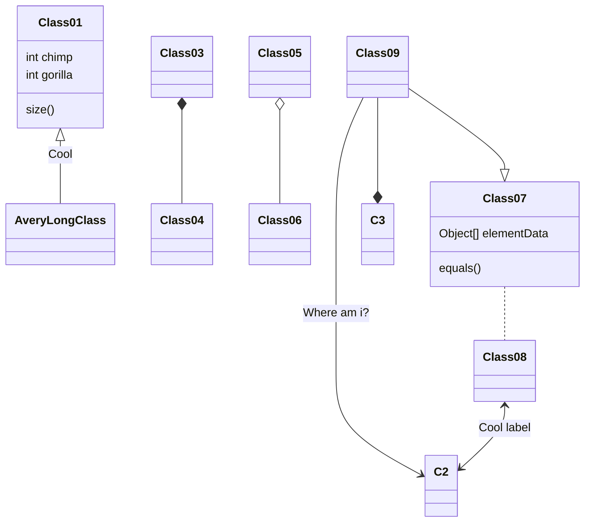

# TÀI LIỆU GIẢI PHÁP QUẢN TRỊ DỮ LIỆU ...

**Công ty cổ phần công nghệ FoxAI**  
**Thuốc lá Thăng Long**: *Thuốc lá Thăng Long*  
**Database Replicate**: *Database Replicate*  
**Ngày ban hành**: *[dd/mm/yyyy]*  
**Phiên bản tài liệu**: *v1.0*  

---

## 1. MỤC ĐÍCH TÀI LIỆU
- Tài liệu này nhằm mô tả chi tiết **giải pháp** mà **Công ty cổ phần công nghệ FoxAI** cung cấp cho *Thuốc lá Thăng Long*.  
- Trình bày **kiến trúc, tính năng, quy trình triển khai** và **quản trị dữ liệu** liên quan đến *Database Replicate*.  

---

## 2. PHẠM VI VÀ ĐỐI TƯỢNG SỬ DỤNG
- **Phạm vi**: Áp dụng cho dự án triển khai giải pháp quản trị dữ liệu/phần mềm tại đơn vị *Thuốc lá Thăng Long*.  
- **Đối tượng sử dụng**:  
  1. Ban quản lý dự án (Bên A, Bên B).  
  2. Đội ngũ kỹ thuật / phòng CNTT.  
  3. Các phòng ban liên quan (nếu có).  

---

## 3. GIỚI THIỆU TỔNG QUAN GIẢI PHÁP
### 3.1 Mô tả ngắn gọn
- *Replica database là bản sao của cơ sở dữ liệu chính, được duy trì để cải thiện hiệu suất và tính sẵn sàng cao.*
- *Mục tiêu cốt lõi của replica database là phân tán tải công việc đọc, tăng cường khả năng chịu lỗi và đảm bảo tính sẵn sàng liên tục cho hệ thống. Nó cho phép sao lưu dữ liệu, phục hồi nhanh chóng khi gặp sự cố, và thực hiện phân tích mà không làm ảnh hưởng đến hoạt động của cơ sở dữ liệu chính.*

### 3.2 Các lợi ích chính
1. **Cải thiện hiệu suất đọc:**: *Việc phân tán các truy vấn đọc giữa các replica giúp giảm tải cho cơ sở dữ liệu chính và cải thiện hiệu suất xử lý các yêu cầu đọc dữ liệu.*  
2. **Tăng cường tính sẵn sàng và khả năng chịu lỗi**: *Nếu cơ sở dữ liệu chính gặp sự cố, các replica có thể thay thế, đảm bảo hệ thống vẫn hoạt động mà không bị gián đoạn.*  
3. **Phân tán tải và mở rộng quy mô**: *Việc sử dụng nhiều replica giúp phân tán tải công việc đọc và hỗ trợ mở rộng quy mô hệ thống mà không làm giảm hiệu suất.*  
4. **Sao lưu và phục hồi nhanh chóng**: *Các replica có thể được sử dụng để sao lưu dữ liệu mà không ảnh hưởng đến hoạt động của cơ sở dữ liệu chính, đồng thời giúp phục hồi dữ liệu nhanh chóng khi cần.*
5. **Phân tích dữ liệu mà không làm gián đoạn**:*Replica database cho phép thực hiện phân tích, báo cáo và các công việc không làm gián đoạn hoạt động của cơ sở dữ liệu chính.*
6. **Tăng tính khả dụng của dịch vụ**:*Với nhiều bản sao ở các vị trí khác nhau, dịch vụ có thể tiếp tục hoạt động ngay cả khi một replica gặp sự cố, đảm bảo dịch vụ luôn có sẵn cho người dùng.*

---

## 4. KIẾN TRÚC VÀ CÔNG NGHỆ
### 4.1 Mô hình tổng quan
- Diagram/hình minh họa sơ đồ kiến trúc:
(Ví dụ: có thể sử dụng các tool như Mermaid để vẽ biểu đồ minh họa)

### 4.2 Thành phần hệ thống
- **Thành phần A**: *[Mô tả chức năng, vai trò]*  
- **Thành phần B**: *[Mô tả chức năng, vai trò]*  
- **Thành phần C**: *[Mô tả chức năng, vai trò]*  

### 4.3 Công nghệ sử dụng
- **Nền tảng/language**: *[.NET, Java, Node.js, v.v.]*  
- **CSDL**: *[SQL Server, Oracle, MongoDB, v.v.]*  
- **Công cụ tích hợp**: *[Ví dụ: API, ETL tool]*  

---

## 5. CHI TIẾT TÍNH NĂNG
### 5.1 Quản trị dữ liệu
- **Thu thập dữ liệu**: *[Phương thức kết nối, lịch thu thập]*  
- **Kiểm soát chất lượng (Data Quality)**: *[Ràng buộc, quy tắc]*  
- **Phân quyền truy cập**: *[Cơ chế role-based, user-based]*  

### 5.2 Quản lý quy trình
- **Quy trình duyệt (workflow)**: *[Các bước phê duyệt, trạng thái]*  
- **Tự động hóa (automation)**: *[Rule, trigger, thông báo]*  

### 5.3 Báo cáo & Phân tích
- **Dashboard**: *[Chỉ số KPI, biểu đồ]*  
- **Phân tích nâng cao**: *[Machine learning, AI (nếu có)]*  

---

## 6. TRIỂN KHAI VÀ VẬN HÀNH
### 6.1 Kế hoạch triển khai
- **Lộ trình**: *[Các giai đoạn, timeline]*  
- **Nguồn lực**: *[Đội dự án, phân công nhiệm vụ]*  

### 6.2 Môi trường triển khai
- **Môi trường phát triển**: *[DEV, TEST]*  
- **Môi trường sản xuất**: *[PROD]*  
- **Hạ tầng**: *[On-premises, Cloud, Hybrid]*  

### 6.3 Hướng dẫn cài đặt và cấu hình
- **Yêu cầu hệ thống**: *[RAM, CPU, dung lượng, OS]*  
- **Quy trình cài đặt**: *[Các bước cài đặt, công cụ hỗ trợ]*  

### 6.4 Bảo trì và hỗ trợ
- **Chính sách bảo hành**: *[Phạm vi bảo hành, thời gian]*  
- **Hỗ trợ kỹ thuật**: *[Mức độ hỗ trợ, hotline, email]*  

---

## 7. QUẢN TRỊ RỦI RO & BẢO MẬT
### 7.1 Rủi ro về kỹ thuật
- *[Danh sách rủi ro + Phương án xử lý]*  

### 7.2 Rủi ro về quy trình
- *[Ví dụ: Thiếu nguồn lực triển khai, thay đổi yêu cầu]*  

### 7.3 Bảo mật
- **Kiến trúc an ninh**: *[Firewall, SSL, xác thực]*  
- **Cơ chế phân quyền**: *[User, role, group]*  
- **Tuân thủ tiêu chuẩn**: *[ISO 27001, GDPR (nếu áp dụng)]*  

---

## 8. KẾT LUẬN
- Tóm tắt **lợi ích** và **giá trị** cốt lõi của giải pháp.  
- Đề xuất phương án **phát triển tiếp** (nâng cấp, mở rộng) trong tương lai.  

---

## 9. PHỤ LỤC (NẾU CÓ)
- **Phụ lục A**: Tài liệu/đường dẫn tham khảo.  
- **Phụ lục B**: Mẫu biểu, quy trình chi tiết.  
- **Phụ lục C**: Thuật ngữ, định nghĩa.  

---

> **Thông tin liên hệ**  
> **Công ty cổ phần công nghệ FoxAI**  
> *Địa chỉ*: …  
> *Điện thoại*: …  
> *Email*: …  

