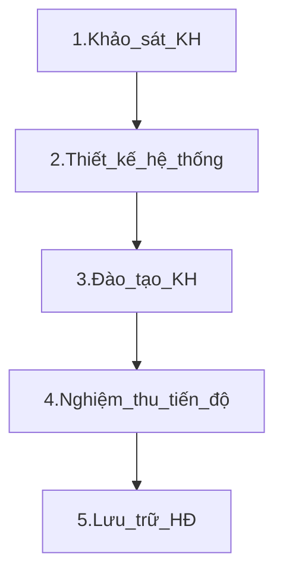

## Quy trình triển khai dự án BI (dự thảo)

### Bước 1.Khảo sát khách hàng

* **Bộ phận thực hiện:** Team triển khai sau khi họp với khách hàng sẽ tiến hành ký xác nhận.
* Mẫu biên bản khảo sát tại [1.1.Template](https://foxai.sharepoint.com/:f:/s/thuoclathanglong/EvLAzgkmT6lGirXaprTFnzYB-okIT17ZF0wzFIeWqUJH_g?e=cRz25A)
* Bản đã ký cần được scan và lưu tại [1.2.Biên bản khảo sát](https://foxai.sharepoint.com/:f:/s/thuoclathanglong/EvLAzgkmT6lGirXaprTFnzYB-okIT17ZF0wzFIeWqUJH_g?e=cRz25A)

### Bước 2.Thiết kế hệ thống

* **Bộ phận thực hiện:** Team triển khai phối hợp với khách hàng để tiến hành thiết kế hệ thống, viết tài liệu giải pháp kỹ thuật.
* Mẫu tài liệu giải pháp kỹ thuật xem tại [2.1.Template](https://github.com/hoanglong8/FoxAI-Data-Analyst/blob/main/%5BFoxAI%20-%20TLTL%5D%20T%C3%A0i%20li%E1%BB%87u%20gi%E1%BA%A3i%20ph%C3%A1p%20k%E1%BB%B9%20thu%E1%BA%ADt.md)
* Tài liệu dạng .pdf được lưu tại [2.2.Thiết kế hệ thống](https://foxai.sharepoint.com/:f:/s/thuoclathanglong/ElrXi9wWISZOo9UVfx5un2oBJEGQhFGqU4A_1AoAvtvJMw?e=AHcVC6)

### Bước 3.Đào tạo khách hàng

* **Bộ phận thực hiện:** Team triển khai viết tài liệu đào tạo (phân quyền, hướng dẫn sử dụng) và tiến hành đào tạo cho khách hàng. Cuối mỗi buổi đào tạo cần khách hàng ký xác nhận để nghiệm thu công việc. 
* Mẫu tài liệu đào tạo xem tại [3.1.Template](https://github.com/hoanglong8/FoxAI-Data-Analyst/blob/main/%5BFoxai%20-%20TLTL%5D%20T%C3%80I%20LI%E1%BB%86U%20H%C6%AF%E1%BB%9ANG%20D%E1%BA%AAN%20S%E1%BB%AC%20D%E1%BB%A4NG%20PH%E1%BA%A6N%20M%E1%BB%80M.md)
* Mẫu biên bản đào tạo xem tại [3.2.Biên bản đào tạo](https://foxai.sharepoint.com/:f:/s/thuoclathanglong/EsQKXZxCa_BPqb768St8GAkBo-QlS5IdgBdkIRBbVAQe8g?e=s8AI6L)
* Bản scan cũng lưu tại [3.2.Biên bản đào tạo](https://foxai.sharepoint.com/:f:/s/thuoclathanglong/EsQKXZxCa_BPqb768St8GAkBo-QlS5IdgBdkIRBbVAQe8g?e=s8AI6L)

### Bước 4.Nghiệm thu dự án

* **Bộ phận thực hiện:** Team kinh doanh phối hợp cùng team triển khai họp với khách hàng để xác nhận và ký biên bản nghiệm thu theo từng giai đoạn. 
* Mẫu biên bản nghiệm thu xem tại [4.1.Template](https://foxai.sharepoint.com/:f:/s/thuoclathanglong/Emivd-eujfhNmxwfgesb2VYB4w9lk2xvUV7s6bpMdqg2zg?e=Mvrt4U)
* Bản scan cũng lưu tại [4.2.Biên bản nghiệm thu](https://foxai.sharepoint.com/:f:/s/thuoclathanglong/Emivd-eujfhNmxwfgesb2VYB4w9lk2xvUV7s6bpMdqg2zg?e=Mvrt4U)

### Bước 5.Lưu trữ Hợp đồng & Hóa đơn

* **Bộ phận thực hiện:** Sau khi kế toán xuất hóa đơn, team kinh doanh tiến hành lưu trữ hợp đồng và hóa đơn theo từng giai đoạn. 
* Hợp đồng và hóa đơn được lưu tại [5.Lưu trữ](https://foxai.sharepoint.com/:f:/s/thuoclathanglong/EunIO_jv1iRKv_UM7muLFiMBOi5xdSdXZbCDi8fBDYWTAw?e=LCcCji)
