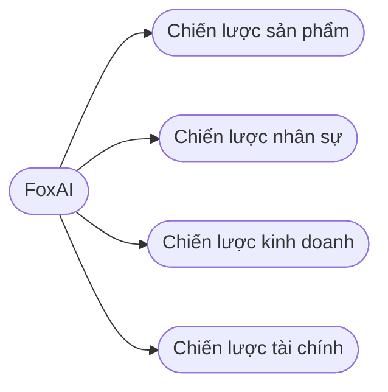
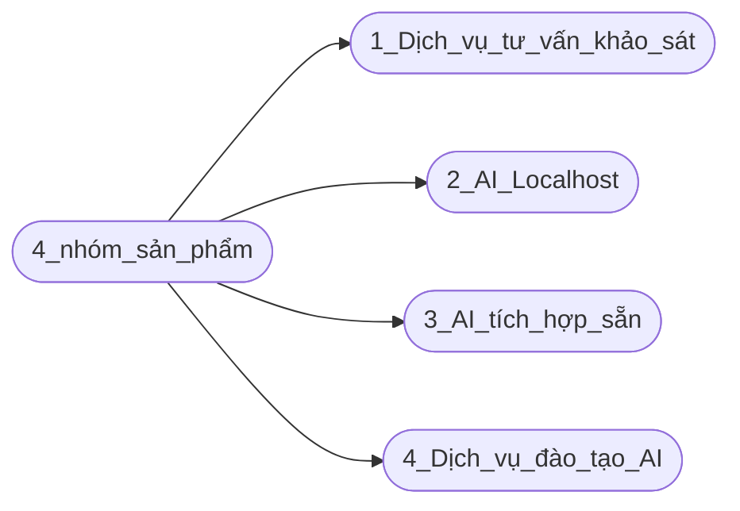
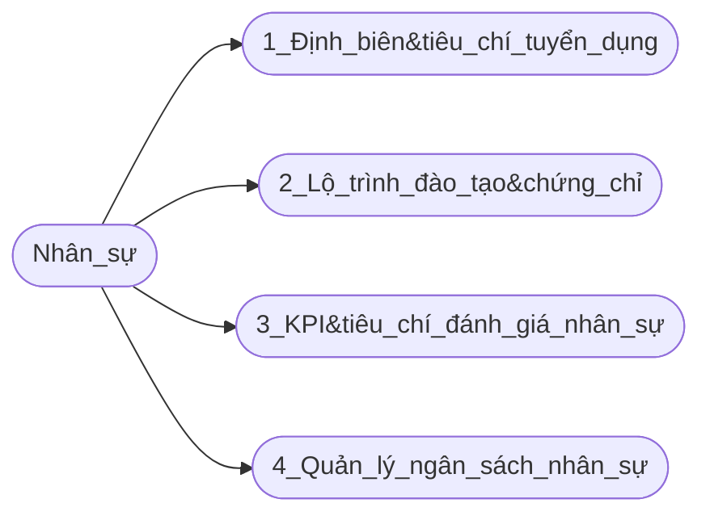
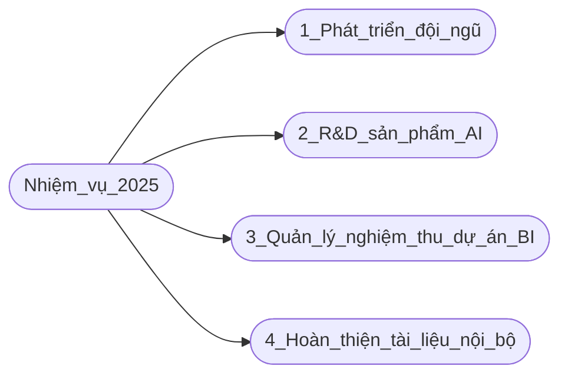

## Công ty cổ phần công nghệ FoxAI

 
 
 

# Dự thảo chiến lược phát triển sản phẩm khối AI trong giai đoạn 2025-2029

Trong nội dung này, tôi sẽ trình bày 2 chiến lược là sản phẩm và nhân sự.

## A.Chiến lược phát triển khối sản phẩm, dịch vụ AI

## B.Chiến lược phát triển nhân sự khối AI

## C.Về nhiệm vụ mục tiêu của trưởng phòng Data Analyst năm 2025:

Tóm tắt nội dung bài viết [tại đây](https://hoanglong8.github.io/FoxAI-Data-Analyst/markmap.html)

