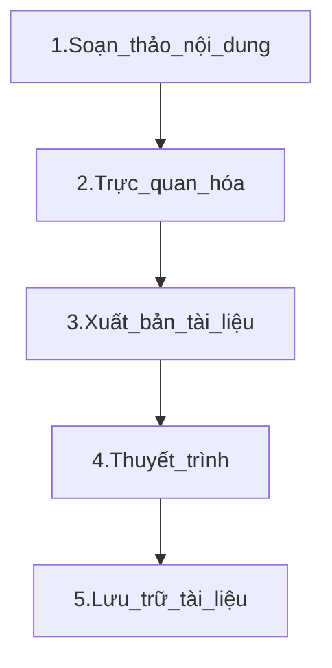

# BỘ QUY TẮC, CÔNG CỤ GIÚP SOẠN THẢO TÀI LIỆU NHANH CHÓNG, CHUYÊN NGHIỆP


# Nội dung
1. [Công cụ soạn thảo](#1-CÁC-CÔNG-CỤ-SOẠN-THẢO-TÀI-LIỆU)
   * [Markdown](#1-1-Ngôn-ngữ-Markdown)
   * [HTML](#1-2-Ngôn-ngữ-HTML)
3. [Công cụ trực quan hóa](#2-CÁC-CÔNG-CỤ-TRỰC-QUAN-HÓA)
   * [Mermaid](#2-1-Công-cụ-Mermaid)
   * [Markmap](#2-2-Công-cụ-Markmap)
   * [Badge](#2-3-Công-cụ-Badge)
5. [Công cụ tự đồng bộ tạo Book Online](#3-TỰ-ĐỒNG-BỘ-TẠO-BOOK-ONLINE)
   * [GitBook](#Công-cụ-GitBook)
7. [Công cụ tự đồng bộ tạo Slide](#4-TỰ-ĐỒNG-BỘ-TẠO-SLIDE)
   * [HackMD](#Công-cụ-HackMD)
9. [Công cụ lưu trữ, quản lý tài liệu](#5-QUẢN-LÝ-TÀI-LIỆU)
    * [Git](#Công-cụ-Git)

## Đối tượng sử dụng
Tài liệu này được thiết kế dành cho nhân viên của FoxAI khi cần thực hiện các công việc như:
* Viết tài liệu đào tạo để chuyển giao cho khách hàng;
* Tạo slide thuyết trình sản phẩm hoặc kế hoạch kinh doanh;
* Xây dựng tài liệu, quy trình, quy định để đào tạo nội bộ.

Giúp nâng cao năng suất, thực hiện một cách dễ dàng, chuyên nghiệp, và hiệu quả.

## Mục tiêu

Người dùng sau khi đọc tài liệu này có thể:
1. **Biết được** cách dùng [Markdown](#1-1-Ngôn-ngữ-Markdown), [HTML](#1-2-Ngôn-ngữ-HTML)... để ghi chú, soạn thảo nội dung một cách nhanh chóng, dễ chỉnh sửa, dễ truyền tải.
2. **Nắm được** các công cụ [Mermaid](#2-1-Công-cụ-Mermaid), [Markmap](#2-2-Công-cụ-Markmap), [Badge](#2-3-Công-cụ-Badge)... để vẽ biểu đồ, workflow giúp trực quan hóa tài liệu.
3. **Thực hành được** cách đồng bộ tự động nội dung trên GitHub sang [GitBook](#Công-cụ-GitBook) để xuất bản sách hướng dẫn nhanh, dễ dàng chia sẻ cho khách hàng, luôn đảm bảo update mà không phải sửa thủ công.
4. **Biết cách** cập nhật nội dung từ GitHub sang [HackMD](#Công-cụ-HackMD) để tạo slide trình chiếu chuyên nghiệp, nhanh chóng.
5. **Hiểu được** cách thức lưu trữ thông qua công cụ [Git](#Công-cụ-Git) đảm bảo tính nhất quán, tránh xung đột khi nhiều nhân viên cùng tham gia chỉnh sửa hoặc cập nhật.

---

## Quy trình thực hiện



## 1-CÁC CÔNG CỤ SOẠN THẢO TÀI LIỆU                                    [⬆️](#nội-dung)

### 1-1-Ngôn ngữ Markdown
- **Markdown** là **ngôn ngữ đánh dấu** đơn giản, cho phép viết tài liệu nhanh chóng, gọn nhẹ. Định dạng đuôi là `.md`.
- Kết hợp với GitHub, GitBook, HackMD… bạn dễ dàng tạo **trang doc**, **slide**, **blog** mà **không cần** các công cụ soạn thảo nặng nề.

#### a.Cú pháp Markdown
- **Tiêu đề**:  
  ```markdown
  # Tiêu đề cấp 1
  ## Tiêu đề cấp 2
  ### Tiêu đề cấp 3

- Đoạn văn in đậm, in nghiêng:
    ```markdown
    Đây là **chữ in đậm** và *chữ in nghiêng*.
    
- Danh sách:
    ```markdown
    - Gạch đầu dòng 1
    - Gạch đầu dòng 2
    1. Mục thứ nhất
    2. Mục thứ hai

- Chèn link, hình ảnh, trích dẫn:
    ```markdown
    [Link đến Google](https://google.com)
    

- Chèn ảnh động .gif /video với kích thước tùy chỉnh thì sử dụng cú pháp HTML:
    ```html
    #1.Tải ảnh lên thư mục Image của GitHub
    #2.Chèn Ảnh với Kích Thước 50%
    

- Dòng code lệnh:
    ```markdown
    ```python
    print("Hello World")

- Dòng kẻ/ngăn cách trang slide:
    ```markdown
    ---

Xem thêm tại: [Basic writing and formatting syntax](https://docs.github.com/en/get-started/writing-on-github/basic-writing-and-formatting-syntax)

#### b.Thao tác trên GitHub

* Tạo repository / file Markdown
* Đăng nhập GitHub → Tạo repo mới (hoặc mở repo sẵn có).
* Tạo file .md (ví dụ: README.md, doc-tong-quan.md).
* Viết nội dung Markdown, commit lên repo. Mọi thay đổi (commit) trong file .md sẽ được Git lưu lại.

### 1-2-Ngôn ngữ HTML
- **HTML** là ngôn ngữ thường dùng để viết tài liệu có cấu trúc rõ ràng, thường viết bằng công cụ như Visual Studio Code VSCode để dễ dàng kiểm tra nội dung.

- Khi mở file `.html` trên GitHub, mã HTML sẽ hiển thị dưới dạng văn bản chứ không được render thành trang web, do vậy để xem thì phải render thông qua GitHub Pages.

- Ngôn ngữ HTML thường kết hợp Markdown để tăng tính tương tác trong tài liệu, ví dụ HTML hỗ trợ tốt các tính năng như: thay đổi font, màu sắc, kích thước ảnh...

Xem thêm:
- [Hướng dẫn sử dụng GitHub Pages](https://docs.github.com/en/pages)  
- [HTML cơ bản - W3Schools](https://www.w3schools.com/html/)  
- [Markdown trên GitHub](https://guides.github.com/features/mastering-markdown/)  

## 2-CÁC CÔNG CỤ TRỰC QUAN HÓA

Nhằm giúp thông tin dễ hiểu hơn, hấp dẫn hơn, và hỗ trợ người đọc nắm bắt ý chính nhanh chóng, chúng ta thường dùng các cách thức như: vẽ biểu đồ workflow, đồ thị chart, sơ đồ mindmap, chèn hình ảnh minh họa và biểu tượng icon, infographic và kết hợp đa phương tiện như video, âm thanh, hoặc liên kết (link) đến tài liệu khác.

### 2-1-Công cụ Mermaid

[Mermaid](https://mermaid.js.org/intro/) là nền tảng giúp bạn vẽ nhanh các diagram nhanh chóng và có thể chèn trực tiếp vào Markdown mà không cần xuất ra ảnh để chèn vào tài liệu.

Các bước thực hiện:
* Lựa chọn dạng biểu đồ: Flowchart, Sequent Diagram, Hierachy, TopDown hay LeftRight...
* Viết code biểu đồ ```mermaid
* Copy code sang GitHub, chú ý bổ sung ``` ở cuối dòng
  ```markdown
  ```mermaid
    graph LR;
    Markdown --> Mermaid --> GitHub --> GitBook --> HackMD ```
  ```
Biểu đồ sẽ có dạng như sau:


### 2-2-Công cụ Markmap

[Markmap.js](https://markmap.js.org/repl) là một nền tảng giúp chuyển đổi Markdown thành **mindmap (sơ đồ tư duy)** trực quan và tương tác, sử dụng trực tiếp trên trình duyệt (dưới dạng HTML).

Giao diện website được chia làm 2 phần:


**Khung bên trái:**
* Nơi bạn nhập nội dung Markdown. Nội dung này sẽ được chuyển thành mindmap.
Ví dụ:
```markdown
# Tài liệu Hướng Dẫn Sử Dụng

## Giới thiệu
- Tổng quan về phần mềm
- Mục đích sử dụng

## Sử dụng
- Tạo tài liệu mới
- Chỉnh sửa tài liệu
  - Thêm nội dung
  - Xóa nội dung
- Xuất tài liệu
  - PDF
  - HTML

## Tài liệu tham khảo
  - Hướng dẫn sử dụng chi tiết
  - FAQ

## Ghi chú
- Thường xuyên cập nhật phần mềm
- Lưu ý bảo mật tài liệu
```

**Khung bên phải:**
* Hiển thị sơ đồ mindmap tương tác được tạo từ nội dung Markdown bạn nhập.

Bạn có thể tải file mindmap về dưới dạng .html, rồi tải lên [**GitHub Pages**](https://hoanglong8.github.io/FoxAI-Data-Analyst/markmap.html) để xem trực tiếp trong tài liệu.


### 2-3-Công cụ Badge

[Badge](https://shields.io/) là các biểu tượng/huy hiệu hiển thị trạng thái, thông tin hoặc số liệu quan trọng, thường được sử dụng trong `README.md` để cung cấp thông tin nhanh (ví dụ: tình trạng dự án, phiên bản của tài liệu, cấp độ bảo mật, license...) và tăng tính chuyên nghiệp, dễ đọc, hiện đại và bắt mắt hơn.

Ví dụ:
### [FoxAI] Tài liệu triển khai dự án ABC...


## 3-TỰ ĐỒNG BỘ TẠO BOOK ONLINE

### Công cụ GitBook
[GitBook](https://www.gitbook.com/) là nền tảng giúp bạn tạo trang tài liệu/sách online chuyên nghiệp, có thể mời người khác cộng tác chỉnh sửa và chia sẻ cho khách hàng.

GitBook có thể sync từ file Markdown từ GitHub, khi chỉnh sửa trên GitHub thì GitBook tự động cập nhật theo.

### Các bước thực hiện:
* Tạo Space trên GitBook
* Thêm Page và sync đồng bộ từ GitHub
* Edit changes, chia sẻ và publish to web.

### Kết quả đầu ra:

 [here](https://foxai-data-analyst.gitbook.io/tai-lieu-dong-bo-tu-github-foxai)


## 4-TỰ ĐỒNG BỘ TẠO SLIDE

### Công cụ HackMD
[HackMD](https://hackmd.io/) là nền tảng soạn thảo Markdown online, hỗ trợ chế độ trình chiếu (Slide mode) dựa trên Reveal.js.
Bạn có thể dán file Markdown (copy/paste) hoặc sync một phần với GitHub (chức năng “Import from GitHub” hoặc “Publish to GitHub”).

### Các bước thực hiện:
* Đăng nhập bằng GitHub account, thực hiện sync
* Chọn “New Note” → “Import from GitHub Gist / GitHub repo”
* Chọn file .md trong repo.
* Mọi thay đổi trên GitHub sẽ được sync với HackMD
(Hoặc bạn có thể copy/paste nội dung Markdown từ GitHub sang HackMD).

### Tạo slide trình chiếu:
* Chỉnh sửa nội dung Markdown đã có trên HackMD (nếu cần)
* Thêm --- để chia slide.
* Bấm Menu → Slide mode (hoặc “Present Slides”).
* Nếu muốn tùy chỉnh theme, transition, CSS… → sử dụng YAML front matter (khóa reveal Options).

### Kết quả đầu ra:

 [here](https://foxai-data-analyst.gitbook.io/tai-lieu-dong-bo-tu-github-foxai)

 [here](https://hackmd.io/@DCs5idhtQRK_cmFBAVRcSw/B1WDl3NPyl#/)


## 5-QUẢN LÝ TÀI LIỆU

### Công cụ Git

[Git](https://git-scm.com/) là Hệ thống Quản lý Phiên bản VCS (Version Control System) giúp quản lý tài liệu, theo dõi phiên bản thay đổi, chia sẻ việc sửa cho nhóm và giữ được lịch sử chỉnh sửa tài liệu thông qua một số nền tảng: GitHub, GitLab, hoặc Bitbucket.

**1.Các thao tác với kho lưu trữ từ xa (Remote Repository)**

- Liên kết kho lưu trữ từ xa bằng link online hoặc GitHub Desktop
- Tải tài liệu lên kho lưu trữ Repo
- Thành viên trong team có thể tải hàng loạt tài liệu bằng lệnh `Git clone`:
```
git clone https://github.com/username/repository-name.git
```
**2.Quản lý phiên bản**

- Tạo nhánh (fork) để chỉnh sửa mà không ảnh hưởng đến tài liệu gốc
- Tạo Commit history sau mỗi lần chỉnh sửa
- Tạo Pull request để gửi yêu cầu phê duyệt tài liệu
- Hợp nhất thay đổi (merge) hoặc phê duyệt thay đổi tài liệu
- Nếu nhiều người cùng chỉnh sửa một file, Git sẽ báo xung đột để tạo ra 2 phiên bản khác

**3.Một số cách thức quản lý tài liệu hiệu quả**

Quy tắc:
* Quy định rõ cấu trúc tài liệu (ví dụ: đặt tên file, thư mục).
* Quy định cách ghi chú thay đổi (changelog).

Phân Quyền Rõ Ràng:
* Ai có quyền chỉnh sửa, nhận xét, hoặc chỉ xem.
* Sử dụng công cụ hỗ trợ phân quyền như Google Workspace, Confluence.

Thiết lập Quy trình Kiểm Duyệt:
* Áp dụng quy trình phê duyệt thay đổi trước khi ban hành.
* Sử dụng Git (Pull Request) hoặc Google Docs (Suggested Edits).

Đặt Lịch Kiểm Tra Định Kỳ:
* Xác định ngày kiểm tra và cập nhật tài liệu định kỳ (hàng quý, hàng năm).
* Sử dụng các công cụ nhắc lịch như Google Calendar hoặc Microsoft Outlook.

Sử dụng các công cụ như Zapier hoặc Make (Integromat) để tự động:
* Thông báo thay đổi tài liệu.
* Gửi tài liệu mới đến các bên liên quan (Lập trình viên, Tư vấn, Kinh doanh, Khách hàng...)

## Tóm tắt
Với tài liệu hướng dẫn này, các nhân viên FoxAI sẽ có công cụ và quy trình rõ ràng để tạo ra những tài liệu chuyên nghiệp, hiệu quả và luôn được cập nhật. Điều này không chỉ nâng cao chất lượng dịch vụ mà còn cải thiện khả năng hỗ trợ khách hàng và đào tạo nội bộ.

[⬆️ Quay lại đầu trang](#nội-dung)
