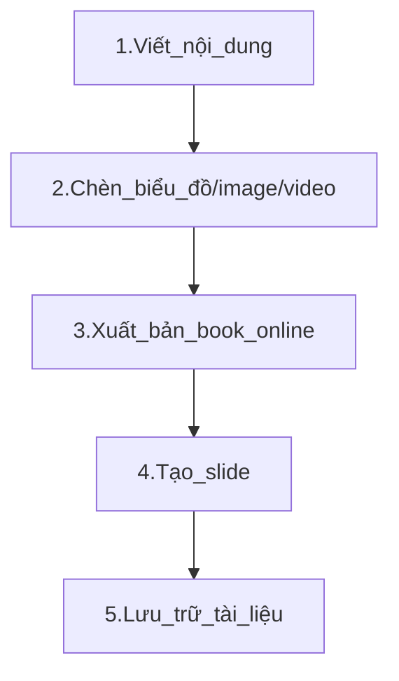
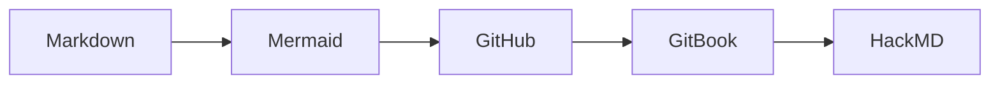

# HƯỚNG DẪN VIẾT TÀI LIỆU TRÊN GITHUB

# Nội dung
1. [Mục tiêu](#mục-tiêu)
2. [Quy trình thực hiện](#Quy-trình-thực-hiện)
3. [Các ngôn ngữ soạn thảo](#1-CÁC-NGÔN-NGỮ-SOẠN-THẢO-TÀI-LIỆU)
4. [Tool vẽ biểu đồ](#2-CÁC-CÔNG-CỤ-VẼ-BIỂU-ĐỒ,-SƠ-ĐỒ,-WORKFLOW,-MINDMAP)
5. [Tự đồng bộ tạo Book Online](#3-TỰ-ĐỒNG-BỘ-TẠO-BOOK-ONLINE)
6. [Tự đồng bộ tạo Slide](#4-TỰ-ĐỒNG-BỘ-TẠO-SLIDE)
7. [Sắp xếp, Quản lý, Cập nhật tài liệu](#5-SẮP-XẾP,-QUẢN-LÝ,-CẬP-NHẬT-TÀI-LIỆU)


## Mục tiêu  
1. Sử dụng ngôn ngữ [Markdown](#1-1-Ngôn-ngữ-Markdown), [HTML](#1-2-Ngôn-ngữ-HTML)... để soạn thảo nội dung một cách nhanh chóng, gọn nhẹ.
2. Thành thạo công cụ [Mermaid](#2-1-Công-cụ-Mermaid), [Markmap](#2-2-Công-cụ-Markmap), [Badge](#2-3-Công-cụ-Badge)... để vẽ biểu đồ, workflow giúp trực quan hóa tài liệu.
3. Nắm được cách đồng bộ tự động nội dung trên GitHub sang [GitBook](#Công-cụ-GitBook) để xuất bản book online nhanh, không phải sửa thủ công.
4. Biết cách cập nhật nội dung từ GitHub sang [HackMD](#Công-cụ-HackMD) để tạo slide trình chiếu chuyên nghiệp, nhanh chóng.
5. Hiểu được cách thức lưu trữ và sử dụng công cụ [Git](#Git-Hệ-thống-Quản-lý-Phiên-bản-VCS-Version-Control-System) đảm bảo nhất quán tài liệu sau nhiều lần chỉnh sửa, nhiều người cùng cập nhật.

---

## Quy trình thực hiện



## 1-CÁC NGÔN NGỮ SOẠN THẢO TÀI LIỆU

### 1-1-Ngôn ngữ Markdown
- **Markdown** là **ngôn ngữ đánh dấu** đơn giản, cho phép viết tài liệu nhanh chóng, gọn nhẹ. Định dạng đuôi là `.md`.
- Kết hợp với GitHub, GitBook, HackMD… bạn dễ dàng tạo **trang doc**, **slide**, **blog** mà **không cần** các công cụ soạn thảo nặng nề.

#### a.Cú pháp Markdown
- **Tiêu đề**:  
  ```markdown
  # Tiêu đề cấp 1
  ## Tiêu đề cấp 2
  ### Tiêu đề cấp 3

- Đoạn văn in đậm, in nghiêng:
    ```markdown
    Đây là **chữ in đậm** và *chữ in nghiêng*.
    
- Danh sách:
    ```markdown
    - Gạch đầu dòng 1
    - Gạch đầu dòng 2
    1. Mục thứ nhất
    2. Mục thứ hai

- Chèn link, hình ảnh, trích dẫn:
    ```markdown
    [Link đến Google](https://google.com)
    

- Chèn ảnh động .gif /video với kích thước tùy chỉnh thì sử dụng cú pháp HTML:
    ```html
    #1.Tải ảnh lên thư mục Image của GitHub
    #2.Chèn Ảnh với Kích Thước 50%
    

- Chèn biểu đồ diagram vẽ trên Mermaid:



- Dòng code lệnh:
    ```markdown
    ```python
    print("Hello World")

- Dòng kẻ/ngăn cách trang slide:
    ```markdown
    ---

Tham khảo thêm tại: [Basic writing and formatting syntax.](https://docs.github.com/en/get-started/writing-on-github/basic-writing-and-formatting-syntax)

#### b.Thao tác trên GitHub

* Tạo repository / file Markdown
* Đăng nhập GitHub → Tạo repo mới (hoặc mở repo sẵn có).
* Tạo file .md (ví dụ: README.md, doc-tong-quan.md).
* Viết nội dung Markdown, commit lên repo. Mọi thay đổi (commit) trong file .md sẽ được Git lưu lại.

### 1-2-Ngôn ngữ HTML
- **HTML** là ngôn ngữ thường dùng để viết tài liệu có cấu trúc rõ ràng, thường viết bằng công cụ như Visual Studio Code VSCode để dễ dàng kiểm tra nội dung.

- Khi mở file `.html` trên GitHub, mã HTML sẽ hiển thị dưới dạng văn bản chứ không được render thành trang web, do vậy để xem thì phải render thông qua GitHub Pages.

- Ngôn ngữ HTML thường kết hợp Markdown để tăng tính tương tác trong tài liệu, ví dụ HTML hỗ trợ tốt các tính năng như: thay đổi font, màu sắc, kích thước ảnh...

- [Hướng dẫn sử dụng GitHub Pages](https://docs.github.com/en/pages)  
- [HTML cơ bản - W3Schools](https://www.w3schools.com/html/)  
- [Markdown trên GitHub](https://guides.github.com/features/mastering-markdown/)  

## 2-CÁC CÔNG CỤ VẼ BIỂU ĐỒ, SƠ ĐỒ, WORKFLOW, MINDMAP

### 2-1-Công cụ Mermaid

[Mermaid](https://mermaid.js.org/intro/) là nền tảng giúp bạn vẽ nhanh các diagram nhanh chóng và có thể chèn trực tiếp vào Markdown mà không cần xuất ra ảnh để chèn vào tài liệu.

Các bước thực hiện:
* Lựa chọn dạng biểu đồ: Flowchart, Sequent Diagram, Hierachy, TopDown hay LeftRight...
* Viết code biểu đồ ```mermaid
* Copy code sang GitHub, chú ý bổ sung ``` ở cuối dòng
  ```markdown
  ```mermaid
    graph LR;
    Markdown --> Mermaid --> GitHub --> GitBook --> HackMD ```
  ```


### 2-2-Công cụ Markmap

[Markmap.js](https://markmap.js.org/repl) là một nền tảng giúp chuyển đổi Markdown thành **mindmap (sơ đồ tư duy)** trực quan và tương tác, sử dụng trực tiếp trên trình duyệt (dưới dạng HTML).

Giao diện website được chia làm 2 phần:

Khung bên trái:
* Nơi bạn nhập nội dung Markdown. Nội dung này sẽ được chuyển thành mindmap.
Khung bên phải:
* Hiển thị sơ đồ mindmap tương tác được tạo từ nội dung Markdown bạn nhập.

Bạn có thể tải file mindmap về dưới dạng .html, rồi tải lên **GitHub Pages** để xem trực tiếp trong tài liệu.


### 2-3-Công cụ Badge

[Badge](https://shields.io/) là các biểu tượng/huy hiệu hiển thị trạng thái, thông tin hoặc số liệu quan trọng, thường được sử dụng trong `README.md` để cung cấp thông tin nhanh (ví dụ: tình trạng dự án, phiên bản của tài liệu, cấp độ bảo mật, license...) và tăng tính chuyên nghiệp, dễ đọc, hiện đại và bắt mắt hơn.

Ví dụ:
### [FoxAI] Tài liệu triển khai dự án ABC...


## 3-TỰ ĐỒNG BỘ TẠO BOOK ONLINE

### Công cụ GitBook
[GitBook](https://www.gitbook.com/) là nền tảng giúp bạn tạo trang tài liệu/sách online chuyên nghiệp, có thể mời người khác cộng tác chỉnh sửa và chia sẻ cho khách hàng.

GitBook có thể sync từ file Markdown từ GitHub, khi chỉnh sửa trên GitHub thì GitBook tự động cập nhật theo.

### Các bước thực hiện:
* Tạo Space trên GitBook
* Thêm Page và sync đồng bộ từ GitHub
* Edit changes, chia sẻ và publish to web.

### Kết quả đầu ra:

[Demo tài liệu](https://foxai-data-analyst.gitbook.io/tai-lieu-dong-bo-tu-github-foxai)


## 4-TỰ ĐỒNG BỘ TẠO SLIDE

### Công cụ HackMD
[HackMD](https://hackmd.io/) là nền tảng soạn thảo Markdown online, hỗ trợ chế độ trình chiếu (Slide mode) dựa trên Reveal.js.
Bạn có thể dán file Markdown (copy/paste) hoặc sync một phần với GitHub (chức năng “Import from GitHub” hoặc “Publish to GitHub”).

### Các bước thực hiện:
* Đăng nhập bằng GitHub account, thực hiện sync
* Chọn “New Note” → “Import from GitHub Gist / GitHub repo”
* Chọn file .md trong repo.
* Mọi thay đổi trên GitHub sẽ được sync với HackMD
(Hoặc bạn có thể copy/paste nội dung Markdown từ GitHub sang HackMD).

### Tạo slide trình chiếu:
* Chỉnh sửa nội dung Markdown đã có trên HackMD (nếu cần)
* Thêm --- để chia slide.
* Bấm Menu → Slide mode (hoặc “Present Slides”).
* Nếu muốn tùy chỉnh theme, transition, CSS… → sử dụng YAML front matter (khóa reveal Options).

### Kết quả đầu ra:

[Dạng book view ](https://foxai-data-analyst.gitbook.io/tai-lieu-dong-bo-tu-github-foxai)

[Dạng slide view](https://hackmd.io/@DCs5idhtQRK_cmFBAVRcSw/B1WDl3NPyl#/)


## 5-SẮP XẾP, QUẢN LÝ, CẬP NHẬT TÀI LIỆU

### Git Hệ thống Quản lý Phiên bản VCS Version Control System

[Git](https://git-scm.com/) là nền tảng mã nguồn mở giúp quản lý tài liệu, theo dõi phiên bản thay đổi, chia sẻ việc sửa cho nhóm và giữ được lịch sử chỉnh sửa tài liệu thông qua: GitHub, GitLab, hoặc Bitbucket.

**1.Các thao tác với kho lưu trữ từ xa (Remote Repository)**

- Liên kết kho lưu trữ từ xa:
```
git remote add origin https://github.com/username/repository-name.git
```
- Đẩy tài liệu lên kho lưu trữ từ xa:
```
git push -u origin main
```
- Thành viên trong team có thể clone kho lưu trữ (tải hàng loạt):
```
git clone https://github.com/username/repository-name.git
```
**2.Quản lý phiên bản**

- Tạo nhánh để chỉnh sửa mà không ảnh hưởng đến tài liệu gốc:
```
git checkout -b feature/update-documents
```
- Hợp nhất thay đổi (merge) hoặc phê duyệt thay đổi tài liệu:
```
git merge feature/update-documents
```
- Nếu nhiều người cùng chỉnh sửa một file, Git có thể báo xung đột.

[⬆️ Quay lại đầu trang](#nội-dung)
