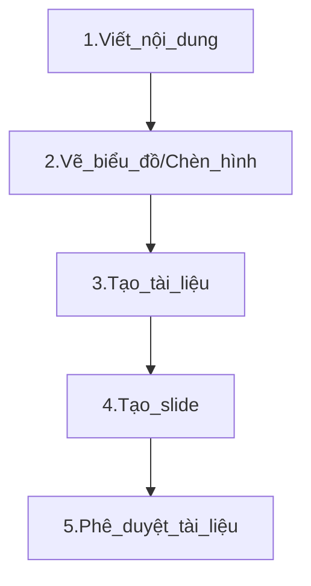
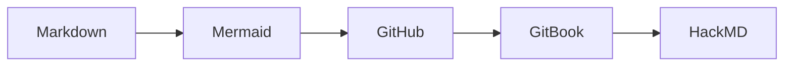

# TÀI LIỆU HƯỚNG DẪN VIẾT TÀI LIỆU TRÊN GITHUB BẰNG MARKDOWN

**Mục tiêu**:  
1. Hiểu được **cách viết tài liệu** bằng Markdown.  
2. Biết cách **đồng bộ** nội dung **GitHub** sang **GitBook** để tạo tài liệu, sách online.  
3. Biết cách **đồng bộ** GitHub với **HackMD** để tạo slide trình chiếu.
4. Giúp bạn **tiết kiệm thời gian, công sức** khi soạn thảo tài liệu, tránh sai sót khi cập nhật.

---

## Quy trình thực hiện


---

## 1. Công cụ MARKDOWN

### 1.1 Markdown là gì?
- **Markdown** là **ngôn ngữ đánh dấu** đơn giản, cho phép viết tài liệu nhanh chóng, gọn nhẹ. Định dạng đuôi là .md.
- Kết hợp với GitHub, GitBook, HackMD… bạn dễ dàng tạo **trang doc**, **slide**, **blog** mà **không cần** các công cụ soạn thảo nặng nề.

### 1.2 Cú pháp Markdown cơ bản
- **Tiêu đề**:  
  ```markdown
  # Tiêu đề cấp 1
  ## Tiêu đề cấp 2
  ### Tiêu đề cấp 3

- Đoạn văn in đậm, in nghiêng:
    ```markdown
    Đây là **chữ in đậm** và *chữ in nghiêng*.
    
- Danh sách:
    ```markdown
    - Gạch đầu dòng 1
    - Gạch đầu dòng 2
    1. Mục thứ nhất
    2. Mục thứ hai

- Chèn link, hình ảnh, trích dẫn:
    ```markdown
    [Link đến Google](https://google.com)
    

- Chèn ảnh động .gif /video với kích thước tùy chỉnh thì sử dụng cú pháp HTML:
    ```html
    # Chèn Ảnh với Kích Thước 50%
    

- Chèn biểu đồ diagram vẽ trên Mermaid:



- Dòng code lệnh:
    ```markdown
    ```python
    print("Hello World")

- Dòng kẻ/ngăn cách trang slide:
    ```markdown
    ---

Tham khảo thêm tại: [Basic writing and formatting syntax.](https://docs.github.com/en/get-started/writing-on-github/basic-writing-and-formatting-syntax)

## 2. VIẾT TÀI LIỆU BẰNG MARKDOWN TRÊN GITHUB
### 2.1 Tạo repository / file Markdown
* Đăng nhập GitHub → Tạo repo mới (hoặc mở repo sẵn có).
* Tạo file .md (ví dụ: README.md, doc-tong-quan.md).
* Viết nội dung Markdown, commit lên repo.
### 2.2 Quản lý phiên bản
* Mọi thay đổi (commit) trong file .md sẽ được Git lưu lại.
* Bạn có thể tạo Pull Request để review nội dung.

## 3. VẼ BIỂU ĐỒ BẰNG MERMAID

[Mermaid](https://mermaid.js.org/intro/) là nền tảng giúp bạn vẽ nhanh các diagram nhanh chóng và có thể chèn trực tiếp vào Markdown mà không cần xuất ra ảnh để chèn vào tài liệu.


3. ĐỒNG BỘ GITHUB SANG GITBOOK
GitBook là nền tảng giúp bạn tạo trang tài liệu (doc) chuyên nghiệp. Có hai hình thức chính:

3.1 GitBook SaaS (gitbook.com)
Phiên bản GitBook mới chủ yếu dùng Giao diện web (có thể import file Markdown), nhưng chưa hỗ trợ Git Sync hoàn hảo như bản cũ.
Bạn có thể:
Tạo Space trên GitBook.
Chọn Import tài liệu Markdown (từ local hoặc copy dán).
Khi cần cập nhật, bạn thủ công import lại hoặc copy-paste.

