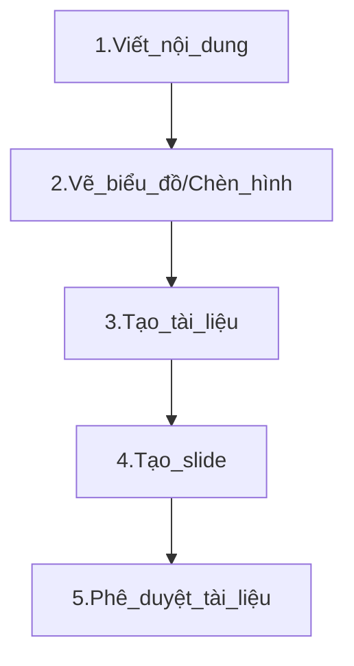
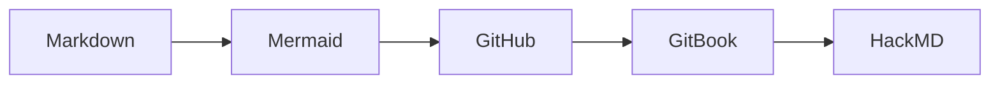

# HƯỚNG DẪN VIẾT TÀI LIỆU TRÊN GITHUB

**Mục tiêu**:  
1. Hiểu được **cách viết tài liệu** bằng ngôn ngữ Markdown, HTML.  
2. Biết cách **đồng bộ** nội dung **GitHub** sang **GitBook** để tạo tài liệu, sách online giúp cập nhật nhanh chóng. 
3. Biết cách **đồng bộ** GitHub với **HackMD** để tạo slide trình chiếu chuyên nghiệp.
4. Giúp **tiết kiệm thời gian, công sức** khi soạn thảo tài liệu, đảm bảo nhất quán tài liệu sau nhiều lần chỉnh sửa, cập nhật.

---

## Quy trình thực hiện


---

## 1. Công cụ MARKDOWN

### 1.1 Markdown là gì?
- **Markdown** là **ngôn ngữ đánh dấu** đơn giản, cho phép viết tài liệu nhanh chóng, gọn nhẹ. Định dạng đuôi là `.md`.
- Kết hợp với GitHub, GitBook, HackMD… bạn dễ dàng tạo **trang doc**, **slide**, **blog** mà **không cần** các công cụ soạn thảo nặng nề.

### 1.2 Cú pháp Markdown cơ bản
- **Tiêu đề**:  
  ```markdown
  # Tiêu đề cấp 1
  ## Tiêu đề cấp 2
  ### Tiêu đề cấp 3

- Đoạn văn in đậm, in nghiêng:
    ```markdown
    Đây là **chữ in đậm** và *chữ in nghiêng*.
    
- Danh sách:
    ```markdown
    - Gạch đầu dòng 1
    - Gạch đầu dòng 2
    1. Mục thứ nhất
    2. Mục thứ hai

- Chèn link, hình ảnh, trích dẫn:
    ```markdown
    [Link đến Google](https://google.com)
    

- Chèn ảnh động .gif /video với kích thước tùy chỉnh thì sử dụng cú pháp HTML:
    ```html
    #1.Tải ảnh lên thư mục Image của GitHub
    #2.Chèn Ảnh với Kích Thước 50%
    

- Chèn biểu đồ diagram vẽ trên Mermaid:



- Dòng code lệnh:
    ```markdown
    ```python
    print("Hello World")

- Dòng kẻ/ngăn cách trang slide:
    ```markdown
    ---

Tham khảo thêm tại: [Basic writing and formatting syntax.](https://docs.github.com/en/get-started/writing-on-github/basic-writing-and-formatting-syntax)

## 2. VIẾT TÀI LIỆU BẰNG MARKDOWN TRÊN GITHUB

Cách thực hiện:
* Tạo repository / file Markdown
* Đăng nhập GitHub → Tạo repo mới (hoặc mở repo sẵn có).
* Tạo file .md (ví dụ: README.md, doc-tong-quan.md).
* Viết nội dung Markdown, commit lên repo. Mọi thay đổi (commit) trong file .md sẽ được Git lưu lại.

## 3. VẼ BIỂU ĐỒ BẰNG MERMAID

[Mermaid](https://mermaid.js.org/intro/) là nền tảng giúp bạn vẽ nhanh các diagram nhanh chóng và có thể chèn trực tiếp vào Markdown mà không cần xuất ra ảnh để chèn vào tài liệu.

Các bước thực hiện:
* Lựa chọn dạng biểu đồ: Flowchart, Sequent Diagram, Hierachy, TopDown hay LeftRight...
* Viết code biểu đồ ```mermaid
* Copy code sang GitHub, chú ý bổ sung ``` ở cuối dòng
  ```markdown
  ```mermaid
    graph LR;
    Markdown --> Mermaid --> GitHub --> GitBook --> HackMD ```
  ```


## 4. ĐỒNG BỘ GITHUB SANG GITBOOK

[GitBook](https://www.gitbook.com/) là nền tảng giúp bạn tạo trang tài liệu/sách online chuyên nghiệp, có thể mời người khác cộng tác chỉnh sửa và chia sẻ cho khách hàng.

GitBook có thể sync từ file Markdown từ GitHub, khi chỉnh sửa trên GitHub thì GitBook tự động cập nhật theo.

### 4.1.Các bước thực hiện:
* Tạo Space trên GitBook
* Thêm Page và sync đồng bộ từ GitHub
* Edit changes, chia sẻ và publish to web.

### 4.2.Kết quả đầu ra:

[Demo tài liệu](https://foxai-data-analyst.gitbook.io/tai-lieu-dong-bo-tu-github-foxai)


## 5. ĐỒNG BỘ HOẶC SỬ DỤNG GITHUB VỚI HACKMD ĐỂ TẠO SLIDE

[HackMD](https://hackmd.io/) là nền tảng soạn thảo Markdown online, hỗ trợ chế độ trình chiếu (Slide mode) dựa trên Reveal.js.
Bạn có thể dán file Markdown (copy/paste) hoặc sync một phần với GitHub (chức năng “Import from GitHub” hoặc “Publish to GitHub”).

### 5.1.Các bước thực hiện:
* Đăng nhập bằng GitHub account, thực hiện sync
* Chọn “New Note” → “Import from GitHub Gist / GitHub repo”
* Chọn file .md trong repo.
* Mọi thay đổi trên GitHub sẽ được sync với HackMD
(Hoặc bạn có thể copy/paste nội dung Markdown từ GitHub sang HackMD).

### 5.2.Tạo slide trình chiếu:
* Chỉnh sửa nội dung Markdown đã có trên HackMD (nếu cần)
* Thêm --- để chia slide.
* Bấm Menu → Slide mode (hoặc “Present Slides”).
* Nếu muốn tùy chỉnh theme, transition, CSS… → sử dụng YAML front matter (khóa reveal Options).

### 5.3.Kết quả đầu ra:

[Slide đào tạo](https://foxai-data-analyst.gitbook.io/tai-lieu-dong-bo-tu-github-foxai)


