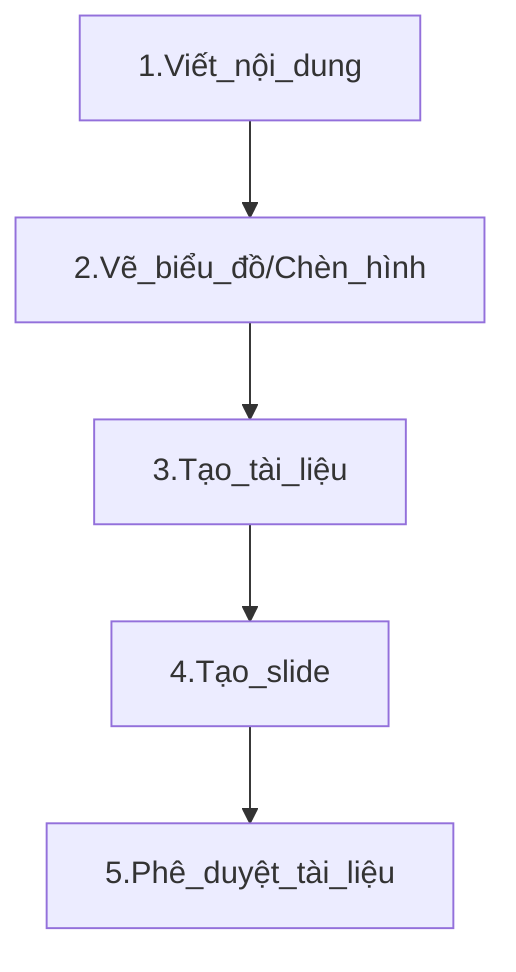
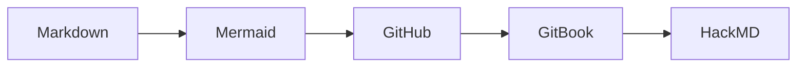

# TÀI LIỆU HƯỚNG DẪN VIẾT TÀI LIỆU TRÊN GITHUB BẰNG MARKDOWN

**Mục tiêu**:  
1. Hiểu được **cách viết tài liệu** bằng Markdown.  
2. Biết cách **đồng bộ** nội dung **GitHub** sang **GitBook** để tạo tài liệu, sách online.  
3. Biết cách **đồng bộ** GitHub với **HackMD** để tạo slide trình chiếu.
4. Giúp bạn **tiết kiệm thời gian, công sức** khi soạn thảo tài liệu, tránh sai sót khi cập nhật.

---

## Quy trình thực hiện


---

## Các công cụ sử dụng


---

## 1. GIỚI THIỆU MARKDOWN

### 1.1 Markdown là gì?
- **Markdown** là **ngôn ngữ đánh dấu** đơn giản, cho phép viết tài liệu nhanh chóng, gọn nhẹ.  
- Kết hợp với GitHub, GitBook, HackMD… bạn dễ dàng tạo **trang doc**, **slide**, **blog** mà **không cần** các công cụ soạn thảo nặng nề.

### 1.2 Cú pháp Markdown cơ bản
- **Tiêu đề**:  
  ```markdown
  # Tiêu đề cấp 1
  ## Tiêu đề cấp 2
  ### Tiêu đề cấp 3

- Đoạn văn in đậm, in nghiêng:
    ```markdown
    Đây là **chữ in đậm** và *chữ in nghiêng*.
    
- Danh sách:
    ```markdown
    - Gạch đầu dòng 1
    - Gạch đầu dòng 2
    1. Mục thứ nhất
    2. Mục thứ hai

- Chèn link, hình ảnh, biểu đồ, trích dẫn:
    ```markdown
    [Link đến Google](https://google.com)
    

- Dòng code lệnh:
    ```markdown
    ```python
    print("Hello World")

- Dòng kẻ/ngăn cách trang slide:
    ```markdown
    ---

Tham khảo thêm tại: [Basic writing and formatting syntax.](https://docs.github.com/en/get-started/writing-on-github/basic-writing-and-formatting-syntax)


