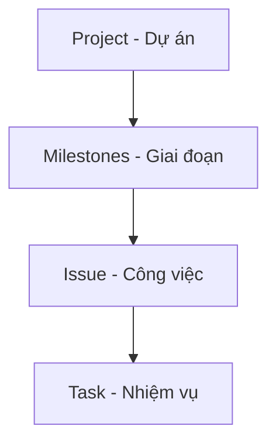

# QUẢN LÝ DỰ ÁN TRÊN GITHUB

# Nội dung
1. [Giới thiệu chung về GitHub và kho lưu trữ Repo](https://docs.github.com/en/get-started/quickstart)
2. [Công cụ quản lý dự án](https://docs.github.com/en/issues/planning-and-tracking-with-projects)
   * [Milestone](#2-1-Milestone)
   * [Project](#2-2-Project)
   * [Issue](#2-3-Issues)
   * [Task](#2-4-Task)
3. [Các dạng xem báo cáo Kanban, Table, Roadmap](#3-Xem-bao-cao)
4. [Các tiện ích mở rộng](#4-Thao-luan)

## 1.Giới thiệu chung về GitHub

- [GitHub](https://docs.github.com/en/get-started) là nền tảng quản lý mã nguồn (phiên bản), hỗ trợ cộng tác, chia sẻ và lưu trữ dự án với các tính năng chính:
  * Repository (kho lưu trữ tài liệu),
  * Issues (Công việc),
  * Task (Nhiệm vụ/Công việc con),
  * Projects (Dự án),
  * Milestone (Giai đoạn),
  * Label (Nhãn),
  * Team (Nhóm, bộ phận)...

- Github có bản free và mất phí. Với Github free thì source code của bạn sẽ công khai, có nghĩa là ai cũng có thể xem code của bạn. Nó phù hợp với các phần mềm nguồn mở, và cũng có thể trở thành một blog cá nhân của chính các bạn như các trang `Blogspot`, `Wordpress`...

### 1.1.Đối tượng sử dụng
Tài liệu này được thiết kế dành cho nhân viên của FoxAI khi cần thực hiện các công việc như:
* **Bộ phận lập trình viên** (Devs) [quản lý mã nguồn (source-code)](https://fox.ai.vn/wp-content/uploads/2024/07/Logo_Original-1.png) một cách tập trung, thống nhất (đặc biệt là khi cả nhóm cùng code);
* **Bộ phận tư vấn triển khai** (Colsutant) cập nhật, sửa đổi và phát hành [tài liệu đào tạo, hỗ trợ khách hàng](https://fox.ai.vn/wp-content/uploads/2024/07/Logo_Original-1.png) một cách nhanh chóng (đặc biệt là khi cả nhóm cùng sửa từng phần trên cùng tài liệu);
* **Bộ phận hành chính nhân sự** cập nhật tài liệu, quy trình, quy định để [truyền thông nội bộ](https://fox.ai.vn/wp-content/uploads/2024/07/Logo_Original-1.png) một cách hiệu quả (với tài liệu lớn thì lưu trên Sharepoint rồi gắn link), tránh phân tán tài liệu ở nhiều nơi.
* **Các thành viên** trong dự án có thể dễ dàng theo dõi lại nội dung các [biên bản cuộc họp (Issue)](https://fox.ai.vn/wp-content/uploads/2024/07/Logo_Original-1.png), cùng nhau trao đổi tương tác qua Discussion, thành viên mới có thể xem lại dữ liệu History commit để nhanh chóng nắm bắt công việc.
* **Leader** dễ dàng giao việc (task) cho từng thành viên (assignee), [quản lý tiến độ công việc](https://fox.ai.vn/wp-content/uploads/2024/07/Logo_Original-1.png), hỗ trợ nhân viên và báo cáo đánh giá chất lượng công việc.

### 1.2.Mục tiêu tài liệu

Người dùng sau khi đọc tài liệu này có thể:
* **Biết cách** dùng công cụ [Repository (Bản lưu trữ)](https://fox.ai.vn/wp-content/uploads/2024/07/Logo_Original-1.png) để quản lý, chỉnh sửa, cập nhật tài liệu (Tab đầu tiên Code)
* **Nắm được** cách dùng công cụ [Issue, Task](https://fox.ai.vn/wp-content/uploads/2024/07/Logo_Original-1.png) để giao nhiệm vụ cho từng thành viên cụ thể.
* **Thực hành được** các công cụ [Discussion](https://fox.ai.vn/wp-content/uploads/2024/07/Logo_Original-1.png) để thảo luận, đưa ra ý tưởng, đề xuất giải pháp, tạo cuộc bình chọn, hỏi đáp Q&A với các thành viên khác.
* **Ứng dụng được** công cụ [Project, Milestone](https://fox.ai.vn/wp-content/uploads/2024/07/Logo_Original-1.png) để quản lý tiến độ các dự án đang triển khai.
* **Hiểu được** công cụ [Insight (Hiểu biết sâu sắc dạng Dashboard)](https://fox.ai.vn/wp-content/uploads/2024/07/Logo_Original-1.png) để có cái nhìn tổng quát theo từng contributors, Traffic (mức độ quan tâm) theo từng bài viết, Folk (quản lý phiên bản)...

### 1.4.Đăng ký tài khoản

- Cách đăng ký: Truy cập [github.com](https://github.com/) rồi đăng ký bằng tài khoản email (công ty hoặc cá nhân).

`Lưu ý`: Ghi rõ họ và tên (có dấu) và thông tin `công ty CP Công nghệ FoxAI` để tránh lẫn sau này.

- Xác minh email và có thể thiết lập bảo mật 2 bước 2FA:

### 1.4.Quản lý kho lưu trữ [Repository](https://docs.github.com/en/get-started/quickstart/create-a-repo)

**Repository**, hay **Repo**, là một kho lưu trữ cloud nhằm thực hiện và quản lý các thay đổi đối với tài liệu (nhiều người cùng chỉnh sửa) hoặc source code (nhiều Devs cùng code).

Ví dụ: Project BTMC tại link: https://github.com/users/hoanglong8/projects/6

**1.4.1.Các trạng thái của một repo:**

* **Working copy**: là nơi người dùng thực hiện các thao tác biên soạn, chỉnh sửa tài liệu trên máy trạm.

* **Local Repo**: là những sự thay đổi của file được lưu lại ở máy chủ.

* **Remote Repo**: là nơi lưu trữ tài liệu trên Cloud của Github.

**1.4.2.Các thao tác với tài liệu trên Repo:**

* **Add/Upload file**: mặc định file đầu tiên là `readme.md` viết bằng ngôn ngữ Markdown - một ngôn ngữ ghi chú nhanh, rất nhỏ gọn và thuận tiện (xem hướng dẫn viết tài liệu [tại đây](https://github.com/hoanglong8/HDSD_markdown_GitHub/blob/master/README.md)).

* **Commit**: tương tự tính năng lưu (Save file)

* **History**: cho phép GitHub Snapshot - chụp ảnh các bước commit nhằm lưu lại nội dung tập tin, thư mục để tham chiếu, khôi phục lại sau này nếu cần.

* **Clone - Phân nhánh**: là một quá trình người dùng B tạo ra bản sao `branch` của kho tài liệu để chỉnh sửa mà không làm ảnh hưởng đến bản chính `main`

* **Pull Request - Yêu cầu kéo**: là quá trình người dùng B gửi đề xuất hợp nhất vào bản chính `main`

* **Merge - Hợp nhất**: là quá trình người dùng A phê duyệt áp dụng những thay đổi của bản sao `branch` vào nhánh chính `main`

* **Push**: Đẩy file từ máy trạm lên server (nếu dùng bản desktop)

* **Fetch**: lệnh sử dụng trên kho lưu trữ server, giúp di chuyển toàn bộ dữ liệu trên kho server về desktop để tích hợp dữ liệu vào `branch`.

* **Pull**: đồng bộ trạng thái từ server về máy trạm (nếu dùng bản desktop)

## 2. Quản lý dự án GitHub [Projects](https://docs.github.com/en/issues/planning-and-tracking-with-projects)

### Sơ đồ Quản lý Dự án

2.1. [**Project - Dự án**](https://docs.github.com/en/issues/tracking-your-work-with-issues/creating-issues)

- Ý nghĩa: Để quản lý tổng thể các công việc, tài liệu đào tạo, giải pháp kỹ thuật và hỗ trợ đối với 1 khách hàng
- Thao tác: Tại trang **Projects** (trong repository hoặc trong profile), nhấn **New project**, chọn **Template** (nếu có).

2.2. [**Milestones - Giai đoạn**](https://docs.github.com/en/issues/tracking-your-work-with-issues/creating-issues)

- Ý nghĩa: Để quản lý **giai đoạn** của dự án, **khoảng thời gian** (tuần, tháng, quý), **sản phẩm** trong dự án hoặc **phiên bản** của source code.
- Thao tác: Tạo milestones rồi gắn Issue vào milestones.  
- GitHub hiển thị % công việc đã đóng (done)/tổng Issue.

2.3. [**Issue - Công việc của phòng**](https://docs.github.com/en/issues/tracking-your-work-with-issues)

- Ý nghĩa: Để quản lý các công việc của GĐTT giao xuống cho từng phòng.
- Thao tác: Giám đốc trung tâm tạo **New issue**, thêm comment, Start-date là ngày đầu tuần.
- Gắn nhóm **"Trung tâm Sản xuất"**, người xử lý (assignee), milestone (tuần/tháng).
- Trong description, sử dụng mã Markdown -[] để tạo checklist box tương ứng với 1 Task.
  Ví dụ: Trong dự án Power BI BTMC, GĐTT giao xuống 2 việc cho 2 phòng như sau:
  * Tuần 3 tháng 2, Phòng tư vấn triển khai chuẩn bị dữ liệu đào tạo cho khách hàng
  * Tuần 3 tháng 2, Phòng phân tích dữ liệu thiết kế giao diện báo cáo trên Power BI

2.4. [**Task - Nhiệm vụ của nhân viên**](https://docs.github.com/en/issues/tracking-your-work-with-issues)

- Ý nghĩa: Để quản lý các công việc của trưởng phòng giao xuống cho từng nhân viên.
- Thao tác: Từ checklist tạo Sub-Issue, gắn số thứ tự của parent Issue (ví dụ: #2)
- Trong description, vẫn tiếp tục sử dụng mã Markdown -[] để tạo checklist box nếu muốn tạo nhiều việc con nữa.
  Ví dụ: Trưởng phòng Phân tích dữ liệu giao 2 việc xuống cho:
  * Tuần 3 tháng 2, Tiến - kết nối dữ liệu SQL và dựng báo cáo tồn kho
  * Tuần 3 tháng 2, Ngân - dựng báo cáo mua hàng, bán hàng

## 3.Cách dạng xem báo cáo

### 3.1. Board (Kanban)  

- Lọc theo tên người assignee, xem theo các Tab: To do (phải làm), Doing (đang làm), Done (Hoàn thành)...

### 3.2. Roadmap  
- Giúp xem các công việc theo **timeline** (thời gian).
- Gán **start date**, **due date** cho mỗi Issue.

### 3.3. Backlog  
- Nơi tập hợp những công việc chờ xử lý/ý tưởng.  
- Chọn lọc các công việc cần làm trong giai đoạn sắp tới và chuyển chúng vào Board/Roadmap.

### 3.4. Table view  
- Dạng bảng danh sách, có thể lọc theo các trường như assignee, labels, due date…  
- Tùy biến field (custom fields) để hiển thị chỉ số, % hoàn thành (nhập tay), v.v.

## 4. Một số tiện ích mở rộng

4.1. **Discussions**  
- Tạo không gian chung để trao đổi, hỏi đáp, thảo luận.  
- So sánh với Issue (phân biệt: Issue → công việc cần làm, Discussion → thảo luận chung).  
- [About Discussions](https://docs.github.com/en/discussions)

4.2. **GitHub Actions**  
- Tự động hóa, CI/CD.  
- Build/test code mỗi khi commit, deploy lên server…  
- [About GitHub Actions](https://docs.github.com/en/actions)

4.3. **ZenHub** hoặc extension khác
- Nếu cần báo cáo chuyên sâu (velocity, burn-down chart…) có thể cài ZenHub extension.  
- Tích hợp với GitHub Projects.  

4.4. **GitHub Pages**  
- Triển khai website tĩnh trực tiếp từ repo, dùng để xem trực tiếp các file dạng .html
- [About GitHub Pages](https://docs.github.com/en/pages)

4.5. **Sử dụng nhãn (Label)**  
- Tạo nhãn `bug`, `enhancement`, `priority-high`, v.v. để dễ lọc.

- [Hướng dẫn bảo mật tài khoản GitHub](https://docs.github.com/en/authentication/keeping-your-account-and-data-secure)

---
