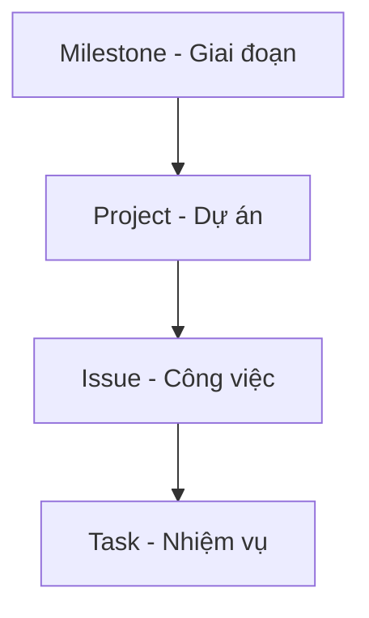

# HƯỚNG DẪN SỬ DỤNG GITHUB QUẢN LÝ DỰ ÁN

# Nội dung
1. [Giới thiệu chung về GitHub và kho lưu trữ Repo](https://docs.github.com/en/get-started/quickstart)

2. [Công cụ quản lý dự án](https://docs.github.com/en/issues/planning-and-tracking-with-projects)
   * [Milestone](#2-1-Milestone)
   * [Project](#2-2-Project)
   * [Issue](#2-3-Issues)
   * [Task](#2-4-Task)
3. [Các dạng xem báo cáo Kanban, Table, Roadmap](#3-Xem-bao-cao)
4. [Thảo luận và Tiện ích mở rộng](#4-Thao-luan)
5. [Một số mẹo và kinh nghiệm](#3-TỰ-ĐỒNG-BỘ-TẠO-BOOK-ONLINE)

## 1.Giới thiệu chung về GitHub

- [GitHub](https://docs.github.com/en/get-started) là nền tảng quản lý mã nguồn (phiên bản), hỗ trợ cộng tác, chia sẻ và lưu trữ dự án với các tính năng chính: Repository (kho lưu trữ mã nguồn), Issues (Công việc), Task (Nhiệm vụ), Projects (Dự án), Milestone (Phiên bản), Label (Nhãn), Team (Nhóm, bộ phận)...

- Github có bản free và mất phí. Với Github free thì source code của bạn sẽ công khai, có nghĩa là ai cũng có thể xem code của bạn. Nó phù hợp với các phần mềm nguồn mở, và cũng có thể trở thành một blog cá nhân của chính các bạn như các trang blogspot, wordpress,...

- Cách đăng ký: Truy cập [github.com](https://github.com/) rồi đăng ký bằng tài khoản của công ty, xác minh email và thiết lập bảo mật.

### Đối tượng sử dụng
Tài liệu này được thiết kế dành cho nhân viên của FoxAI khi cần thực hiện các công việc như:
* **Bộ phận lập trình viên** (Devs) [quản lý mã nguồn (source-code)](https://fox.ai.vn/wp-content/uploads/2024/07/Logo_Original-1.png) một cách tập trung, thống nhất (đặc biệt là khi cả nhóm cùng code);
* **Bộ phận tư vấn triển khai** (Colsutant) cập nhật, sửa đổi và phát hành [tài liệu đào tạo, hỗ trợ khách hàng](https://fox.ai.vn/wp-content/uploads/2024/07/Logo_Original-1.png) một cách nhanh chóng (đặc biệt là khi cả nhóm cùng sửa từng phần trên cùng tài liệu);
* **Bộ phận hành chính nhân sự** cập nhật tài liệu, quy trình, quy định để [truyền thông nội bộ](https://fox.ai.vn/wp-content/uploads/2024/07/Logo_Original-1.png) một cách hiệu quả (với tài liệu lớn thì lưu trên Sharepoint rồi gắn link), tránh phân tán tài liệu ở nhiều nơi.
* **Các thành viên** trong dự án có thể dễ dàng theo dõi lại nội dung các [biên bản cuộc họp (Issue)](https://fox.ai.vn/wp-content/uploads/2024/07/Logo_Original-1.png), cùng nhau trao đổi tương tác qua Discussion, thành viên mới có thể xem lại dữ liệu History commit để nhanh chóng nắm bắt công việc.
* **Leader** dễ dàng giao việc (task) cho từng thành viên (assignee), [quản lý tiến độ công việc](https://fox.ai.vn/wp-content/uploads/2024/07/Logo_Original-1.png), hỗ trợ nhân viên và báo cáo đánh giá chất lượng công việc.

### Mục tiêu tài liệu

Người dùng sau khi đọc tài liệu này có thể:
* **Biết cách** dùng công cụ [Repository (Bản lưu trữ)](https://fox.ai.vn/wp-content/uploads/2024/07/Logo_Original-1.png) để quản lý, chỉnh sửa, cập nhật tài liệu (Tab đầu tiên Code)
* **Nắm được** cách dùng công cụ [Issue, Task](https://fox.ai.vn/wp-content/uploads/2024/07/Logo_Original-1.png) để giao nhiệm vụ cho từng thành viên cụ thể.
* **Thực hành được** các công cụ [Discussion](https://fox.ai.vn/wp-content/uploads/2024/07/Logo_Original-1.png) để thảo luận, đưa ra ý tưởng, đề xuất giải pháp, tạo cuộc bình chọn, hỏi đáp Q&A với các thành viên khác.
* **Ứng dụng được** công cụ [Project, Milestone](https://fox.ai.vn/wp-content/uploads/2024/07/Logo_Original-1.png) để quản lý tiến độ các dự án đang triển khai.
* **Hiểu được** công cụ [Insight (Hiểu biết sâu sắc dạng Dashboard)](https://fox.ai.vn/wp-content/uploads/2024/07/Logo_Original-1.png) để có cái nhìn tổng quát theo từng contributors, Traffic (mức độ quan tâm) theo từng bài viết, Folk (quản lý phiên bản)...

### Quản lý kho lưu trữ [Repository](https://docs.github.com/en/get-started/quickstart/create-a-repo)

**Repository**, hay **Repo**, là một kho lưu trữ cloud nhằm thực hiện và quản lý các thay đổi đối với tài liệu (nhiều người cùng chỉnh sửa) hoặc source code (nhiều Devs cùng code).

**Ba trạng thái của một repo:**

* Working dir: là nơi bạn thực hiện các thao tác biên soạn, chỉnh sửa tài liệu.

* Stagging area: là những sự thay đổi của file được lưu lại, giống như khi ấn Save.

* Git directory: là nơi lưu trữ tài liệu trên cloud (github).

**Các thao tác với tài liệu trên Repo:**

* Add hoặc Upload file: mặc định file đầu tiên là `readme.md` viết bằng ngôn ngữ Markdown - một ngôn ngữ ghi chú nhanh, rất nhỏ gọn và thuận tiện (xem hướng dẫn tại đây).

* Commit: tương tự tính năng lưu (Save file)

* History: cho phép nền tảng lưu lại tất cả những thay đổi trên tài liệu và có thể quay về bất kỳ thời điểm nào

* Branch - Phân nhánh: là một quá trình 1 người dùng khác tạo ra bản sao của kho tài liệu để chỉnh sửa mà không làm ảnh hưởng đến bản gốc

* Pull Request - Yêu cầu kéo: là quá trình 1 người dùng khác gửi đề xuất hợp nhất vào bản gốc

* Merge - Hợp nhất: là quá trình admin phê duyệt áp dụng những thay đổi của bản sao `branch` vào nhánh chính `main`

* Push: Đẩy file từ máy trạm lên server (nếu dùng bản desktop)

* Pull: đồng bộ trạng thái từ server về máy trạm (nếu dùng bản desktop)

## 2. Quản lý dự án GitHub [Projects](https://docs.github.com/en/issues/planning-and-tracking-with-projects)

### Sơ đồ Quản lý Dự án

2.1. [**Milestones**](https://docs.github.com/en/issues/tracking-your-work-with-issues/creating-issues)
- Tạo milestone rồi gắn Issue vào milestone.  
- GitHub hiển thị % công việc đã đóng (done) / tổng Issue.

2.2. [**Project**](https://docs.github.com/en/issues/tracking-your-work-with-issues/creating-issues)
- Tại trang **Projects** (trong repository hoặc trong profile), nhấn **New project**.  
- Đặt tên, chọn **Template** (nếu có).

2.3. [**Issue**](https://docs.github.com/en/issues/tracking-your-work-with-issues)
- Tại tab **Issues** → **New issue**.  
- Đặt tiêu đề, mô tả (có thể thêm checklist công việc con).  
- Trong giao diện Issue, chọn **Projects** (phía bên phải), hoặc  
- Vào giao diện Project → **+ Add item** → Nhập `#` + số Issue.
- Gắn nhãn (label), người xử lý (assignee), milestone.  
- Thêm comment, checklist…

2.4. [**Task**](https://docs.github.com/en/issues/tracking-your-work-with-issues)
- Là công việc con trong từng Issue, có thể chuyển thành Issue để quản lý tiến độ.
- Trong description, sử dụng mã Markdown -[] để tạo checklist box tương ứng với 1 Task. 

# 3.Cách dạng xem báo cáo

### 3.1. Board (Kanban)  
- Ở Projects Beta, chọn **Board view**.  
- Sử dụng các cột (chẳng hạn: *To do*, *In progress*, *Done*).  
- Kéo – thả các card (Issue) giữa các cột để cập nhật tiến độ.  

### 3.2. Roadmap  
- Giúp xem các công việc theo **timeline** (thời gian).  
- Gán **start date**, **due date** cho mỗi Issue.  
- Thuận tiện cho việc sắp xếp thứ tự ưu tiên, theo dõi deadline.

### 3.3. Backlog  
- Nơi tập hợp những công việc chờ xử lý/ý tưởng.  
- Chọn lọc các công việc cần làm trong giai đoạn sắp tới và chuyển chúng vào Board/Roadmap.

### 3.4. Table view  
- Dạng bảng, hiển thị fields (các trường) như assignee, labels, due date…  
- Tùy biến field (custom fields) để hiển thị chỉ số, % hoàn thành (nhập tay), v.v.

## 4. Thảo luận và một số tiện ích mở rộng

4.1. **Discussions**  
- Tạo không gian chung để trao đổi, hỏi đáp, thảo luận.  
- So sánh với Issue (phân biệt: Issue → công việc cần làm, Discussion → thảo luận chung).  
- [About Discussions](https://docs.github.com/en/discussions)

4.2. **GitHub Actions**  
- Tự động hóa, CI/CD.  
- Build/test code mỗi khi commit, deploy lên server…  
- [About GitHub Actions](https://docs.github.com/en/actions)

4.3. **ZenHub** hoặc extension khác
- Nếu cần báo cáo chuyên sâu (velocity, burn-down chart…) có thể cài ZenHub extension.  
- Tích hợp với GitHub Projects.  

4.4. **GitHub Pages**  
- Triển khai website tĩnh trực tiếp từ repo, dùng để xem trực tiếp các file dạng .html
- [About GitHub Pages](https://docs.github.com/en/pages)

## 5. Một số mẹo và kinh nghiệm

5.1. **Workflow cơ bản**  
- Tạo Issue → Thêm vào Project → Thảo luận → Pull Request → Merge → Đóng Issue.

5.2. **Sử dụng nhãn (Label)**  
- Tạo nhãn `bug`, `enhancement`, `priority-high`, v.v. để dễ lọc.

5.3. **Regular review**  
- Thường xuyên rà soát Project (Board/Roadmap) theo tuần/sprint để cập nhật tiến độ, sắp xếp lại độ ưu tiên.
- [Hướng dẫn bảo mật tài khoản GitHub](https://docs.github.com/en/authentication/keeping-your-account-and-data-secure)

---
